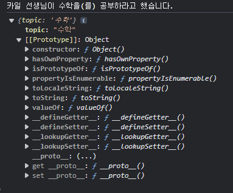
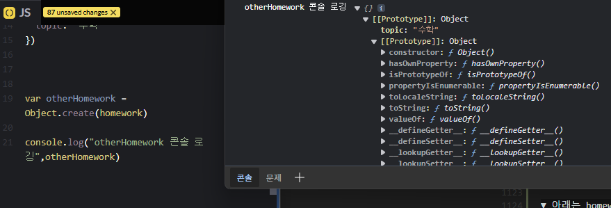
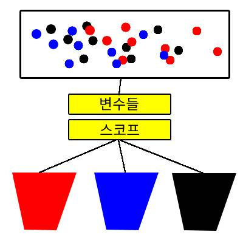
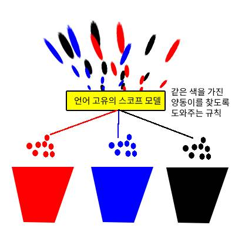
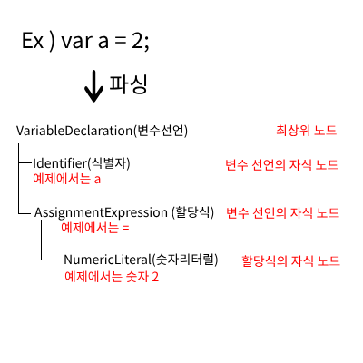
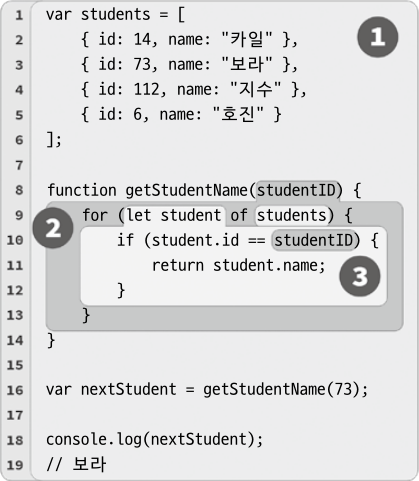

# you don't know JS yet 스터디 기록물

- [you don't know JS yet 스터디 기록물](#you-dont-know-js-yet-스터디-기록물)
  - [Part 1](#part-1)
    - [CHAPTER 1. 자바스크립트](#chapter-1-자바스크립트)
      - [1.2 자바스크립트의 유래](#12-자바스크립트의-유래)
      - [1.3 명세서](#13-명세서)
      - [1.3.1 JS를 지배하는 웹](#131-js를-지배하는-웹)
      - [1.3.2 JS지만 JS가 아닌 웹 전용 문법](#132-js지만-js가-아닌-웹-전용-문법)
      - [1.3.3 모든 코드가 JS는 아니다?](#133-모든-코드가-js는-아니다)
      - [1.4 JS의 다양성](#14-js의-다양성)
      - [1.5 하위 호환성과 상위 호환성](#15-하위-호환성과-상위-호환성)
      - [1.5.1 상위 호환성의 간극 줄이기](#151-상위-호환성의-간극-줄이기)
      - [1.6 인터프리터 이해](#16-인터프리터-이해)
      - [1.6.1 웹어셈블리](#161-웹어셈블리)
      - [1.7 엄격모드(stric mode)](#17-엄격모드stric-mode)
    - [CHAPTER 2. 자바스크립트 조망하기](#chapter-2-자바스크립트-조망하기)
      - [2.1 파일은 프로그램입니다](#21-파일은-프로그램입니다)
      - [2.2 값(value)](#22-값value)
      - [2.2.1 배열과 객체](#221-배열과-객체)
      - [2.2.2 값의 타입](#222-값의-타입)
      - [2.3 변수 선언과 사용](#23-변수-선언과-사용)
      - [2.4 함수](#24-함수)
      - [2.5 비교](#25-비교)
      - [2.5.1 같음에 대한 고찰](#251-같음에-대한-고찰)
      - [2.5.2 강제 변환](#252-강제-변환)
      - [2.6 코드 구조화 패턴](#26-코드-구조화-패턴)
      - [2.6.1 클래스](#261-클래스)
      - [2.6.2 모듈](#262-모듈)
    - [CHAPTER 3. 자바스크립트 뿌리 파헤치기](#chapter-3-자바스크립트-뿌리-파헤치기)
      - [3.1 이터레이션](#31-이터레이션)
      - [3.1.1 이터레이터 소비하기](#311-이터레이터-소비하기)
      - [3.1.2 이터러블](#312-이터러블)
      - [3.2 클로저](#32-클로저)
      - [3.3 this 키워드](#33-this-키워드)
      - [3.4 프로토타입](#34-프로토타입)
      - [3.4.1 객체 연결 장치](#341-객체-연결-장치)
      - [3.4.2 this 다시 보기](#342-this-다시-보기)
      - [3.5 '왜?' 라고 질문하기](#35-왜-라고-질문하기)
    - [Chapter4. 더 큰 그림](#chapter4-더-큰-그림)
      - [4.1 첫 번째 기둥: 스코프와 클로저](#41-첫-번째-기둥-스코프와-클로저)
      - [4.1.1 스코프](#411-스코프)
      - [4.1.2 클로저](#412-클로저)
      - [4.2 두 번째 기둥: 프로토타입](#42-두-번째-기둥-프로토타입)
      - [4.3 세 번째 기둥: 타입과 타입 강제 변환](#43-세-번째-기둥-타입과-타입-강제-변환)
      - [4.4 JS의 본질 따르기](#44-js의-본질-따르기)
  - [Part 2](#part-2)
    - [CHAPTER 1. 스코프](#chapter-1-스코프)
      - [1.1 책에 대하여](#11-책에-대하여)
      - [1.2 컴파일 VS 인터프리트](#12-컴파일-vs-인터프리트)
      - [1.2.1 컴파일](#121-컴파일)
      - [1.2.2 인터프리트](#122-인터프리트)
      - [1.2.3 그럼 JS는?](#123-그럼-js는)
      - [1.3 코드 컴파일](#13-코드-컴파일)
      - [1.4 컴파일러체](#14-컴파일러체)
      - [1.4.1 할당의 타깃 (타깃 참조)](#141-할당의-타깃-타깃-참조)
      - [1.4.2 값의 소스 (소스 참조)](#142-값의-소스-소스-참조)
      - [1.5 런타임에 스코프 변경하기](#15-런타임에-스코프-변경하기)
      - [1.6 렉시컬 스코프](#16-렉시컬-스코프)
    - [CHAPTER 2. 렉시컬 스코프](#chapter-2-렉시컬-스코프)
      - [2.1 구슬과 양동이](#21-구슬과-양동이)
      - [2.2 JS 엔진 구성원 간의 대화](#22-js-엔진-구성원-간의-대화)
      - [2.3 중첩 스코프](#23-중첩-스코프)
      - [2.3.1 탐색이 실패할 경우](#231-탐색이-실패할-경우)
      - [2.3.2 스코프 건물](#232-스코프-건물)
      - [2.4 정리](#24-정리)
    - [CHAPTER 3. 스코프 체인](#chapter-3-스코프-체인)
      - [3.1 탐색의 진실](#31-탐색의-진실)
      - [3.1.1 컴파일 중 결정되지 않는 경우](#311-컴파일-중-결정되지-않는-경우)
      - [3.2 변수 섀도잉](#32-변수-섀도잉)
      - [3.2.1 전역 섀도잉](#321-전역-섀도잉)
      - [3.2.2 복사는 접근과 다릅니다](#322-복사는-접근과-다릅니다)
      - [3.2.3 금지된 섀도잉](#323-금지된-섀도잉)
      - [3.3 함수 이름 스코프](#33-함수-이름-스코프)
      - [3.4 화살표 함수](#34-화살표-함수)
      - [3.5 정리](#35-정리)
    - [CHAPTER 4. 전역 스코프](#chapter-4-전역-스코프)
      - [4.1 전역 스코프를 배워야 하는 이유](#41-전역-스코프를-배워야-하는-이유)
      - [4.2 전역 스코프의 위치](#42-전역-스코프의-위치)
      - [4.2.1 브라우저의 창, window 객체](#421-브라우저의-창-window-객체)
      - [4.2.2 웹 워커](#422-웹-워커)
      - [4.2.3 개발자 도구와 콘솔, REPL](#423-개발자-도구와-콘솔-repl)
      - [4.2.4 ES모듈](#424-es모듈)
      - [4.2.5 Node.js](#425-nodejs)
      - [4.3 globalThis](#43-globalthis)
      - [4.4 정리](#44-정리)
    - [CHAPTER 5. 변수의 비밀 생명주기](#chapter-5-변수의-비밀-생명주기)
    - [CAHPTER 6. 스코프 노출 제한](#cahpter-6-스코프-노출-제한)
      - [6.1 최소 노출의 원칙(POLE)](#61-최소-노출의-원칙pole)
      - [6.2 일반(함수) 스코프에 숨기기](#62-일반함수-스코프에-숨기기)
      - [6.2.1 함수 표현식 즉시 호출하기](#621-함수-표현식-즉시-호출하기)
      - [6.3 블록으로 스코프 지정](#63-블록으로-스코프-지정)
      - [6.3.1 var와 let](#631-var와-let)
      - [6.3.2 let의 위치](#632-let의-위치)
      - [6.3.3 catch와 스코프](#633-catch와-스코프)
      - [6.4 블록 내 함수 선언](#64-블록-내-함수-선언)
      - [6.5 정리](#65-정리)
    - [CHAPTER 7. 클로저 사용법](#chapter-7-클로저-사용법)
      - [7.1 클로저 관찰하기](#71-클로저-관찰하기)
      - [7.1.1 화살표 함수의 스코프](#711-화살표-함수의-스코프)
      - [7.1.2 추가되는 클로저](#712-추가되는-클로저)
      - [7.1.3 스냅숏이 아닌 라이브링크](#713-스냅숏이-아닌-라이브링크)
      - [7.1.4 쉽게 관찰할 수 있는 클로저: Ajax와 이벤트](#714-쉽게-관찰할-수-있는-클로저-ajax와-이벤트)
      - [7.1.5 보이지 않으면 어떡하죠?](#715-보이지-않으면-어떡하죠)
      - [7.1.6 관찰 가능성 관점에서 클로저의 정의](#716-관찰-가능성-관점에서-클로저의-정의)
      - [7.2 클로저 생명주기와 가비지 컬렉션](#72-클로저-생명주기와-가비지-컬렉션)
      - [7.2.1 변수 혹은 스코프](#721-변수-혹은-스코프)
      - [7.3 다른 관점](#73-다른-관점)
      - [7.4 클로저를 사용하는 이유](#74-클로저를-사용하는-이유)
      - [7.5 정리](#75-정리)
    - [CHAPTER 8. 모듈 패턴](#chapter-8-모듈-패턴)
      - [8.1 캡슐화와 최소 노출의 원칙(POLE)](#81-캡슐화와-최소-노출의-원칙pole)
      - [8.2 모듈이란?](#82-모듈이란)
      - [8.2.1 네임스페이스(무상태 그룹화)](#821-네임스페이스무상태-그룹화)
      - [8.2.2 데이터 구조(상태 유지 그룹화)](#822-데이터-구조상태-유지-그룹화)
      - [8.2.3 모듈(상태를 가진 접근 제어)](#823-모듈상태를-가진-접근-제어)
      - [8.3 Node.js의 CommonJS 모듈](#83-nodejs의-commonjs-모듈)
      - [8.4 최신 ES 모듈](#84-최신-es-모듈)
      - [8.5 정리](#85-정리)
  - [부록 APPENDIX A 한 걸음 더](#부록-appendix-a-한-걸음-더)
    - [A.1 암시적 스코프](#a1-암시적-스코프)
      - [A.1.1 매개변수 스코프](#a11-매개변수-스코프)
      - [A.1.2 함수 이름 스코프](#a12-함수-이름-스코프)
    - [A.2 익명함수 vs 기명함수](#a2-익명함수-vs-기명함수)
      - [A.2.1 명시적 혹은 추론된 이름](#a21-명시적-혹은-추론된-이름)
      - [A.2.2 이름이 없다면?](#a22-이름이-없다면)
      - [A.2.3 나는 누구일까요?](#a23-나는-누구일까요)
      - [A.2.4 이름은 설명입니다](#a24-이름은-설명입니다)
      - [A.2.5 화살표 함수](#a25-화살표-함수)
      - [A.2.6 IIFE 변형](#a26-iife-변형)
      - [!! A.2 정리](#-a2-정리)
    - [A.3 호이스팅: 함수와 변수](#a3-호이스팅-함수와-변수)
      - [A.3.1 함수 호이스팅](#a31-함수-호이스팅)
      - [A.3.2 변수 호이스팅](#a32-변수-호이스팅)
    - [A.4 var에 대한 변론](#a4-var에-대한-변론)
      - [A.4.1 var를 버리지 마세요](#a41-var를-버리지-마세요)
      - [A.4.2 혼란스러운 const](#a42-혼란스러운-const)
      - [A.4.3 var와 let](#a43-var와-let)
    - [A.5 TDZ](#a5-tdz)
      - [A.5.1 모든 일이 시작된 곳, const](#a51-모든-일이-시작된-곳-const)
      - [A.5.2 곁다리 let](#a52-곁다리-let)
    - [A.6 동기 콜백도 여전히 클로저일까?](#a6-동기-콜백도-여전히-클로저일까)
      - [A.6.1 콜백이란?](#a61-콜백이란)

## Part 1

### CHAPTER 1. 자바스크립트

#### 1.2 자바스크립트의 유래

- 자바스크립트는 넷스케이프에 재직중이던 브랜던 아이크가 모카라는 암호명으로 제작했으며 외부에 공개할 때 '자바스크립트' 로 명명했다.
- 자바개발자들의 입맛에 맞게 만들었고, 개발자들에게 어필하기 위해 마케팅 목적으로 '자바스크립트'라고 명명했으며 이는 자바와는 별개의 언어이다.

#### 1.3 명세서

- ECMA 표준 기구에 의해 공식화된 명칭으로는 ECMAScript 라고 불린다. 2016년 이후부터는 개정 연도를 붙여서 표기한다.

  > ## ECMAScript의 버전?
  >
  > <table>
  > <tr>
  > <th>이름</th>
  > <th>출판일</th>
  > <th>추가된 내용</th>
  > </tr>
  > <tr>
  > <td><span style="font-weight:700">ECMAScript 1 (ES1)</span></td>
  > <td>1997년 6월</td>
  > <td>최초의 ECMAScript 표준.</td>
  > </tr>
  > <tr>
  > <td><span style="font-weight:700">ECMAScript 2 (ES2)</span></td>
  > <td>1998년 6월</td>
  > <td>문서화 및 편집상의 변경만 포함한 소규모 업데이트.</td>
  > </tr>
  > <tr>
  > <td><span style="font-weight:700">ECMAScript 3 (ES3)</span></td>
  > <td>1999년 12월</td>
  > <td>레귤러 익스프레션(Regular Expression, 정규표현식), 새로운 제어문, try/catch 예외 처리, 더 엄격한 오류 처리 등을 포함.</td>
  > </tr>
  > <tr>
  > <td><span style="font-weight:700">ECMAScript 4 (ES4)</span></td>
  > <td>취소됨</td>
  > <td>이 버전은 제안되었으나, 지나치게 복잡하다는 이유로 표준화되지 않았고 취소되었습니다.</td>
  > </tr>
  > <tr>
  > <td><span style="font-weight:700">ECMAScript 5 (ES5)</span></td>
  > <td>2009년 12월</td>
  > <td>strict mode, JSON, Array 메서드 (forEach, map, filter, reduce, some, every 등), Object 메서드 (Object.keys,   Object.create 등) 포함.
  > </td>
  > </tr>
  > <tr>
  > <td><span style="font-weight:700">ECMAScript 5.1 (ES5.1)</span></td>
  > <td>2011년 6월</td>
  > <td>ECMAScript 5의 수정판. 주로 문서화 수정이 포함되었으며, 이 버전은 ISO/IEC 16262:2011으로 표준화됨.</td>
  > </tr>
  > <tr>
  > <td><span style="font-weight:700">ECMAScript 6 (ES6, ECMAScript 2015)</span></td>
  > <td>2015년 6월</td>
  > <td>모듈, 클래스, 화살표 함수, let, const, 템플릿 리터럴, Promise, 제너레이터, for...of, 심볼, 맵과 셋 등의 큰 변화와 새로운 기능들 포함.</td>
  > </tr>
  > <tr>
  > <td><span style="font-weight:700">ECMAScript 2016 (ES7)</span></td>
  > <td>2016년 6월</td>
  > <td>두 가지 주요 기능: Array.prototype.includes, 지수 연산자(**).</td>
  > </tr>
  > <tr>
  > <td><span style="font-weight:700">ECMAScript 2017 (ES8)</span></td>
  > <td>2017년 6월</td>
  > <td>async/await, Object.values, Object.entries, String.prototype.padStart, String.prototype.padEnd, 트레일링 쉼표(함수 매개변수) 포함.</td>
  > </tr>
  > <tr>
  > <td><span style="font-weight:700">ECMAScript 2018 (ES9)</span></td>
  > <td>2018년 6월</td>
  > <td>Rest/Spread Properties, 비동기 이터레이션(for await...of), 정규 표현식 개선, Promise.prototype.finally 포함.</td>
  > </tr>
  > <tr>
  > <td><span style="font-weight:700">ECMAScript 2019 (ES10)</span></td>
  > <td>2019년 6월</td>
  > <td>Array.prototype.flat, Array.prototype.flatMap, Object.fromEntries, String.prototype.trimStart, String.prototype.trimEnd, Optional Catch Binding, 심볼 설명(Symbol Description) 포함.</td>
  > </tr>
  > <tr>
  > <td><span style="font-weight:700">ECMAScript 2020 (ES11)</span></td>
  > <td>2020년 6월</td>
  > <td>널 병합 연산자(??), 선택적 체이닝(?.), 글로벌 This, 동적 import, BigInt, Promise.allSettled, 모듈의 네임스페이스 export, import.meta 포함.</td>
  > </tr>
  > <tr>
  > <td><span style="font-weight:700">ECMAScript 2021 (ES12)</span></td>
  > <td>2021년 6월</td>
  > <td>String.prototype.replaceAll, 논리 할당 연산자(&&=, ||=, ??=), WeakRefs, FinalizationRegistry, Promise.any 포함.</td>
  > </tr>
  > <tr>
  > <td><span style="font-weight:700">ECMAScript 2022 (ES13)</span></td>
  > <td>2022년 6월</td>
  > <td>Array 및 TypedArray의 at(), Object.hasOwn, Error 원인 속성, import.meta.resolve 포함.</td>
  > </tr>
  > <tr>
  > <td><span style="font-weight:700">ECMAScript 2023 (ES14)</span></td>
  > <td>2023년 6월</td>
  > <td>Array.findLast(), Array.findLastIndex(), Hashbang(#!), Symbol.prototype.description, Array.fromAsync, 버퍼링된 문자셋과 정규식 개선 포함.</td>
  > </tr>
  > <tr>
  > </tr>
  > </table>

  **출처 - chat gpt**

- 자바스크립트의 명세는 TC39 라는 자바스크립트를 관리하는 기술 운영 위원회에서 관리한다.
- 제안서 작성은 누구에게나 열려있으며, 해당 제안이 명세에 추가되려면 TC39 위원의 지원을 받아야한다

#### 1.3.1 JS를 지배하는 웹

- 간혹 새로운 동작이 추가되거나 기존 작동 방식을 변경하는 등 명세서가 개정이 될 수 있다. 기존에 자바스크립트의 엔진을 만드는 곳들은 오랜시간 기능을 구현하다보니 오류에 대해 처리하기 위해 엣지케이스를 다루는 기능을 **자체적**으로 추가했는데 이런 상황에서 명세서 개정안이 반영됐을 때, 기존에 문제가 없던 부분에서 문제가 나올 경우 **자사 엔진에 반영하지 않겠다고 강짜부림** 그렇게 불일치가 발생하게 되면 TC39는 종종 기존 결정을 철회하고 명세서를 웹에 맞추기도 함.

#### 1.3.2 JS지만 JS가 아닌 웹 전용 문법

- 자바스크립트에서 사용되지만 자바스크립트가 아닌 메서드가 있다. EX) alert, console.log, console.info 등

#### 1.3.3 모든 코드가 JS는 아니다?

- 콘솔에 입력한 코드는 JS 엔진이 .js 파일을 다루는 방식과 동일한 방식으로 처리되지는 않는다.
- 콘솔에 나타난 결과가 JS 문법을 **정확히** 지키더라도 결과를 신뢰하지 말고, 개발자 도구는 "JS에 우호적인" 별도의 환경임을 유념

#### 1.4 JS의 다양성

- 자바스크립트는 다중 패러다임 언어로써 절차적, 객체지향, 함수형 스타일의 코드를 모두 사용할 수 있다.

#### 1.5 하위 호환성과 상위 호환성

- 자바스크립트는 하위호환성을 보장한다. 따라서 브라우저의 버전이 업데이트 되더라도 그 이전에 작성된 코드는 무조건 동작을 보장받을 수 있다. 단, 상위호환성은 보장하지 않는다.

  > - 하위호환성 ? 예를 들어 약 10년전에 작성한 JS 코드가 있다면 현재(2024년)의 브라우저 또는 엔진에서 해당 코드의 동작이 보장된다는 개념.
  > - 상위호환성 ? 하위호환성과 반대되는 개념으로 최신의 문법(또는 메소드)인 경우 구형 브라우저에서는 의도한 동작이 실행되지 않는다는 개념.

  <span style="color: red; font-weight: 700">문제 ? </span> 하위호환성을 알아볼수 있는 코드들을 찾아보면 어떨까요? 또는 상위호환성 코드를 찾아보는것도 좋을 것 같습니다.

#### 1.5.1 상위 호환성의 간극 줄이기

- 최신의 문법을 사용하여 개발 할 때는 구형 브라우저에서도 동일한 동작이 이뤄질 수 있도록 **바벨**과 같은 트랜스파일러의 도움을 받을 수 있다. 트랜스파일러는 최신 형태의 문법을 이전 형태의 문법으로 변환하여 소스로 반환해준다.

- 최신의 기능을 구형 브라우저 또는 엔진에서 사용할 수 있게 하는데 필요한 코드를 폴리필(polyfill) 또는 심(shim)이라고 함

  > 폴리필이 필요할 때는 폴리필을 모아놓은 ES-Shim 과 괕은 공신력있는 폴리필을 사용하는게 좋다.
  > https://www.npmjs.com/org/es-shims //NPM에서 검색시 다양한게 나오는 듯?

- 바벨과 같은 트랜스파일러는 폴리필이 필요한 코드가 있는 경우 자동으로 폴리필을 추가하기도 함
- 해당 책의 저자의 경우 JS는 지속적인 진화가 이뤄질 것이고, 구 버전과의 간극은 절대 사라지지 않을 거기에 JS 기반 프로젝트에서는 트랜스파일이나 폴리필 사용이 표준으로 자리 잡아야 한다고 생각한다고 함

#### 1.6 인터프리터 이해

- **인터프리터 언어란 ?** 코드를 한 줄씩 읽어 내려가며 실행하는 프로그램. (출처 - 나무위키)

  - 종류 : Python, Javascript, SQL, Ruby 등

- **스크립트 언어란 ?** 응프로그래밍 언어의 한 종류로, 기존에 이미 존재하는 소프트웨어(애플리케이션)를 제어하기 위한 용도로 쓰이는 언어이다.
  일반적인 응용 소프트웨어는 컴파일러를 사용하는 언어에 의해 기계어로 번역된 채로 실행되기 때문에, 수정이 빈번하게 발생하면 수정 후 일일이 컴파일을 다시 해야 한다. 덩치가 큰 프로그램은 컴파일 시간도 몇 시간 단위로 잡아먹는 일이 많은데다, 일일이 컴파일을 다시 하는 것도 상당히 귀찮은 작업이다.  
  이 때문에 수정이 빈번하게 발생하는 부분은 소스코드를 한줄 한줄 읽어 바로바로 실행하는 인터프리터 방식이 상당히 유리하다. 스크립트 언어는 이런 부분에 사용하기 위해 나온 것으로, 응용 소프트웨어에서 스크립트 언어에 맞는 API를 제공, 응용 소프트웨어와 상호작용하면서 돌아가게 된다.  
  인터프리터 언어와 헷갈리는 사람이 있는데 인터프리터 언어는 인터프리터 방식을 사용하는 언어를 뜻하고 스크립트 언어는 앞서 말했듯이 이미 존재하는 소프트웨어를 제어하기 위한 용도로 쓰이는 언어이다. 단지 스크립트 언어 용도상 인터프리터 방식이 유용하기 때문에 스크립트 언어 대부분이 인터프리터 방식을 쓰는 인터프리터 언어일 뿐.

  - 종류 : Javascript, Typescript, Actionscript,AutoHotkey, JSP, PHP 등

- **컴파일 언어란 ?** 컴파일 언어(compiled language)는 코드가 실행되기 전 컴파일러를 거쳐서 기계어로 모두 변환되어 실행되는 프로그래밍 언어이다. (출처 - 위키백과)
  - 종류 : C, C++, C#, Java, Go 등등

컴파일 언어는 소스코드 파싱 -> 컴파일러에게 전달 -> 기계어로 변환되어 실행
되는 과정을 거치게 되는 특징을 가지고 있다.

JS로 만들어진 소스 코드도 실행 전 파싱을 거치기 때문에 컴파일 언어 라고 부를 수 있다.

초기의 자바스크립트는 인터프리터 언어였지만, 현대의 자바스크립트 엔진(구글의 V8, 모질라의 스파이더몽키)은 JIT(Just-In-Time) 컴파일 기술을 탑재하여 사용하기 때문에 코드 실행 전 필요한 부분을 즉시 컴파일하여 실행 속도를 높였다.

이에 따라 JS는 인터프리터 언어지만 컴파일 언어의 특성도 갖게 됨.

JS가 파싱된다는 근거로는 명세서에 중복된 매개변수명과 같이
정적으로 탐지가 가능한 오류를 초기 오류(entry error)라고 부르고 가능하면 프로그램 실행 전에 초기 오류를 찾아낼 수 있어야 한다고 언급되었는데, 이는 파싱이 없다면 사전에 탐지할 수 없는 오류이기 때문이다.

#### 1.6.1 웹어셈블리

- 도구 기반으로 만든 프로그램이 JS 엔진에서 좀 더 효율적으로 처리된다는 사실을 기반으로 웹어셈블리(WebAssembly, Wasm)라는 기술을 공개함  
  ※ 해당 내용은 크게 중요한 내용이 아닌 듯 하여 그냥 이 정도가 있다 정도만 짚고 넘어가면 될듯

#### 1.7 엄격모드(stric mode)

- stric mode를 바라보는 시점은 '할 수 없는 것에 제약을 두는 모드' 가 아니라 js엔진이 코드를 최적화 하고 효율적으로 실행할 수 있게 해주는 '안내 가이드 역할을 하는 모드'로 봐야한다.
- 엄격모드는 파일을 대상으로 처리 되기 때문에 파일에 전처리 구문이 'use Strict'가 있어야 활성화가 된다.
- 함수 단위로도 엄격모드를 설정할 수 있으며 함수의 시작 부분에 전처리 구문을 넣어주면 된다.
  ```javascript
  function useStrictMode() {
    //전처리 구문 상단에는 공백이나 주석만 적을 수 있음
    'use strict';
    // 전처리 구문 아래부턴 엄격 모드가 적용됨
  }
  ```
- 파일단위로 엄격모드를 사용한 경우 함수 단위에서 엄격모드는 적용이 불가 따라서 파일 단위 또는 함수 단위 중 선택하여 사용
- 함수 단위의 엄격 모드는 비 엄격 모드로 작성한 기존 코드를 <span style="color: red">**점진적으로 엄격 모드를 적용 해야 할 때만**</span> 사용하는게 좋다.
- 비 엄격 모드에서 작성 된 코드도 트랜스파일 처리 될 떄 엄격 모드를 준수하도록 변경된다(당혹스럽네???)
- 심지어 ES6의 모듈 형식으로 코드를 작성한 경우 ES6의 모듈은 기본이 엄격모드이다..;;

### CHAPTER 2. 자바스크립트 조망하기

- 가장 좋은 JS 학습 방법은 직접 코드를 작성하는 것 (인정..)

#### 2.1 파일은 프로그램입니다

- JS에서는 파일 각각이 별도의 프로그램이다.  
  이유 - JS는 파일을프로그램으로 취급하기 때문에 파일 하나에만 오류가 있어도 (파싱/컴파일 또는 실행단계) 다음 파일이 처리되지 않을 수 있다.
- 일반 유저의 경우 파일 단위로 실행하는 게 아닌 하나의 파일을 실행시켜 모든 기능을 동작하기 떄문에 단순히 하나의 프로그램만 만든 것이라고 생각할 수 있다. (이해됨, 항상 고객사는 단순히 생각하기 때문에 그냥 쉽게 얘기하는 듯?)

NOTE : 빌드 도구(웹팩 같은)가 하나의 파일로 만들고 배포하는데 이 경우 JS는 합쳐진 단일 파일을 전체 프로그램으로 취급

- 노트의 대한 주석에서 옮긴이가 현대 웹 개발에서 빌드 도구는 네트워크 효율성, 성능 최적화등의 이유로 여러 파일을 생성하는 경우가 더 많다고 얘기함 (개인적으로는 처음 듣는 방식이여서 놀램)  
   관련된 형태는 찾아보니 코드 스플리팅(Code Splitting) 이라고 함
  https://ko.legacy.reactjs.org/docs/code-splitting.html // 리액트 공식문서에서의 코드 스플리팅
  https://ui.toast.com/weekly-pick/ko_20200128 // Vue를 다루는 네이버의 토스트UI에서의 코드 스플리팅을 통해 사이트의 효율성을 높이는 방법  
   Ex - 코드 스플리팅을 활용한 대표적 사례 사이트  
   | 사이트 | 특징 | 이점 |
  |-----------|-------|------|
  | **YouTube** | - 복잡한 웹 애플리케이션<br>- 각 페이지마다 필요한 코드만 불러옴 | - 초기 로딩 시간 단축<br>- 사용자 경험 최적화 |
  | **Facebook** | - React 기반 웹 애플리케이션<br>- 기능 모듈을 별도 번들로 분리 | - 초기 로딩 시간 감소<br>- 특정 기능 사용 시 관련 스크립트만 로드 |
  | **Twitter** | - 실시간 소셜 미디어 플랫폼<br>- 코드 스플리팅과 지연 로딩 활용 | - 사용자 인터페이스 성능 최적화<br>- 특정 기능 사용 시 관련 코드만 로드 |
  | **Airbnb** | - 다양한 페이지와 기능 제공<br>- 사용자 상호작용에 따라 필요한 번들만 로드 | - 사이트 성능 최적화<br>- 빠른 페이지 로딩 |
  | **Amazon** | - 전자 상거래 플랫폼<br>- 제품 페이지와 장바구니 페이지가 별도 번들로 분리 | - 쇼핑 경험 최적화<br>- 빠른 로딩 시간 제공 |
  **출처 - 채찍피티**

- 독립적인 js 파일 여러개를 하나의 프로그램으로써 작동시키는 유일한 방법은 **전역 스코프(global scope)** 를 사용해 파일 간 상태를 공유하고 공통으로 사용하는 기능을 접근할 수 있도록 만드는 방법 뿐, 전역스코프의 네임스페이스에서 여러 js 파일이 조합되면 이 파일들은 런타임에서 하나의 애플리케이션으로 작동함

- 전역 스코프란? 브라우저의 window 객체 또는 Node.js의 global 객체와 같이 애플리케이션 전체에서 접근 가능한 범위를 의미  
  전역스코프는 전역 변수 사용은 관리하기 어려워질 수 있고, 다른 파일에서 동일한 이름을 사용하는 변수와 충돌이 발생할 수 있습니다. 따라서 유지보수성과 코드의 안정성을 해칠 수 있어 사용에 주의해야 한다고 함

> #### 전역스코프를 사용하여 독립적인 js파일을 하나의 애플리케이션처럼 작동시키는 예제
>
> file1.js
>
> ```javascript
> var MyApp = MyApp || {}; // 네임스페이스 정의
>
> MyApp.module1 = (function () {
>   function greet() {
>     console.log('Hello from Module 1');
>   }
>
>   return {
>     greet: greet,
>   };
> })();
> ```
>
> file2.js
>
> ```javascript
> var MyApp = MyApp || {}; // 네임스페이스 재사용
>
> MyApp.module2 = (function () {
>   function greet() {
>     console.log('Hello from Module 2');
>   }
>
>   return {
>     greet: greet,
>   };
> })();
> ```
>
> index.js
>
> ```javascript
> <script src="file1.js"></script>
> <script src="file2.js"></script>
> <script>
>    MyApp.module1.greet(); // "Hello from Module 1" 출력
>    MyApp.module2.greet(); // "Hello from Module 2" 출력
> </script>
> ```
>
> - MyApp이라는 전역 네임스페이스를 사용하여 두 파일에서 정의된 모듈들을 그룹화했습니다.
> - file1.js와 file2.js는 서로 독립적으로 작성되었지만, 같은 네임스페이스를 사용하여 전역 스코프에서 하나의 애플리케이션처럼 결합되었습니다.
> - index.html에서 각 모듈을 호출하여 실행할 수 있습니다.

- ES6 이후 모듈 포맷도 지원하는데 모듈 포맷도 파일 기반이다. JS는 각 모듈을 별도로 처리한다.
- 어쨌든 중요한건 js 파일 하나하나를 고유한 작은 프로그램이라고 생각해야 함

#### 2.2 값(value)

- 프로그램의 가장 기본적인 단위는 값(value), 값에는 데이터가 저장 됨
- 값으로 인해 상태를 유지할 수 있음
- 크게 원시 타입(primitive type, 프리미딥 타입ㅋㅋㅋ) 과 객체 타입(object type)으로 분류
- JS에서 리터럴을 사용해 프로그램에 값을 주입
- 문자열 범위를 정할 때는 큰따옴표, 작은따옴표, 백틱(`) 을 사용할 수 있음
- 단 백틱은 보간법을 위해 만들어졌으므로 백틱은 보간법을 사용할 때 쓰도록 하자!
- JS의 원시 타입 종류 - string, number, boolean, null, undefined, symbol, bigint
- 심볼은 일반적인 JS에서는 잘 사용하지 않는다. 보통 라이브러리나 프레임워크 같이 좀 더 저차원의 코드에서 사용한다.
- 원시타입의 값은 할당, 전달될 때 값이 복사되어 할당, 전달 된다.

#### 2.2.1 배열과 객체

- 배열은 인덱스가 있는 특수한 객체
- 배열은 객체에 포함
- 객체는 객체
- 함수도 객체 (자세한건 나중에?)
- 단 객체는 배열보다 좀 더 일반적인 데이터 타입
- 객체 접근방법은 온점('.') 말고도 []로 접근 가능

```javascript
ex)
 let me = {
  first : "k",
  last : "Paul",
  age : "비밀",
  "favorite color" : "blue"
 }

 // 온점(.) 접근방식
 me.age // 비밀

 // 대괄호[] 접근방식
 me["last"] // Paul
```

- 일반적인 온점 접근방식은 객체의 속성에 접근할 때 가장 일반적으로 사용
- 대괄호는 좀 특별해서 찾아봄  
  위 예제에서 key에 공백이 있는 형태가 있는데 저런 공백이 있는 형태이거나 또는 특수문자, 또는 속성 값이 동적일 때 접근용으로 사용함

```javascript
// 공백이 있는 key 인 경우
me['favorite color']; // blue

// 값이 동적인 경우 - 속성 이름이 변수로 지정되는 경우
let property = 'age';
me[property]; // 비밀
```

#### 2.2.2 값의 타입

- typeof 연산자를 통해 값의 타입을 확인할 수 있다
- null은 예상과 달리 object를 반환
- 문자열을숫자로 바꾸는 것처럼 값의 타입을 변경하는 것을 JS에서는 타입강제변환(coercion) 이라고 한다.

#### 2.3 변수 선언과 사용

- 변수 ? 값을 담는 상자라고 생각하면 됨, 식별자(identifier)라고도 불림
- 변수를 사용하려면 변수 선언이 선행
- 변수 선언 문법 - var, let, const
- let과 var의 선언 방식의 차이는 변수 접근 범위

```
* 변수 선언의 접근 범위
접근 범위 = 스코프
var = 함수 스코프
let = 블록 스코프
```

필자의 생각 ? var의 유효 범위에 대한 작동 방식은 혼란을 주다 보니 요즘에는 let과 const를 사용하라고 하지만, 지난친 제한이라고 생각한다고 함,

- const ? 선언 시 값을 할당해야 하고, 다른 값을 재할당할 수 없다.
- const 사용 시 주의 사항

```
const로 선언한 변수는 재할당이 불가능할 뿐 값을 바꿀수는 있다.
따라서 const를 사용해 객체를 정의하는건 좋지 않은 방식
const는 간단한 원싯값에 이름을 부여할 때 가장 적절

ex)

const myBirthday = 1231;
```

- var, let, const 외에도 특정 스코프 내에 변수와 같은 식별자를 선언하는 방법

```javascript
function hello(myName) {
  console.log(`${myName} 님, 안녕하세요:)`);
}

hello('카일'); //카일 님, 안녕하세요:)
```

그것은 함수로 정의하는 방법!

try..catch의 catch 구문에 전달하는 error도 블록 스코프이다.

#### 2.4 함수

※ 프로그래밍 언어에서 '함수' 의 의미?

- 함수형 프로그래밍 패러다임에서는 함수가 정확한 수학적 정의(특정 작업이나 연산을 수행하는 코드)를 가지고 있으며 준수해야 할 엄격한 규칙의 집합을 의미

- js로 개발할 때 좀 더 포괄적인 개념인 '프로시저'를 프로그램에 녹여내기 위해 심사숙고하며 함수를 작성해야 함

> 나만 몰랐던 프로시저의 개념 - 이제 약간 이해가 됨
> 한번 이상 호출할 수 있고, 입력값이 있을 수 있으며 하나 이상의
> 출력 값을 반환하는 구문
>
> ```javascript
> function add(a, b) {
>   return a + b;
> }
>
> console.log(add(3, 4)); // 7
> ```
>
> 위 처럼 입력값이 있고 하나 이상의 값을 반환하면 프로시저로 볼 수 있다.
> 함수와 같은 개념으로 볼 수 있음

- 함수 사용방법

1.  함수 선언 (함수 선언문) 방식

```javascript
function awesomeFunction(collThings) {
  // ... 중략
  return amazingStuff;
}
```

- 위와 같은 방식을 함수 선언 또는 함수 선언문(function declaration)이라고 함
  ??? 함수 선언이란 이름은 이 함수가 다른 문의 표현식이 아니라 문 자체이기 떄문에 붙게됨?? 무슨 말인지 이해 안됨;;;

- 함수 선언으로 정의한 함수 awesomeFunction은 식별자 awesomeFunction과 실제 함수를 나타내는 값의 연관이 코드 실행 단계가 아닌 컴파일 단계에서 맺어짐

  2. 함수 표현식 방식

```javascript
let awesomeFunction = function (coolThings) {
  // ...
  return amazingStuff;
};
```

- 함수 표현식으로 선언된 함수는 식별자(위 예제에서는 awesomeFunction)가 코드가 실행되기 전까지는 관계를 맺지 않는다.

**JS에서 함수는 할당 가능하고 어디든 전달 가능한 값이라는 특징이 매우 중요**

- 함수형 패러다임을 지원하는 언어에서는 함수를 값으로 취급하는게 필수

매개변수(parameter)를 통해 함수에 값을 전달할 수 있다.

```javascript
function greeting(myName) {
  console.log(`${myName} 님 안녕하세요!`);
}

greeting('폴'); //폴 님 안녕하세요!
```

- 위 예시에서 myName이 매개변수이며 함수 내에서 지역 변수 역할을 함
- 함수는 0개부터 원하는 개수까지 원하는 만큼 매개변수를 받을 수 있도록 정의할 수 있음
- 함수를 호출할 때 인수(argument)라 부르는 값(예시에서는 "폴")을 매개변수에 할당한다.
- 함수는 오로지 한 개의 값만 반활할 수 있음, 여러개를 반환하고 싶다면 객체나 배열로 감싸 반환
- 함수는 값이므로 함수를 객체의 프로퍼티로 할당할 수 있음

#### 2.5 비교

#### 2.5.1 같음에 대한 고찰

- js에서 같음을 비교할 때는 **'정확하게'** 일치하는지를 따지기도 하지만 **'아주 유사'**하다거나 **'교환 가능'**한지와 같이 좀 더 넓은 관점에서 비교하는 떄도 있다.

**일치 비교**  
-일치 연산자(===)  
 단 일치 연산자가 특수한 값인 NaN(Not a Number) 이나 -0과 함꼐 사용되면 예상과 다르게 작동할 수 있다.

```javascript
NaN === NaN; // false
0 === -0; // true
```

- 일치 연산자는 NaN이나 -0과 함께 사용하지 않는게 최선  
  NaN을 비교할 때는 Number.isNaN() 을 사용  
  -0과 비교할 때는 Object.is() 를 사용  
  Object.is()는 NaN과의 비교에서도 사용 가능  
  따라서 일치 연산자만으로는 **"아주 정확하게"** 비교할 수 없다.

- 객체 비교

```javascript
[1,2,3] === [1,2,3]; //false
{a:42} === {a:42}    //false
(x => x *2) === (x => x *2) //false
```

- 일치 비교는 값의 본질(nature)이나 내용(content)을 비교
- 비교 대상이 객체인 경우 값의 본질이나 내용이 아닌 **구조적 일치**를 비교
- 객체 끼리 비교할 때 비교 연산자가 구조적 일치를 판단하지 않고 **독자성 일치**를 비교
- js객체는 참조에 의해 고정되며 참조 복사본을 사용해 할당, 전달 됨, 그리고 참조(독자성)을 대상으로 일치 비교가 일어남

```javascript
let x = [1, 2, 3]; //false

// 참조를 복사한 값이 할당되기 떄문에 변수 y는 x의 복사본이 아니다.
// 변수 y는 x와 '같은' 배열을 참조한다.
// 참조란 메모리에 할당된 영역

let y = x;

y === x; //true
y === [1, 2, 3]; //false
x === [1, 2, 3]; //false
```

**참조의 독자성** 중요

> 일단 책에서 참조에 대한 부분이 약간은 설명이 부족한 듯 싶어 추가
>
> ```javascript
> let x = [1, 2, 3]; //메모리 주소 0x001 할당되고 x는 메모리주소를 참조
> let y = x; // y는 위에 할당 된 x의 메모리 주소값을 참조하게 됨
>
> y === x; //이는 메모리 주소값이 같은 곳을 참조하기 떄문에 true
> ```
>
> ```javascript
> let a = [1, 2, 3]; // 메모리 주소 0x001 할당
> let b = [1, 2, 3]; // 메모리 주소 0x002 할당
> // a와 b는 객체의 값은 같으나 참조하는 메모리 주소가
> // 다르기 때문에 일치 비교연산 시 false를 반환하게 됨
> ```

- js에는 객체 구조가 같은지 비교할 방법이 없음, 같은 것을 참조하는지만 비교할 수 있음
- js에서는 객체 구조를 비교할 방법을 제공하지 않는다.

#### 2.5.2 강제 변환

- 한 타입의 값이 다른 타입의 값으로 변하는 걸 의미
- 타입강제 변환은 js를 지탱하는 커다란 기둥 중 하나  
  **동등 비교** -동등 연산자(==)는 피연산자의 타입을 비교한다. 단, 피연산자의 타입이 다른 경우 동등 연산자는 비교 이전에 강제로 타입을 맞추는 작업을 수행한다. (빡침포인트 1)  
  브랜던아이크(js창시자)가 동등 연산자 설계에는 큰 실수가 있다고 한탄한 바 있다고 함..후..

- 동등 연사자는 숫자형 피연산자를 선호함  
  예를 들어 42 == "42" 를 비교할 때 문자열을 숫자형으로 타입을 강제 변환하거나 1 == true 일 때 true를 1로 변환하는 형태..

- < , > , <= , >= 도 타입이 같으면 괜찮은데 다르면 강제 타입변환...(빡침포인트 2)
- 피연산자가 모두 문자열일 경우 알파벳순으로 문자열을 비교

```javascript
let x = '10';
let y = '9';

x < y; // true

// 이유 ? 문자열 "10"의 첫 문자는 "1" 이고, "9" 첫 번쨰 문자는 "9" 인데 js는 유니코드 값으로 비교하기 때문에 "1(유니코드 값: 49)"이고 "9(유니코드 값:57)" 이기 때문에 true
```

- 이런 강제 타입 변환 때문에 비교 연산자의 작동 방식을 제대로 배우고 받아들이는게 중요

#### 2.6 코드 구조화 패턴

- js 생태계 전반에 걸쳐 코드를 구조화하는 패턴은 크게 클래스와 모듈 두 가지가 있음
- 상호 배타적인 패턴이 아니기 때문에 두 패턴 모두를 사용함

#### 2.6.1 클래스

- 사용자가 정의한 데이터 '타입' 으로 데이터와 데이터를 조작하는 동작이 들어감, 다만 클래스는 사용자 정의 데이터 타입이 어떻게 동작하는지 정의하지만 구체적인 값은 아니며, 구체적인 값이 필요하다면 new 키워드를 통해 인스턴스를 만들어야 함.

- 클래스가 없어도 동일한 결과물을 만들수 있으나, 클래스를 사용하면 체계적이고 가독성이 좋은 코드를 만들 수 있다.

- 클래스 지향(객체 지향) 설계는 **상속**과 **다형성**을 뺴놓고 생각할 수 없다.

**상속**

- js에서 새로운 클래스를 정의할 때 기존의 클래스를 상속 받아 기능을 확장시킬 수 있는데 이때 사용하는 키워드는 **extends** 이다

**다형성**

- 상속받은 메서드와 새롭게 정의한 메서드의 이름이 동일하고 공존할 수 있는 것을 의미한다.

> ex) 상속과 다형성을 확인할 수 있는 예제 코드
>
> ```javascript
> // 부모 클래스
> class Publication {
>   constructor(title, author, pubDate) {
>     this.title = title;
>     this.author = author;
>     this.pubDate = pubDate;
>   }
>
>   print() {
>     console.log(`
>       제목 : ${this.title},  
>       저자 : ${this.author},  
>       발행일 : ${this.pubDate}  
>     `);
>   }
> }
> ```
>
> ```javascript
> // 자식 클래스 (부모 클래스를 상속 받았으니까)
> class Book extends Publication {
>   constructor(bookDetails) {
>     super(bookDetails.title, bookDetails.author, bookDetails.pubData);
>     this.publisher = bookDetails.publisher;
>     this.ISBN = bookDetails.ISBN;
>   }
>
>   print() {
>     super.print();
>     console.log(`
>       출판사 : ${this.publisher},
>       ISBN: ${this.ISBN}
>     `);
>   }
> }
>
> class BlogPost extends Publication {
>   constructor(title, author, pubDate, URL) {
>     super(title, author, pubDate);
>     this.URL = URL;
>   }
>
>   print() {
>     super.print();
>     console.log(`URL: ${this.URL}`);
>   }
> }
> ```
>
> ```javascript
> //자식클래스를 인스턴스화해서 사용하기
> let YDKJSY = new Book({
>   title: "You Don't Know JS Yet",
>   author: '카일 심슨',
>   publishedOn: '2020년 1월',
>   publisher: '독립 출판',
>   ISBN: '979-8602477429',
> });
>
> YDKJSY.print();
>
> // 결과
> // 제목 : You Don't Know JS Yet
> // 저자 : 카일 심슨
> // 발행일 : 2020년 1월
> // 출판사 : 독립 출판
> // ISBN : 979-8602477429
>
> let forBlog = new BlogPost(
>   'For and against let',
>   '카일 심슨',
>   '2024년 12월 31일',
>   'https://...'
> );
>
> forBlog.print();
>
> // 결과
> // 제목 : For and against let
> // 저자 : 카일 심슨
> // 발행일 : 2024년 12월 31일
> // URL : https://...
> ```

??문제 클래스에서 정의 된 함수는 뭐라고 할까요?

#### 2.6.2 모듈

- 클래스와 마찬가지고 논리적 단위 기준으로 데이터와 행동을 그룹화 하는데 목적이 있음
- 가장 큰 차이점은 문법
- ES6에서 공식적으로 추가됨 이전까진 자체적으로 패턴을 만들어 활용함

**클래식 모듈**

- 최소한 한 번 이상 실행되는 외부 함수
- 모듈 인스턴스 내부의 숨겨진 데이터를 대상으로 작동하는 함수가 있는 '인스턴스'를 반환
- 클래식 모듈은 **단순한 함수**이기도 하고 함수를 호출하면 모듈 인스턴스가 생성되기 떄문에 클래식 모듈 인스턴스에 있는 함수를 **모듈 팩토리** 라고 설명하기도 함

```javascript
//모듈팩토리 함수(클래식 함수) 정의
function Publication(title, author, pubDate) {
  let publicAPI = {
    print() {
      console.log(`
        제목 : ${this.title},  
        저자 : ${this.author},  
        발행일 : ${this.pubDate}  
      `);
    },
  };

  return publicAPI;
}

function Book(bookDetails) {
  let pub = Publication(
    bookDetails.title,
    bookDetails.author,
    bookDetails.publishedOn
  );

  let publicAPI = {
    print() {
      pub.print();
      console.log(`
        출판사 : ${bookDetails.publisher}
        ISBN : ${bookDetails.ISBN}
      `);
    },
  };

  return publicAPI;
}

function BlogPost(title, author, pubDate, URL) {
  let pub = Publication(title, author, pubDate);

  let publicAPI = {
    print() {
      pub.print();
      console.log(URL);
    },
  };

  return publicAPI;
}
```

```javascript
//모듈 팩토리(클래식 모듈) 함수를 인스턴스화해서 사용하기

let YDKJSY = Book({
  title: "You Don't Know JS Yet",
  author: '카일 심슨',
  publishedOn: '2020년 1월',
  publisher: '독립 출판',
  ISBN: '979-8602477429',
});

YDKJSY.print();

// 결과
// 제목 : You Don't Know JS Yet
// 저자 : 카일 심슨
// 발행일 : 2020년 1월
// 출판사 : 독립 출판
// ISBN : 979-8602477429

let forBlog = BlogPost(
  'For and against let',
  '카일 심슨',
  '2024년 12월 31일',
  'https://...'
);

forBlog.print();

// 결과
// 제목 : For and against let
// 저자 : 카일 심슨
// 발행일 : 2024년 12월 31일
// URL : https://...

//결과는 당연히 클래스와 같음 차이는 new키워드가 없을뿐
```

- 클래스는 메서드와 데이터를 객체 인스턴스에 저장하며, 메서드와 데이터에 접근하려면 접두사 this.를 사용해야 함
- 모듈에서는 this.없이 도 스코프 내 식별자 역할을 하는 변수를 사용해 메서드와 데이터에 접근
- 외부에 노출된 공개 메서드를 사용해 객체를 명시적으로 만들고 반환한다. 이때 데이터나 참조되지 않은 메서드는 팩토리 함수 내에 비공개로 남는다.

1. 예시에서 외부에 노출된 메서드 ?  
   1.1 Publication 함수의 print 메서드  
   1.2 Book 함수의 print 메서드
   1.3 BlogPost 함수의 print 메서드

2. 예시에서 비공개로 남는 데이터나 참조되지 않는 메서드 ?  
   2.1 비공개 데이터 : title, author, pubDate, bookDetails  
   2.2 비공개 메서드 : Publication 객체의 print 메서드

**ES 모듈**

- 구현관점에서 ES모듈과 클래식 모듈의 접근법에는 큰 차이가 있다.
- ES 모듈은 클래식 모듈과 동일한 취지를 갖는 문법
- AMD, UMD, CommonJS의 주요 변형과 그 용례를 고려해 만들어짐

**차이점**

1. ES모듈에는 모듈을 정의하는 래핑 함수가 없다.
2. ES모듈을 사용할 떄 모듈 API와 직접 상호작용하지 않는다.  
   export 키워드를 사용해 변수나 메서드를 퍼블릭 API로 정의한다. 모듈 내에 변수나 메서드라도 export 키워드가 없으면 비공개 처리 됨
3. ES모듈을 인스턴스화하지 않아도 import 키워드를 사용해 가져오기만 하면 단일 인스턴스처럼 사용할 수 있다.  
   import 키워드를 사용해 처음 모듈을 가져온 순간 인스턴스가 생성되고, 동일한 모듈을 다른 곳에서 import 할 때는 이미 생성된 모듈의 참조(메모리 주소값)만 가져온다.

> Chapter2 문제
>
> <details>
>  <summary>Q1. JS에서 값은 크게 어떻게 나뉠까요?
> </summary>
> <br/>
>  <p>A 1. 원시타입과 객체타입</p>
> </details>
> <br/>
> <details>
>  <summary>Q2. JS에서 백틱(`)으로 감싼 문자열에 변수표현식을 사용하는 방식을 뭐라고 하나요? 
> </summary>
> <br/>
>  <p>A2. 보간법</p>
> </details>
> <br/>
> <details>
>  <summary>Q3. JS에서 원시타입에는 어떤게 있나요?
> </summary>
> <br/>
>  <p>A3. JS의 원시 타입 종류 - string, number, boolean, null, undefined, symbol, bigint</p>
> </details>
> <br/>
> <details>
>  <summary>
>  Q4. 아래의 코드의 console.log의 결과값은?<br/>
> var myName = "폴"; <br/>
> var yourName = myName; <br/>
> myName = "망푸"; <br/>
> 1. console.log(myName); <br/>
> 2. console.log(yourName); <br/>
> </summary>
> <br/>
>  <p>
>   A4. 1. 망푸, 2. 폴
>   <br/>
>   -원시타입의 값이 독립적인 것에 대한 증명(부록 A.1) 
> </p>
> </details>
> <br/>
> <details>
>  <summary>Q5. JS의 변수 선언 시 var과 let의 접근 범위는 어떻게 되나요?
> </summary>
> <br/>
>  <p>A5. 함수스코프, 블록스코프</p>
> <p>2.3 변수 선언과 사용 60P 참조</p> 
> </details>
> <br/>

### CHAPTER 3. 자바스크립트 뿌리 파헤치기

#### 3.1 이터레이션

- 이터레이터 패턴은 데이터 전체를 한꺼번에 처리하기보다 데이터를 일정 단위로 쪼개고, 이 조각들을 차례대로 순회하며 점진적으로 처리하면 좀 더 범용적이고 유용할 거라는 아이디어에서 출발함
- ES6 명세서에 JS 내장 문법을 통해 이터레이터 패턴을 구현하는 구체적인 프로토콜이 추가 됨
  > 1. 이터레이터 패턴 프로토콜에서 next() 메서드는 **이터레이터 리절트(iterator result)** 라는 객체를 반환
  > 2. 이터레이터 리절트 객체에는 value와 done 프로퍼티가 존재
  > 3. 반복 작업이 끝나면 done 프로퍼티에 true를 할당, 반대로 끝나지 않은 경우 false를 할당하여 반복작업 처리

```javascript
//이터레이터 내장문법 사용 예제
function makeRangeIterator(start = 0, end = Infinity, step = 1) {
  var nextIndex = start;
  var n = 0;

  var rangeIterator = {
    next: function () {
      var result;
      if (nextIndex < end) {
        result = { value: nextIndex, done: false };
      } else if (nextIndex == end) {
        result = { value: n, done: true };
      } else {
        result = { done: true };
      }
      nextIndex += step;
      n++;
      return result;
    },
  };
  return rangeIterator;
}

//위의 반복자를 사용하면 아래와 같다.

var it = makeRangeIterator(1, 4);

var result = it.next();
while (!result.done) {
  console.log(result.value); // 1 2 3
  result = it.next();
}

console.log('Iterated over sequence of size: ', result.value);
```

출처 : MDN - https://developer.mozilla.org/ko/docs/Web/JavaScript/Guide/Iterators_and_generators

#### 3.1.1 이터레이터 소비하기

- 위의 내장 문법과 같은 방식으로 이터레이터를 처리하기엔 다소 복잡
- 간단하게 1.for...of 반복문, 2.표현식 ...(전개 연산자)를 사용하여 이터레이터를 소비(처리)할 수 있다.

#### 3.1.2 이터러블

- JS의 이터러블 객체 = 배열, 문자열,map, set 등이 있다.

  > JS에서 이터러블 객체들은 2장에서 잠깐 스쳐지나간 Symbol 이라는 원시타입으로 iterator 라는 메서드를 가지고 있고, 2장에서 값의 타입을 확인하는 typeof를 통해서 이터레이터 메서드를 확인할 수 있다. 아래 예시와 같이 typof로 Symbol.iterator를 로그로 찍어보면 function 을 반환하므로 이터레이터 메서드를 가지고 있다는 것을 유추할 수 있다.

  ```javascript
  //배열
  const arr = [1, 2, 3];
  console.log(typeof arr[Symbol.iterator]); // 'function'

  // 문자열
  const str = 'hello';
  console.log(typeof str[Symbol.iterator]); // 'function'

  // Map
  const map = new Map();
  console.log(typeof map[Symbol.iterator]); // 'function'

  // Set
  const set = new Set();
  console.log(typeof set[Symbol.iterator]); // 'function'

  // TypedArray (예: Uint8Array)
  const typedArray = new Uint8Array([1, 2, 3]);
  console.log(typeof typedArray[Symbol.iterator]); // 'function

  // arguments 객체
  function exampleFunction() {
    console.log(typeof arguments[Symbol.iterator]); // 'function'
  }
  exampleFunction();

  // NodeList (예: document.querySelectorAll의 결과)
  const nodeList = document.querySelectorAll('div');
  console.log(typeof nodeList[Symbol.iterator]); // 'function'
  ```

- Map(맵)은 모든 자료형을 키로 허용하는 키-값(key-value) 형태인데, 기본 이터레이터를 지원한다. 맵의 내장 메서드 entries, values 등을 이용할 수 있다.
- keys()는 키만 반환한다.
- values()는 값만 반환한다.
- entries()는 키와 값을 모두 반환할 수 있다.

```javascript
//Map 사용 및 이터러블 사용 예제
var map1 = new Map();
map1.set('a', 1);
map1.set('b', 2);
map1.set('c', 3);

for (let value of map1.values()) {
  console.log(value);
}

for (let [keys, value] of map1.entries()) {
  console.log(`${keys} : ${value}`);
}

// values 결과값
// 1
// 2
// 3

// entries 결과값
// "a : 1"
// "b : 2"
// "c : 3"
```

| 특징          | 이터러블(iterable)                                                                                                                                           | 이터레이터(Iterator)                                                                                                                                     |
| ------------- | ------------------------------------------------------------------------------------------------------------------------------------------------------------ | -------------------------------------------------------------------------------------------------------------------------------------------------------- |
| **정의**      | - Symbol.iterator 메서드를 가진 객체                                                                                                                         | - next() 메서드를 가진 객체                                                                                                                              |
| **역할**      | - 이터레이터를 반환하는 역할                                                                                                                                 | - 이터러블 객체의 요소를 순회하는 역할                                                                                                                   |
| **사용 목적** | - 이터레이터를 생성하여 반복 가능하게 함                                                                                                                     | - 반복을 수행하고, 각 단계에서 요소를 반환                                                                                                               |
| **예시**      | - 배열, 문자열, Map, Set 등                                                                                                                                  | - iterable\[Symbol.iterator]()의 반환값                                                                                                                  |
| **언어적**    | "Iterable"은 "iterate"라는 동사의 형용사형입니다. "Iterate"는 "반복하다, 순회하다"라는 뜻을 가지고 있으며, "Iterable"은 "반복 가능한"이라는 의미를 가집니다. | "Iterator"는 "iterate"에 "or"가 붙어서 만들어진 명사형입니다. "-or"는 "~하는 사람/것"을 의미하므로, "Iterator"는 "반복하는 사람/것"이라는 뜻을 가집니다. |

#### 3.2 클로저

- js에만 있는 개념은 아님, 여러 주요 프로그래밍 언어에서 사용하는 기능
- 클로저란 ? 함수가 정의된 스코프가 아닌 다른 스코프에서 함수가 실행되더라도, 스코프 밖에 있는 변수를 기억하고 이 외부 변수에 계속 접근할 수 있는 경우를 의미 (하..어렵네 문장으로 표현된거..;;)

**특징**

1. 함수의 타고난 특징, 객체는 클로저가 되지 않지만, 함수는 자연스럽게 클로저가 됨
2. 함수를 해당 함수가 정의된 스코프가 아닌 다른 스코프에서 실행하면 클로저를 볼 수 있음

```javascript
//클로저의 예시
function greeting(msg) {
  return function who(name) {
    console.log(`${name}님, ${msg}!`);
  };
}

let hello = greeting('안녕하세요');
let howdoyou = greeting('잘 지내시죠?');
hello('은도'); //은도님, 안녕하세요
hollo('슈슉'); //슈슉님, 안녕하세요
howdoyou('망푸'); //망푸님, 잘 지내시죠?
howdoyou('호두집사'); //호두집사님, 잘 지내시죠?

//클로저의 또 다른 예시
function counter(step = 1) {
  var count = 0;
  return fucntion increaseCount() {
    count = count + step;
    return count;
  };
}

var incBy1 = counter(1);
var incBy2 = counter(3);

incBy1();
incBy1();

incBy3();
incBy3();
incBy3();
```

> 클로저를 이해하기 위해 이것저것 찾다보니 나오던 관련된 기타 개념들
>
> \* JS에서의 스코프 - 함수 스코프 , 블럭스코프 두 가지가 있음
>
> \* 렉시컬 스코프 - 코드가 작성된 위치에 따라, 변수의 유효범위(Scope)가 결정된다는 것을 의미 - 조금 더 쉽게는 함수스코프와 블럭스코프의 유효범위를 결정짓는 규칙 또는 매커니즘 같은 것
>
> \* 보통 함수는 정의되고 호출이 되면 종료가 되고 함수에 전달된 인자는 GC(가비지컬렉션)이 동작되어 메모리에서 제거된다.
>
> \* 외부 스코프에서 정의 된 변수나 또는 매개변수로 정의된 값을 내부함수가 참조할 때 클로저가 형성됨 - 이 부분이 렉시컬 스코프의 의해서 가능해짐
>
> \* 클로저는 함수형 패러다임에서 매우 중요한 역할을 함
>
> \* 클로저는 GC가 동작하지 않기 때문에 메모리 누수를 신경써야 한다.

- 클로저는 콜백과 같이 비동기 작업을 수행하는 코드에 가장 흔히 찾아 볼 수 있다.
- 클로저는 외부 스코프가 꼭 함수여야 하는건 아니다.

```javascript
//외부스코프가 함수가 아닌 클로저의 예제
for (let i = 0; i < 3; i++) {
  setTimeout(function () {
    console.log(i); // 각각의 'i' 값에 접근
  }, 100);
}
```

\* 자세한건 뒤에가서 더 공부하는걸로...;;;;;

#### 3.3 this 키워드

- this는 함수의 정의에 종속되어 결정되는 변치 않는 특성이 아니라 함수를 호출할 때마다 결정되는 동적인 특성이다.  
   \* 실행 컨텍스트란 ? 함수가 실행되는 동안 함수에서 사용할 수 있는 프로퍼티를 가진 유형의 객체  
   더 나아가서 실행 컨텍스트는 더 많은 것을 내포하나 일단 이 장에서는 이 정도까지만으로 이해
- this는 함수 자신이 아니다

```javascript
//구체적인 컨텍스트를 제공하지 않은 형태의 this 사용 예시
function classroom(teacher) {
  return function study() {
    console.log(`${teacher} 선생님이 ${this.topic}을(를) 공부하라고 했습니다.`);
  };
}

var assignment = classroom('카일');

assignment(); //카일 선생님이 undefined을(를) 공부하라고 했습니다.
```

- this가 있는 함수는 실행 컨텍스트에 종속된다.
- 구체적인 컨텍스트를 지정하지 않고 실행하게 되면 기본 컨텍스트가 전역 객체(브라우저에서는 window 객체)가 된다. 위 예제는 구체적인 컨텍스트가 지정되지 않았기에 this가 window객체를 가르키고 window 객체에는 topic이 없어 undefined가 발생한다.

```javascript
//구체적인 컨텍스트를 제공한 형태의 this 사용 예시
function classroom(teacher) {
  return function study() {
    console.log(`${teacher} 선생님이 ${this.topic}을(를) 공부하라고 했습니다.`);
  };
}

var assignment = classroom('카일');

var homework = {
  topic: 'js',
  assignment, //객체의 키와 프로퍼티가 같아서 축약
};

homework.assignment(); //카일 선생님이 js을(를) 공부하라고 했습니다.
```

#### 3.4 프로토타입

- 객체, 구체적으로 프로퍼티에 접근할 때 일어나는 동작과 관련된 특징
- 두 객체를 연결하는 연결 장치
- 프로토타입을 통해 연결된 일련의 객체는 **프로토타입 체인** 이라고 부름

**프로토타입의 예제**

```javascript
var homework = {
  topic: 'js',
};
```

▼ 아래는 homework 객체를 콘솔로그로 찍어 개발자도구의 콘솔에서 캡처한 이미지 / 기본 객체의 프로토타입을 확인할 수 있다.


#### 3.4.1 객체 연결 장치

- 객체의 프로토타입을 직접 정의하고 싶을 떄는 Object.create를 사용할 수 있다.

```javascript
var homework = {
  topic: '수학',
};

var otherHomework = Object.create(homework);

console.log('otherHomework 콘솔 로깅', otherHomework);
```

▼ 아래는 otherHomework 객체를 콘솔로그로 찍어 개발자도구의 콘솔에서 캡처한 이미지 / 기본 객체의 프로토타입 외에도 새로운 프로토타입이 생성됐고 내부에 topic이 들어가 있음을 확인할 수 있다.


> TIP)  
> Object.create(null)을 호출하면 어떤 객체도 연결되어 있지 않은 순수 독립 객체가 만들어지며 이런 객체가 필요한 특별한 경우가 있으니 알아두면 좋다.

- js에서 프로토타입을 가지는 type들

  1. 일반 객체 (object)
  2. 배열 (array)
  3. 함수 (function)
  4. 정규 표현식 (regexp)
  5. date 객체
  6. error 객체

- 원시타입은 프로토타입이 없지만 웃긴건 원시타입에 메서드를 사용할 수 있다? 찾아보니 원시타입은 직접적으로 프로토타입을 가지지지 않지만 js는 원시타입에 대해 객체처럼 동작할 수 있도록 **래퍼 객체(Wrapper Object)** 를 사용한다고 함

```javascript
//원시타입으로 메서드 호출하는 예제
let str = 'hello';
str.toUpperCase(); //HELLO
```

\* 실제로 위 예시에 있는 str를 콘솔로 찍오보면 프로토타입은 나오지 않고 hello만 보임  
https://developer.mozilla.org/ko/docs/Web/JavaScript/Reference/Global_Objects/String  
하지만 위 링크(MDN 문서)에 들어가보면 문자열타입에 사용가능한 프로토타입 메서드들이 수두룩빽빽임ㅋ

#### 3.4.2 this 다시 보기

- 함수를 호출할 때 프로토타입을 통해 발생하는 상속과 this 를 함께 다루면 좋다.
- 상당수의 다른 언어에서는 함수가 정의된 객체가 this의 대상이 되지만, js는 앞서 나왔듯이 함수가 실행되는 실행컨텍스트에 의해 this의 대상이 동적으로 변경된다. 이런 특징은 프로토타입을 통한 상속, 특히 class에서 상속을 가능하게 만드는 중요한 요소이다.

#### 3.5 '왜?' 라고 질문하기

좋은데...시간이...으읔...ㅠㅠ 어쩄든 중꺽마!

> Chapter3 문제
>
> <details>
>  <summary>Q1. 이터레이터를 처리할 때 유용한 메서드는?
> </summary>
> <br/>
>  <p>A1. for...of, <br/><a href="https://developer.mozilla.org/ko/docs/Web/JavaScript/Reference/Statements/for...of"> MDN - for...of</a><br/>  
> 또는 전개연산자(...) 도 맞는걸로(물론 메서드는 아니지만...ㅎㅎ)
>
> </p>
> </details>
> <br/>
> <details>
>  <summary>Q2. Map은 기본 이터레이터를 지원하는데 이 때 값만 반환받고 싶으면?
> </summary>
> <br/>
>  <p>A2. values()를 사용한다.
>  <br/>
>  키만 반환할 땐 keys(), 키값 모두는 entries() 
> </p>
> </details>
> <br/>
> <details>
>  <summary>Q3. this가 가리키는 것은 함수 자신이다? O / X
> </summary>
> <br/>
>  <p>A3. X, this는 함수 자체에서의 정의가 아니라 호출할 때마다 결정된다.</p>
> </details>
> <br/>

### Chapter4. 더 큰 그림

- **중요** 부록 B '연습만이 살길입니다!'는 꼭 풀어보자!

#### 4.1 첫 번째 기둥: 스코프와 클로저

#### 4.1.1 스코프

- 함수나 블록 단위로 변수의 스코프(유효범위)를 한정 짓는 것은 모든 프로그래밍 언어의 근본적 특징

  **\* 스코프와 변수의 비유**

  

  -이미지와 같이 스코프는 양동이에,  
  변수는 양동이에 넣을 구슬에 비유할 수 있다.

  **\* 언어 고유의 스코프 모델이란?**

  

  -이때 언어 고유의 스코프 모델은 구슬과 같은 색을 가진 양동이를 찾도록 도와주는 규칙

- 스코프 안에는 다른 스코프가 올 수 있음
- 스코프가 중첩되면 표현식 또는 문(statement)은 해당 레벨의 스코프 혹은 더 높거나 바깥 레벨에 있는 변수에만 접근 가능하며 낮거나 안쪽 레벨 스코프에 있는 숨겨진 변수에는 접근할 수 없음

```javascript
// 중첩 스코프가 접근하는 변수 레벨 예제

let outerVariable = '저는 전역변수에요!';

function outerFunction() {
  let outerFunctionVariable = '저는 바깥함수에 있는 변수에요!';

  function innerFunction() {
    let innerFunctionVariable = '저는 내부 함수에 있는 변수에요!';
    console.log('내부 함수에서 전역변수로 접근해보겠습니다! ', outerVariable);
    console.log(
      '내부 함수에서 바깥함수에 있는 변수에 접근해보겠습니다! ',
      outerFunctionVariable
    );
    console.log(
      '내부 함수에서 내부함수의 변수에 접근해보겠습니다! ',
      innerFunctionVariable
    );
  }

  try {
    console.log(
      '외부함수에서 내부함수를 실행시켜보면 결과는 ->',
      innerFunction()
    );
  } catch (err) {
    console.log('실패!');
  }
}

outerFunction();
```

1. outerVariable은 전역 스코프에 선언, 모든 함수 내에서 접근할 수 있음
2. 바깥함수(outerFunction) 내에 outerFunctionVariable을 선언, 이 변수는 outerFunction 내부와 그 하위 함수에서 접근 가능
3. innerFunction 내에 innerFunctionVariable을 선언, 이 변수는 innerFunction 내부에서만 접근 가능
4. 바깥함수(outerFunction)에서 innerFunction을 실행하여 innerFunctionVariable에 접근하려했지만 실패! 스코프 체인에서 내부 스코프의 변수에 외부 스코프에서 접근할 수 없음을 보여줌

- 이를 통해서 바깥 레벨의 스코프에서 정의된 변수에 접근할 수 있지만, 내부 스코프에 정의된 변수는 외부에서 접근할 수 없음을 알 수 있음

- 대부분의 프로그래밍 언어는 이런 작동 방식을 가지고 있으며, 이를 렉시컬 스코프(어휘 스코프)라고 한다.
- 프로그램을 파싱(또는 컴파일)할 때 결정, 즉 개발자가 코드를 작성할 때 함수나 스코프를 프로그램 내 어디에 배치하느냐에 따라 스코프가 결정됨

\* JS의 렉시컬 스코프 모델은 여타 언어들과 다른 두 가지 특성을 갖는다.

1. 호이스팅(hoisting)
2. var를 사용해 선언한 변수는 해당 변수를 선언한 블록 위치와 상관없이 함수 기준으로 스코프가 만들어지는 특성

- 호이스팅이란?

  - hoist는 들어올리다, 끌어올리다 라는 뜻을 가진 영단어
  - 특정 스코프 내에 선언한 변수가 선언된 위치와 상관없이 해당 스코프 시작 부분에서 선언한 것처럼(끌어올려진 것처럼) 처리 되는 것.

  \* 호이스팅을 확인하기 전에 먼저 다른 언어에서 호출을 먼저하고 변수를 뒤에 선언했을 때를 살펴보자

  ```java
  // 자바에서 변수선언을 나중에 했을 떄 예제
  import java.util.*;
  import java.lang.*;
  import java.io.*;

  // The main method must be in a class named "Main".
  class Main {
    public static void main(String[] args) {
        System.out.println(name);
        String name = "폴";
    }
  }
  ```

  자바 웹 컴파일러 - https://www.mycompiler.io/ko/new/java

  ```javascript
  // JS에서 var 호이스팅 예제
  console.log(hoistingName); // undefined
  var hoistingName = '폴';

  console.log(hoistingName); // 폴
  ```

  - 위 예제는 js에서 변수선언을 호출보다 뒤에 했을 때와 java에서 변수선언을 호출보다 뒤에 했을 때 인데 java에서는 에러가 나지만, js는 에러가 발생하지 않고 undefined가 발생한다. js에서 undefined는 에러가 아니고 원시타입의 값임을 우리는 앞서 배웠음!

  - js에서 undefined가 발생한 이유는 호이스팅 때문임, 변수 hoistingName이 호출보다 나중에 선언됐지만 호이스팅 떄문에 var로 선언한 변수가 먼저 최상단에서 초기화가 이뤄졌기 떄문에 첫 호출에서는 undefined가 출력되고 이후 변수 선에서 값이 할당되어 두 번째 호출 때는 '폴'이 출력됐음을 확인할 수 있음

  ```javascript
  // JS에서 let 호이스팅 예제
  console.log(hoistingName); // Uncaught ReferenceError: Cannot access 'hoistingName' before initialization
  let hoistingName = '폴';

  console.log(hoistingName); // 폴
  ```

  - 이번엔 var 대신 let으로 변수를 선언했는데 이번엔 undefined 대신 "Uncaught ReferenceError: Cannot access 'hoistingName' before initialization" 이라는 에러가 발생함, 이는 변수가 초기화 전에는 접근할 수 없다는 메시지이며 let과 const로 선언한 변수는 TDZ(Temporal Dead Zone, 일시적 사각지대)의 특징 떄문에 호이스팅은 일어났지만 변수에 접근은 불가함. 따라서 var은 호이스팅됐을때 자동으로 변수의 초기화 선언이 이뤄지고 let과 const는 초기화가 이뤄지지 않았다는것을 알수 있음.

  ```javascript
  //let 또는 const의 초기화 선언 방법에 예제
  let hoistingName; //이 부분이 초기화 선언임
  console.log(hoistingName); // undefined
  hoistingName = '폴!';
  ```

- var 변수의 함수 스코프 예제

  ```javascript
  function varScope() {
    if (true) {
      var ifBlockVariable = 'if 블록안에 선언한 변수에용!';
    }
    console.log(ifBlockVariable); // "if 블록안에 선언한 변수에용!"
  }

  varScope();
  ```

  - 위 예제처럼 if블록 밖에서 ifBlockVariable 를 호출해도 동작한다. var는 함수스코프이기 떄문에 varScope 함수 내에서는 블럭 밖에서도 접근이 가능하다는것을 알 수 있다.

  ```javascript
  function varScope() {
    if (true) {
      let ifBlockVariable = 'if 블록안에 선언한 변수에용!';
    }
    console.log(ifBlockVariable); // Uncaught ReferenceError: ifBlockVariable is not defined
  }

  varScope();
  ```

  - 위는 var과는 다르게 let으로 변수를 지정한 경우 에러가 발생하고 이는 블록스코프의 특징임을 확인할 수 있다.

- 간혹 js가 렉시컬스코프 모델을 사용하지 않는다 라고 하는 사람들이 있는데 그 이유가 위에서 알아본 2가지 특징 때문이라고 하는 경우가 있다. 하지만 그 특징때문에 렉시컬스코프 모델을 사용하지 않는다고 할 수는 없음, 그냥 js의 렉시컬 스코프의 특징임

#### 4.1.2 클로저

- JS와 같이 함수를 일급값(first-class-value)으로 취급하는 언어에서 렉시컬 스코프 모델을 사용하면 자연스레 나타나는 결과

- 함수는 함수가 정의된 스코프를 기준으로 변수를 참조한다.

\* 리액트에서의 클로저 사용 예제 - https://ko.react.dev/reference/react/useState

```javascript
import { useState } from 'react';

export default function Counter() {
  const [count, setCount] = useState(0);

  function handleClick() {
    setCount(count + 1);
  }

  return <button onClick={handleClick}>You pressed me {count} times</button>;
}
```

1. handleClick() 함수는 Counter() 함수의 내부함수, 반대로 Counter() 함수는 handleClick() 함수의 외부 함수가 된다.
2. 버튼을 클릭하면 handlClick() 함수가 호출되고 외부함수인 Counter() 함수의 변수인 count 값에 접근한다.

\* 모듈에서의 클로저 예제

```javascript
//모듈파일(counter.js)
let count = 0; // 모듈 스코프에서 선언된 변수

export function increment() {
  count++; // 클로저로 모듈 스코프의 count를 참조
  return count;
}

export function getCount() {
  return count; // 클로저로 모듈 스코프의 count를 참조
}
```

```javascript
//메인파일(index.js)
import { increment, getCount } from './counter.js';

console.log(increment()); // 1
console.log(increment()); // 2
console.log(getCount()); // 2
```

\* 클로저의 경우는 뒤에서 더 많은 예제로 다룬다고 했으니 일단 이런게 클로저다 라고만 생각해두고 뒤에서 더 자세히 알아보는걸로...;;

#### 4.2 두 번째 기둥: 프로토타입

- js는 클래스를 통해 사전에 구조를 정의하지 않아도 직접적이고 명시적으로 객체를 만들 수 있는 몇 안되는 언어 중 하나.

  \-> 예를 들어 JAVA나 C++ 같은 경우 먼저 class라는 구조를 정의하고 그 클래스를 기반으로 객체를 생성해야됨

  ex)

  ```java
  class Car {
    String color;
    int wheels;

    public Car(String color, int wheels) {
      this.color = color;
      this.wheels = wheels;
    }
  }

  Car myCar = new Car("red", 4);
  ```

  하지만 JS는?

  ex)

  ```javascript
  let car = {
    color: 'red',
    wheels: 4,
  };
  ```

  객체 리터럴을 사용해 뚝딱!

- 위와 같이 객체 리터럴을 사용해 객체를 만들 수 있는 JS의 장점으로 프로토타입을 사용해 **프로토타입 상속** 이라고 부르는 클래스 디자인 패턴을 구현해왔음

```javascript
//프로토타입 상속의 예제 (작동위임패턴)
var Classroom = {
  welcome() {
    console.log('하이! 스터디 그룹원님들!');
  },
};

var studyClass = Object.create(Classroom);

studyClass.welcome();
console.log(studyClass); // 프로토타입에 welcome()함수가 들어가 있는것을 확인할 수 있음
```

```javascript
//프로토타입을 이용한 클래스 상속 패턴 디자인
function Classroom() {}

Classroom.prototype.welcome = function hello() {
  console.log('하이?');
};

var mathClass = new Classroom();

mathClass.welcome();

console.log(mathClass);
```

위 두 예제 중 처음은 기본적인 프로토타입의 상속을 보여주는 예제이고 두 번째 예제가 JS의 프로토타입을 이용해서 객체지향 개발자들이 익숙한 형태인 클래스 기반의 상속을 모방한 코드

근데 위의 두 번째 예제처럼 패턴을 모방하여 쓸 바엔 ES6의 클래스 문법을 사용해서 클래스 상속을 사용하는게 훨씬 나음

```javascript
//ES6의 Class 문법을 사용한 상속 예제
class Classroom {
  constructor() {}

  welcome() {
    console.log('하이?');
  }
}

var mathClass = new Classroom();

mathClass.welcome();
```

이유는 기존의 프로토타입을 이용해서 디자인 패턴만 모방한 방식은 조금만 복잡해지면 코드가 지저분해짐...

하지만 ES6는 Class문법을 도입함으로써 좀더 깔끔하게 코딩할 수 있음

- 위 예제에서 잠시 봤지만 클래스 없이 프로토타입 체인을 통해 객체가 협력하도록 하는 접근법을 작동위임 패턴 이라고 함

\* 저자의 사견이라 클래스 상속 보단 프로토타입의 작동 위임 패턴이 코드 동작과 데이터를 구조화하는데 있어 더 강력하다 라고 하는데 직접적으로 사용 경험이 미천한 저로써는 아직 그게 옳다 라는 판단은 섣부르게 할 수 없어 일단 그렇다라고 생각하고 넘어감

#### 4.3 세 번째 기둥: 타입과 타입 강제 변환

- JS의 본질에서 가장 간과되는 영역

- JS 개발자가 타입에 관해 더 많이 학습하고 JS에서 타입 변환이 어떻게 이뤄지는지 반드시 배워야 함

- 타입 관련 기초 지식이 갖춰진 후에 타입 기반 도구를 사용하면 개발 생산성이 올라갈 수 있다.

#### 4.4 JS의 본질 따르기

- 면접볼 때 이 책에서 나오는 주제나 설명을 인용해 답변하면 틀렸다고 지적받는 경우가 많다고 들었다고 함

- 해당 책에는 JS의 명세서를 기반으로 모든 내용을 다루고 있다고 함

- 중요한 건 왜 그렇게 생각하는지 답변할 준비가 되어 있어야 하고 그러려면 공부를 많이 하라고 함

- 중요한건 현재 작업 중인 플젝이 있다면 개발 방식과 동료들이 일하는 방식을 따르는 게 중요. 기존 플젝을 다 뒤엎겠다고 생각하지 마라 이 방법은 무조건 실패한다. 개선할 점이 있다면 장기간에 걸쳐 조금씩 바꿔나가는걸 추천.
  동료들과의 토론하고 개선 전과 후 코드 차이에 대해서도 토론하면 좋은 개발자가 될 수 있다고 생각한다고 함

\* 4.5 은 학습 순서에 관한 내용이라 정리에서 제외 합니다.

## Part 2

### CHAPTER 1. 스코프

#### 1.1 책에 대하여

\* 프로그래밍 언어를 크게 두 분류로 나눈다면

- 컴파일 언어
- 인터프리터 언어

로 구분할 수 있고 JS는 일반적으로 스크립트 언어로 분류 됨

하지만 실제로 JS는 **실행 전 별도의 단계에서 파싱, 컴파일** 이 일어남

개발자가 지정한 변수와 함수, 블록의 위치는 파싱, 컴파일 단계에서 스코프 규칙에 따라 분석되고 그 결과에 따라 결정된 스코프 구조는 대개 런타임 조건에 영향을 받지 않음

#### 1.2 컴파일 VS 인터프리트

#### 1.2.1 컴파일

- 컴파일레이션 ? 텍스트 형식으로 작성한 코드를 처리해서 컴퓨터가 이해할 수 있는 작업 지시 목록으로 바꾸는 일련의 과정

- 컴파일레이션을 거치면 보통 한 번에 소스 코드가 변환됨, 변환 결과는 추후에 실행 가능한 형태(대개 파일 형태)로 저장됨

#### 1.2.2 인터프리트

- 인터프리테이션 ? 개발자가 작성한 프로그램을 기계가 해석할 수 있는 명령으로 변환한다는 점에선 컴파일과 유사

- 단, 처리 방식이 다름, 컴파일레이션은 프로그램을 한 번에 처리하는 반면, 인터프리테이션은 소스 코드를 한 줄씩 변환함

#### 1.2.3 그럼 JS는?

- JS는 프로그램을 처리할 때 수많은 종류의 컴파일레이션과 인터프리테이션을 사용

#### 1.3 코드 컴파일

- 스코프는 주로 컴파일 중에 결정됨, 따라서 스코프를 정복하려면 컴파일레이션과 실행이 어떻게 연관되는지 이해하는게 중요.

\* 고전 컴파일러 이론의 주요 처리 단계

1. 토크나이징/렉싱
2. 파싱
3. 코드생성

단계가 있음.

1. 토크나이징 / 렉싱 - 문자열을 토큰이라 불리는 의미있는 조각으로 쪼개는 행위  
   ex) var a = 2;  
   이 코드는 var, a, =, 2, ; 로 조각 남

- 띄어쓰기 같은 공백은 토큰이 될 수도 있고 안될 수도 있음, 이는 프로그래밍 언어에서 의미가 있는지 없는지에 따라 달라짐

- 토크나이징과 렉싱은 학술적으로 토큰을 무상태 방식으로 인식하는지와 상태유지 방식으로 인식하는지의 차이가 있음

2. 파싱 - 1단계에서 쪼개진 토큰을 프로그램 문법 구조를 반영하는 중첩 원소 기반의 트리인 AST(추상 구문 트리)로 변환



3. 코드생성 - AST를 컴퓨터가 실행 가능한 코드로 변환, 이 단계는 언어 또는 목표하는 플랫폼 등에 따라 달라짐  
   이 과정에서 실제 a라는 변수가 생성되고 후에 변수 a 에 2가 할당 됨

\* 사실 더 복잡한 과정이 있지만 자세한건 제외

- 타 언어와 달리 JS 컴파일레이션은 구축 단계에서 일어나지 않음,
- 충분한 시간이 없으며, 굉장히 빠른 시간 내에 컴파일레이션을 완료해야 하는 제약으로 JS엔진은 레이지 컴파일이나 핫 리컴파일 과 같은 꼼수를 사용함

  1.3.1 필수 두 단계

- JS가 프로그램 처리는 최소 파싱과 컴파일을 봐야 함, 파싱/컴파일 -> 실행

- 파싱과 컴파일이 반드시 필요하다고 명세서에 적히진 않았으나 선 컴파일 후 실행 접근 방식이 아니면 명세서에서 요구하는 동작을 충족할 수 없음

- 선 컴파일 후 실행을 입증할 세 가지 특징

1. 구문오류
2. 초기오류
3. 호이스팅

JS의 위 3가지 특징을 통해 선 컴파일이 일어난다는걸 확인할 수 있음, 아래 예제를 통해 근거를 확인할 수 있음

1. 구문오류

```javascript
var greeting = "하이?";

console.log(greeting);

greeting = ."리하이?";
```

위의 경우 console.log 이후 greeting에 새로운 값을 다시 할당 할 때 온점(.) 때문에 "리하이"가 출력되지 않고 SyntaxError(구문 오류)가 발생함

일반적으로 인터프리터의 방식으로 한 줄씩 처리하게되면 "하이" 까지는 출력되고 이후에 에러가 발생해야 하는데 그렇지 않음

2. 초기오류

```javascript
console.log('잘지내?');

saySometing('안녕?', '안녕하세요?');

function saySometing(greeting, greeting) {
  'use strict';
  console.log(greeting);
}
```

첫 번째 줄에 문제가 없지만 메시지가 출력되지 않고 SyntaxError 발생,  
오류가 발생한 이유는 함수에 적용한 엄격모드 떄문인데 ECMA 명세에 따르면 엄격 모드에서 프로그램을 실행할 때, 가이드를 어긴 경우 초기 오류를 발생시킴

greeting이 중복됐는지 알 수 있으려면 여전히 파싱이 되어야지 가능

3. 호이스팅

```javascript
function saySometing() {
  var greeting = '하이';
  {
    greeting = '잘지내?';
    let greeting = '안녕?';
    console.log(greeting);
  }
}

saySometing();
```

ReferenceError가 발생, 이유는 블록 스코프인 let이 사용됐기 떄문인데 오류가 발생한다는 것을 JS 엔진이 알 수 있는 방법은 오류가 발생한 문이 실행되 전, 프로그램 내 스코프와 변수 관계를 전부 사전에 파악하는 방법 뿐.

- 위 세 가지 근거들로 파싱된다는걸 알 수가 있음 다만 이게 컴파일된다는 걸 증명할 수 있느냐의 질문을 던저볼 수 있음.
- 파싱을 하긴 하지만 컴파일은 않하는거 아니냐 라고 생각할 수 있는데 그렇게 되면 성능 측면에서 굉장히 비효율적임
- JS엔진이 프로그램을 처리할 때 내부에서 일어나는 일은 언터프리테이션보다는 컴파일레이션에 가깝다. 라고 볼수 있음
- JS의 컴파일러처럼 배포 모델(실행 가능한 바이너리 혹은 바이트코드의 파일생성)과는 관계없고, JS 코드를 처리 및 분석할 때 여러 절차를 거치는데 이 절차들은 코드를 실행 하기 전에 반드시 일어나며 실제로 관찰 가능하다.

#### 1.4 컴파일러체

- JS는 컴파일 후 실행된다는 지식을 기반으로 JS 엔진이 어떻게 변수를 식별하는지와 프로그램의 스코프를 결정지는 방법을 살펴볼거임

```javascript
// 예제 소스
var student = [
  { id: 1, name: '슈슉' },
  { id: 2, name: '망푸' },
  { id: 3, name: '은도' },
  { id: 4, name: '폴' },
  { id: 5, name: '호두집사' },
];

function getStudentName(studentID) {
  for (let student of students) {
    if (student.id == studentID) {
      return student.name;
    }
  }
}

var nextStudent = getStudentName(1);
console.log(nextStudent); //슈슉
```

- 선언을 제외한 프로그램 내 모든 변수와 실별자는 할당의 타깃이나 소스 둘 중 하나의 역할을 함

- 할당된 값이 있다면 변수는 할당의 '타깃'이고 그렇지 않으면 값의 '소스' 가 됨

#### 1.4.1 할당의 타깃 (타깃 참조)

1. var student = [ //.. ] 는 student에 배열을 할당했으므로 할당 연산임

2. nextStudent에 getStudentName(73)을 할당했으므로 역시 할당 연산임

3. for(let student of students) {} 의 루프가 돌 때마다 student에 값을 할당하기 떄문에 할당 연산임

4. getStudentName(1) 도 인수인 1이 매개변수 studentID에 할당되기 때문에 할당 연산임

5. function getStudentName(studentID)도 function 키워드로 선언한 함수 선언도 타깃 참조의 할당 연산임(특수 케이스임), 다만 var getSutdentName = function(studentID)와 유사하다고 볼 수 있지만, 그렇게 생각하면 안됨  
   이유는 코드에서 식별자 getStudentName은 컴파일 타임에 선언되고 = function(studentID) 역시 컴파일레이션 과정에서 처리되기 떄문

#### 1.4.2 값의 소스 (소스 참조)

- 위에서 할당의 타깃(타깃 참조) 5개를 확인했으니 남은 변수 참조들은 당연히 소스 참조임

1. 앞서 for (let student of students) 에서 student는 타깃인데 반해, students 는 소스 참조임

2. if(student.id == studentID) 에서 student와 studentID는 둘 다 소스 참조  
   특히 student는 return student.name에서 소스 참조 역할을 함

3. getStudentName(1)에서 getStudentName은 함수 참좃값의 소스 참조임

4. console.log(nextStudent)에서 console은 소스 참조이고 nextStudent도 소스 참조임

타깃과 소스를 구분해서 이해해야 하는 실질적인 이유는 2장에서 더 자세히 알아봄

\* 사견 - 그냥 단순히 할당문에서 식별자는 타깃 값은 소스라고 생각하면 이해하기 수월할 것 같긴함..현재까지는.. 예를 들어 let a = 5 에서 a가 타깃, 5가 소스

#### 1.5 런타임에 스코프 변경하기

- 지금까지 스코프가 프로그램이 컴파일 될 때 결정되고, 런타임 환경에는 영향을 받지 않는 다는것을 알아봤음, 다만 비엄격 모드에서 런타임에도 프로그램의 스코프를 수정할 수 있는 방법이 두 가지가 있어서 알고 있어야 함

\* 가능한 두 가지 방법은 사용하지 말아야 함, 위험하고 개발자를 혼란스럽게 하기 때문임, 엄격모드에서는 두 가지 모두 사용 불가 하지만 언제든 우연히 이런 방법을 마주칠 수 있기 떄문에 미리 이런게 있다 학습하는 것

1. eval()
2. with 키워드

위 두 가지가 런타임에서 스코프를 바꿔버리는 것들임

1. eval()
   - eval()은 컴파일과 실행의 대상이 되는 문자열 형태의 소스 코드를 받는데 이 소스 코드는 런타임에 컴파일 -> 실행 됨
   - eval()로 넘기는 소스 코드에 var나 function 선언이 있는 경우 실행 중인 스코플 변경함
2. with
   - with는 특정 객체의 스코프를 지역 스코프로 동적 변환시킴
     이렇게 스코프가 변환되면 새로운 지역 스코프에서는 객체의 프로퍼티가 식별자가 됨

\* 다시 한번 강조하지만 eval()과 with는 사용하지 말 것,

#### 1.6 렉시컬 스코프

- 컴파일 타임에 결정되는 스코프를 렉시컬 스코프(어휘 스코프) 라고 함

- 렉시컬 스코프의 렉시컬은 앞서 배운 컴파일레이션의 렉싱과 관련 있음

- 렉시컬 스코프의 핵심은 함수나 블록, 변수 선언의 스코프는 전적으로 코드 배치에 따라 제한됨

1. 함수 안에 변수를 선언하면 컴파일러는 함수를 파싱할 때 변수 선언을 처리하고 함수의 스코프와 선언을 연결함

2. 변수를 블록 스코프(let 또는 const)로 선언하면 스코프는 함수 범위가 아닌 가장 가까운 블록이 됨

- 변수 참조(할당의 타깃, 소스 참조 역할)는 해당 변수가 렉시컬적으로 사용 가능한 여러 스코프 중 하나에서 결정되어야 함, 그렇지 않으면 변수가 선언하지 않은 상태가 되어 높은 확률로 오류가 발생함

- 변수가 현재 스코프에 선언되어 있지 않은 경우 다음 외부(감싸는) 스코프를 참조함(이거때문에 클로저가 발생하는 듯), 이러한 프로세스는 식별자가 일치하는 변수 선언을 찾거나 전역 범위에 도달해 더 이상 찾을 수 없을 때 까지 계속 됨

- 컴파일레이션은 스코프와 변수의 메모리 예약 관점에서는 아무것도 하지 않음! 대신 컴파일 도중에 프로그램에 필요한 모든 렉시컬 스코프가 들어간 지도가 만들어짐, 다시 말해 런타임에 사용할 모든 코드가 들어간 계획안이 이떄 만들어진다고 생각하면 됨

- 이때 렉시컬 환경이라고 칭해지는 스코프가 전부 정의되고 스코프에 해당하는 식별자(변수)가 추가 됨

- 즉, 컴파일 중에는 스코프를 식별하기만 하고 실제 각 스코프를 실행해야만 하는 런타임 전까지는 스코프가 생성되지 않음

> Chapter1 문제
>
> <details>
>  <summary>Q1. JS가 일반적으로 "스크립트 언어"로 분류되지만, 실제로 프로그램을 실행하기 전에 어떤 두 가지 단계가 수행되나요?
> </summary>
> <br/>
>  <p>A1. 파싱과 컴파일 <br/>
>
> </p>
> </details>
> <br/>
> <details>
>  <summary>Q2. 인터프리터와 컴파일러 방식의 차이점은 무엇인가요?
> </summary>
> <br/>
> <p> A2. 컴파일러 - 소스 코드를 한 번에 변환하여 실행 가능한 파일로 저장
> <br/>
> 인터프리터 - 소스 코드를 한 줄씩 읽어가며 코드를 실행
> </p>
> </details>
> <br/>
> <details>
>  <summary>Q3. 고전 컴파일러 이론의 3가지 단계 중 토크나이징/렉싱 단계에서는 어떤 작업이 수행되나요?
> </summary>
> <br/>
>  <p>A3. 소스를 토큰이라 불리는 유의미한 조각으로 쪼갬</p>
> </details>
> <br/>
> <details>
>  <summary>Q4. 선언을 제외한 모든 변수와 식별자는 할당의 '타깃' 또는 '소스' 중 하나로 역할을 합니다. let a = 5;에서 a와 5는 각각 무엇인가요?
> </summary>
> <br/>
>  <p>A4. a는 타깃, 5는 소스</p>
> </details>
> <br/>
> <details>
>  <summary>Q5. 런타임에 프로그램의 스코프를 변경할 수 있는 두 가지 방법은 무엇인가요?
> </summary>
> <br/>
>  <p>A5. eval(), with</p>
> </details>
> <br/>
> <details>
>  <summary>Q6. 런렉시컬 스코프(어휘 스코프)는 무엇에 의해 결정되나요?
> </summary>
> <br/>
>  <p>A6. 수나 블록, 변수 선언의 코드 배치에 따라 결정</p>
> </details>
> <br/>

### CHAPTER 2. 렉시컬 스코프

- 컴파일레이션 중 스코프가 결정되는 방식 : 렉시컬 스코프
- 렉시컬 스코프에서 '렉시컬'은 컴파일 단계 중 렉싱(파싱)을 의미한다

이걸 기반으로 스코프의 작동 원리를 정확히 이해할 필요가 있음

#### 2.1 구슬과 양동이

- 변수의 스코프는 변수가 어디에서 선언되었는지에 따라 달라짐

```javascript
// 외부/전역 스코프 : 빨간색 버블 ⓛ
var students =[
  {id: 1, name : '슈슉'}
  {id: 2, name : '망푸'}
  {id: 3, name : '은도'}
  {id: 4, name : '폴'}
  {id: 5, name : '호두집사'}
];

function getStudentName(studentID) {
  //함수 스코프 : 파란색 버블 ②
  for (let student of students) {
    // 반복문 스코프 : 초록색 버블 ③
    if (student.id == studentID) {
      return student.name;
    }
  }
}

var nextStudent = getStudentName(1);

console.log(nextStudent);
// 슈슉

```

- 위 예제에서 빨간색 버블(가장 바깥의 전역 스코프), 파란색 버블(함수 스코프), 초록색 (for 반복문의 스코프)로 구분됨
- 아래는 스코프의 경계를 나타낸 이미지 (책에 있는 이미지 캡처함..;;)



- 1. 전역 스코프, 예시의 전역 스코프에는 student, getSutdentName, nextStudent라는 식별자/변수가 있음
- 2. 함수 getStudentName 의 함수 스코프, 예시의 함수 스코프에는 매개변수 studentID라는 식별자/변수가 있음
- 3. for 반복문 스코프, 예시의 반복문에는 student라는 식별자/매개변수가 있음
- ※ 실제로 함수 getStudentName의 매개변수인 studentID는 함수 스코프의 속하진 않음, 해당 예제에서 참고용으로만 사용됨

- 스코프 버블은 함수/블록 스코프의 위치 따라 컴파일 중에 결정됨, 또한 스코프 블록은 서로 중첩됨
- 단, 스코프 버블은 부모 스코프 버블에 온전히 포함됨, 따라서 어떤 스코프가 외부 스코프에 동시에 포함되는 일은 절대 없음
- 변수나 식별자는 정의 된 위치에 따라 스코프가 결정됨, 어디서 접근 가능한지 따라 결정되지 않음
- 이미 선언된 변수나 식별자를 참조(비선언) 할 때는 현재 스코프나 현재 스코프의 위, 혹은 바깥 스코프에 참조하려는 변수나 식별자의 정의가 있는 경우 가능, 정의가 아래 혹은 안쪽 스코프에 있으면 불가
- 1번 스코프에 있는 표현식은 스코프 내의 변수에만 접근할 수 있으며 안쪽 스코프인 함수 스코프, for 반복문 스코프에 있는 변수에는 접근 불가
- 반면에 3번 스코프인 반복문에서는 함수 및 전역스코프에 있는 변수에 접근 가능

- 런타임 중 비선언(참조)를 결정짓는 절차를 탐색(lookup) 으로 개념화 할 수 있음
- lookup(탐색) : 말 그대로 찾아올라간다라고 생각하면 이해하기 편할듯
- 예제의 for 반복문에서 참조하는 변수 students는 선언이 아니기 때문에 자신의 스코프 내에서 먼저 students 변수를 탐색하고 해당 변수를 찾지 못한 경우 영역을 확장해 전역 스코프를 탐색하여 변수를 다시 찾아서 참조하게 됨
- ※ 엔진은 일반적으로 변수의 스코프를 런타임 중에 확정짓지 않음, 이해를 위해 탐색이란 비유를 사용했고, 컴파일 중 대부분의 변수 또는 모든 변수 참조는 이미 결정됨

_2.1 정리_

1. 변수는 특정 스코프에서 선언됨
2. 선언이 이뤄진 스코프와 동일한 스코프에 있는 변수 참조, 혹은 선언이 이뤄진 스코프보다 더 깊은 스코프에 있는 변수 참조는 해당 스코프의 변수가 됨
   ※ 해당 부분에서 동일한 색을 가진 구슬이 됩니다 라는 부분이 많이 헷갈림..표현때문인듯 하지만 결국 해당 내용이 이야기하는 건 동일한 스코프에 있는 변수 참조,
   혹은 선언이 이뤄진 스코프 보다 더 깊은 스코프에 있는 변수 참조는 어쨌든 상위 스코프든 동일 선상에 스코프든 접근이 가능하다는걸 이야기 하는 듯 하다.

```javascript
function outer() {
  //빨간색 스코프
  var a = 1; // 'a'는 외부 스코프(outer)의 구슬

  function inner() {
    //파란색 스코프
    var b = 2; // 'b'는 내부 스코프(inner)의 구슬

    console.log(a); // 여기서 'a'를 참조. 'a'는 outer 스코프에서 선언되었으므로, 같은 색(같은 스코프 계층)의 구슬처럼 보임.
    console.log(b); // 여기서 'b'를 참조. 'b'는 inner 스코프에서 선언된 것과 같은 스코프에서 참조됨.
  }

  inner();
}

outer();
```

- 2번의 내용이 동일한 색상을 가진 구슬이 된다를 표현한 예제
- 변수 a는 outer함수 스코프에서 선언됐고 inner함수의 스코프에서 변수 참조가 이뤄짐
- 이 떄 책의 비유대로라면 파란색 스코프인 inner 함수에서 참조하는 a는 파란색 스코프가 되는게 아니라  
  빨간색 스코프인 a가 파란색 스코프에 있는 것처럼 동작한다는걸 비유하는 내용인 듯

3. 중간에 섀도잉하면 규칙이 적용되지 않는다는 내용이 있지만 이 내용은 다음에..
4. 변수가 어떤 스코프에 들어가는지는 컴파일 중에 결정됨, 컴파일레이션 과정에서 확정된 정보는 프로그램 실행 중 탐색하는데 사용

#### 2.2 JS 엔진 구성원 간의 대화

JS 엔진의 구성원과 역할

1. 엔진 : 컴파일레이션을 시작부터 끝까지 책임지고 JS로 만든 프로그램을 실행함
2. 컴파일러 : 엔진의 친구로, 파싱과 코드 생성 과정에서 일어나는 모든 잡일을 담당
3. 스코프 매니저 : 엔진의 또 다른 친구로, 선언된 모든 변수와 식별자를 담은 탐색용 목록을 작성하고 유지보수함, 여기에 더해 코드 실행 시 선언된 변수와 식별자 접근 관련 규칙을 강제함

- JS엔진은 컴파일 중에 컴파일러가 처리하는 작업과 실행 중에 엔진이 처리하는 작업, 두 개의 별도 작업으로 나눠 문들을 처리함

- 예로 var students = [ ... ] 는 하나의 문처럼 보이지만, 컴파일러가 엔진이 최종적으로 실행할 코드를 생성할 때 거치는 단계는 아래와 같다.

1. 컴파일러는 var students를 만나면 스코프 매니저에 특정 스코프에 students 라는 변수가 있는지 확인, 스코프 매니저가 '그렇다' 라고 답변한 경우
   선언을 무시하고 '그렇지 않다' 이면 프로그램이 실행될 때 스코프 매니저에게 해당 스코프에 students라는 변수를 생성하라 요청

2. 컴파일러는 프로그램 실행 시점에 엔진이 실행할 students = [] 할당문에 대한 코드를 생성, 엔진은 추후 실행 시점에  
   컴파일러가 생성한 코드를 보고 스코프 매니저에게 현재 스코프에 students 변수가 있는지 확인하고 없으면 상위 스코프를 타고 올라가며 변수를 탐색함.  
   변수를 찾으면 엔진은 여기에 배열을 참조를 할당함

_var students = [ ... ] 문의 처리 요약_

1. 컴파일러는 스코프 변수 선언을 준비 (현재 스코프에서 스코프 변수가 선언되어 있지 않은 경우)
2. 엔진은 엔진이 실행되는 동안 문에서 할당 부분을 처리하기 위해 스코프 매니저에게 변수를 찾도록 요청하고 변수를 undefined로 초기화 해 사용할 준비를 하고 변수에 배열을 할당 함

#### 2.3 중첩 스코프

- 스코프는 프로그램을 어떻게 짜는지에 따라 중첩 깊이가 달라짐
- 모든 스코프는 한번이든 여러 번이든 실행될 떄마다 스코프에 해당하는 스코프 매니저 인스턴스를 갖게 됨  
  그리고 스코프가 실해될 떄마다 자동으로 해당 스코프 내 모든 식별자가 스코프에 등록됨 (이를 변수 호이스팅 이라고 함)

- 식별자가 function 선언과 함께 등장하면 해당 변수는 연관된 함수 참조로 자동 초기화
- 식별자가 var 선언과 함께 등장하면 해당 변수는 자동으로 undefined로 초기화 되어 바로 사용 가능한 상태가 됨
- 식별자가 let, const로 선언되면 변수는 초기화 되지 않은 상태(TDZ)가 되고 선언 및 초기화가 되기 전까지 사용할 수 없음

#### 2.3.1 탐색이 실패할 경우

- 엔진이 탐색 범위를 확장해가며 모든 렉시컬 스코프를 뒤졌는데도 원하는 식별자를 찾지 못한 경우에는 오류 발생 상태가 조성 됨

1. 변수가 소스 역할을 할 때 식별자를 찾지 못하면 해당 변수는 선언되지 않은 변수로 간주어되 ReferenceError가 발생함
2. 변수가 타깃 역할을 하고 프로그램이 엄격 모드에서 실행되고 있을 때 역시 해당 변수는 ReferenceError가 발생

- 대부분의 실행 환경에서 선언되지 않은 변수 때문에 발생하는 오류 메시지는 "ReferenceError : xyz is not defined." 임
  저걸 undefined랑 헷갈리면 안됨
- undefined 는 변수는 있으나 값이 할당되지 않은 상태임

_전역 변수의 갑작스런 등장_

- 변수가 타깃 역할을 하고 엄격모드가 아닐 때, 타깃 할당이라는 목적 달성을 위해 전역 스코프의 스코프 매니저가 돌발적으로 전역 변수를 만들어버림

예시)

```javascript
function getStudentName() {
  nextStudent = '폴';
}

getStudentName();

console.log(nextStudent);
//폴
```

- 엄격 모드에선 ReferenceError 발생함..

#### 2.3.2 스코프 건물

- 중첩된 스코프는 건물로 비유할 수 있고 현재 층에 찾는 변수가 없는 경우 다음층(바깥 스코프)으로 올라가 변수를 찾고 꼭대기까지 올라감
- 꼭대기 층은 전역 스코프에 비유할 수 있음
- 전역 스코프에 도달하면 원하는 변수를 찾든 찾지 못했든 탐색은 종료됨

#### 2.4 정리

- 엔진이 어떻게 소스 코드를 읽어 스코프를 결정하고 사용하는지에 대한 멘탈 모델을 알아봄 실제로 작업하는 코드를 보고 대화를 구성해보면 좋음

> Chapter2 문제
>
> <details>
>  <summary>Q1. 다음 중 렉시컬 스코프는가 결정되는 것으로 옳은 것을 고르시오. <br/><br/>
> 1. 프로그램 실행 중에 변수에 접근할 때 결정된다.<br/>
> 2. 함수가 호출되는 시점에 따라 결정된다.<br/>
> 3. 코드가 작성된 위치에 따라 결정된다.<br/>
> 4. 사용자가 스코프를 명시적으로 지정해줘야 한다.<br/>
> </summary>
> <br/>
>  <p>A1. 3번 (코드가 작성된 위치에 따라 결정된다.) <br/> </p>
> </details>
> <br/>
> <details>
>  <summary>Q2. 다음 코드에서 변수 students는 어느 스코프에 선언되었는지 고르시오. <br/><br/>
>
> ```javascript
> var students = [
>   { id: 1, name: '슈슉' },
>   { id: 2, name: '망푸' },
> ];
> function getStudentName(studentID) {
>   for (let student of students) {
>     if (student.id == studentID) {
>       return student.name;
>     }
>   }
> }
> console.log(getStudentName(1));
> ```
>
> 1. 전역 스코프 <br/>
> 2. 함수 스코프 <br/>
> 3. 반복문 스코프 <br/>
> 4. 매개변수 스코프 <br/>
> </summary>
> <br/>
> <p> A2. 1번</p>
> </details>
> <br/>
> <details>
>  <summary>Q3. 아래 코드에서 console.log(a)는 어떤 값을 출력하는지 고르시오. <br/><br/>
>
> ```javascript
> function outer() {
>   var a = 1;
>
>   function inner() {
>     console.log(a);
>   }
>
>   inner();
> }
>
> outer();
> ```
>
> 1. 1 <br/>
> 2. undefined <br/>
> 3. 에러 발생 <br/>
> 4. 0 <br/>
> </summary>
> <br/>
>  <p>A3. 1번</p>
> </details>
> <br/>
> <details>
>  <summary>Q4. 아래 코드에서 console.log(name)이 출력하는 값을 고르시오. <br/><br/>
>
> ```javascript
> var name = '은도';
>
> function hi() {
>   var name = '호두집사';
>   console.log(name);
> }
>
> hi();
> ```
>
> 1. 은도 <br/>
> 2. 호두집사 <br/>
> 3. undefined <br/>
> 4. 에러발생 <br/>
> </summary>
> <br/>
>  <p>A4. 2번</p>
> </details>
> <br/>

### CHAPTER 3. 스코프 체인

- 스코프 체인이란 ? 스코프와 중첩 스코프 사이에 맺어진 연결
- 변수 접근 시 사용할 경로가 스코프 체인을 통해 결정됨
- 체인은 변수 탐색 경로가 위 혹은 바깥으로만 향하도록 지시받음

#### 3.1 탐색의 진실


- 이전 장에서 배웠던 탐색은 런타임 검색 프로세스의 개념을 이해하는 데 도움을 주기위해 선행한 내용, 실제 탐색 프로세스와는 다름
- 변수가 어떤 스코프에서 왔는지 알려주는 메타 정보는 보통 컴파일 과정 초기에 결정 됨
- 렉시컬 스코프는 컴파일 초기에 확정되므로 구슬 색은 런타임 상황에 영향을 받지 않음
- 구슬 색은 컴파일레이션 때 확정되고 변하지 않고, 구슬 색에 관한 정보는 AST에 있는 각 변수(혹은 접근 가능한 변수) 정보와 함께 저장됨
- 이 정보는 런타임을 구성하는 실행 가능한 명령에 의해 명시적으로 사용됨
- 결론적으로는 프로그램이 실행되는 동안 js엔진은 변수가 속한 스코프 정보를 이미 알고 있기 때문에 해당 변수가 어느 스코프에 있는지 파악하기 위해  
  여러 스코프에 대해 탐색할 필요가 없음
  이는 최적화 관점에서 변수 탐색에 시간을 쓰지 않아도 되기 때문에 효율적으로 동작할 수 있음

#### 3.1.1 컴파일 중 결정되지 않는 경우

- 접근 가능한 렉시컬 스코프 어디에서도 참조가 불가능한 변수가 있다고 가정했을 때, 탐색과정에서 무조건 에러가 발생하는 것은 아님
- 런타임에 다른 파일이 해당 변수를 전역에 선언할 가능성도 있기 떄문
- 이런 이유로 접근 가능한 스코프에 변수가 선언돼 있는지의 여부는 컴파일 타임이 아닌 런타임에 완전히 확정
- 선언하지 않은 변수에 대한 참조는 해당 파일을 컴파일하는 동안에는 색을 지정하지 않고 연관 파일들을 컴파일하고 앱 실행직전까지도 색을 지정하지 않음
- 이런 검색 프로세스는 변수당 최대 한 번, 스코프가 결정되면 변경되지 않음
- 그리고 변수 참조가 실행되는 순간, 마지막까지 변수의 색을 확정 짓지 못한 경우 not defined 같은 에러 발생

#### 3.2 변수 섀도잉

- 렉시컬 스코프에 해당하는 스코프를 분류하는 게 중요해지는 시점은 다음과 같다.
- 두 개 이상의 변수가 있고, 각 변수들이 속한 스코프는 다르지만 이름은 같은 경우
- 이름이 같은 두 개 이상의 변수가 하나의 스코프에 있으면 안됨. 이렇게 복수 참조가 발생하면 변수가 하나만 있는 것처럼 처리됨
- 이름이 같은 변수를 꼭 두 개 이상 사용해야 한다면 스코프를 반드시 분리(중첩 스코프 등)해야 함

```javascript
var studentName = 'jimin';

function printStudent(studentName) {
  studentName = studentName.toUpperCase();
  console.log(studentName);
}

printStudent('bora');
// BORA
printStudent(studentName);
// JIMIN
console.log(studentName);
// ?? codepen에선 jimin으로 나옴(책에선 대문자 출력으로 보임)
```

- 예제에서 전역변수 studentName 은 빨간색
- 함수 printStudent()의 매개변수 studentName은 파란색
- printStudent() 함수 내 할당문 studentName = studentName.toUpperCase()의  
  있는 두 studentName과 console.log()에 있는 studentName 모두 파란색

- 이전까지 탐색 개념을 통하면 현재 스코프부터 시작해 바깥과 위를 향해 스코프를 점차 넓혀가며 진행되다 일치하는 변수를 찾으면 중단됨을 배움
- 위 예제에서 실행문 printStudent('bora');에서 보라는 파란색 매개변수를 찾았기 때문에 탐색이 중단됨, 전역에 있는 빨간색은 범위에 들지 않음
- ※ 위와 같은 렉시컬 스코프이 주요 특징 = 섀도잉(shadowing)
- 예시에서 매개변수가 전역변수를 섀도잉 시킴
- 즉, 모든 studentName 식별자 참조는 매개변수의 변수에 대응할 뿐 전역 studentName 변수에 대응하지 않음
- printStudent() 함수 내부(또는 중첩 스코프)에서 전역 studentName을 참조하는 것은 렉시컬적으로 불가능

#### 3.2.1 전역 섀도잉

- 좋은 프랙티스가 아닌 꼼수를 사용한 코드도 살펴볼 필요가 있음
- 전형적인 렉시컬 식별자 참조를 통해서가 아닌 다른 방법을 통해 전역 변수를 가린 변수가 있는 스코프에서 전역 변수에 접근할 수 있음
- 전역 스코프에서는 var로 선언한 변수와 fucntion 키워드로 선언한 함수는 전역 객체의 프로퍼티로 접근할 수 있음

```javascript
var studentName = '보라';

function printStudent(studentName) {
  console.log(studentName);
  console.log(window.studentName);
}

printStudent('지수');
//지수
//보라
```

- 예시에서 window.studentName 표현식은 전역 변수 studentName을 window 객체에 있는 프로퍼티처럼 접근 중
- 예시처럼 섀도잉 변수가 있는 스코프에서 섀도잉 된 변수에 접근할 수 있는 방법은 전역 객체를 통하는 방법 뿐
- window.studentName은 전역 변수 studentName을 거울에 비친 값이지 복제본이 아님, 따라서 코드를 한쪽에서 변경하면 다른쪽 코드에도 영향이 미침
- 단 이런 꼼수는 전역 스코프 변수에 접근할 때만 동작하는데 여기에 더해 var나 fucntion 키워드로 선언했을 때만 작동함

```javascript
var one = 1;
let notOne = 2;
const notTwo = 3;
class notThree {}

console.log(window.one); // 1
console.log(window.notOne); // undefined
console.log(window.notTwo); // undefined
console.log(window.notThree); // undefined
```

- 아래 예시와 같이 전역 스코프가 아닌 스코프에 존재하는 변수는 어떻게 선언했는지와 관계없이 섀도잉된 스코프에서 접근할 수 없음

```javascript
var special = 42;

function lookingFor(special) {
  // 함수 lookingFor 스코프 안의 식별자(매개변수) special은 함수 keepLooking안에서 섀도잉 되기 떄문에
  // keepLooking에서 접근할 수 없음

  function keepLooking() {
    var special = 3.141592;
    console.log(special);
    console.log(window.special);
  }

  keepLooking();
}

lookingFor(112358132134);
// 3.141592
// 42
```

- 1. 전역스코프의 special은 함수 lookingFor 스코프의 매개변수 special에 의해 섀도잉 됨
- 2. 매개변수 special은 함수 keepLooking 스코프에 있는 special에 의해 섀도잉 됨
- 3. window.special을 사용했을 땐 전역스코프의 special에 접근함
- 4. 하지만 매개변수에 담긴 인자값(112358132134)은 함수 keepLooking에서 접근할 수 있는 방법은 없음

#### 3.2.2 복사는 접근과 다릅니다

```javascript
var special = 42;

function lookingFor(special) {
  var another = {
    special: special,
  };

  function keepLooking() {
    var special = 3.141592;
    console.log(special);
    console.log(another.special); // 또 꼼수!!ㅋㅋ
    console.log(window.special);
  }

  keepLooking();
}

lookingFor(112358132134);
// 3.141592
// 112358132134
// 42
```

- 위 예시처럼 lookingFor 함수 내에 another 객체를 정의하면 매개변수값이 keepLooking 함수에서 출력이 됐으니 위에서 주장했던  
  접근이 불가능하다는게 틀린게 아니냐? 라는 질문을 할 수 있음

- 위 예시에서 special : special은 매개변수 special의 값을 또 다른 컨테이너(같은 이름을 가진 프로퍼티)에 복사해 전달함
- 별개의 컨테이너에 값을 넣게 되면 당연히 섀도잉이 효과를 발휘하지 못함
- 단, 섀도잉이 효과를 발휘하지 못한다는 말이 매개변수 special에 접근 가능하다는 건 아님
- 매개변수에 전달하는 인자를 숫자가 아닌 객체나 배열을 쓰면 되지 않을까 라고 생각할 수 있지만  
  참조 복사본을 통해 객체의 내용을 수정하는 건 렉시컬 환경을 고려해 변수 자체에 접근하는게 아니기 떄문에  
  객체 참조를 사용한다고 해도 여전히 매개변수 special에는 값을 재할당할 수 없음

#### 3.2.3 금지된 섀도잉

- 모든 선언 조합이 섀도잉을 만들진 않음, let은 var를 가릴 수 있지만 var는 let을 가릴 수 없음

```javascript
function something() {
  var special = '자스';
  {
    let special = 42; //이건 섀도잉 가능
    console.log(special); // 42
  }

  console.log(special); // 자스
}

something();

////////////////////////////

function another() {
  {
    let special = '자스';
    {
      var special = '자바스크립트'; // 구문오류 발생
    }
  }
}

another();

// Uncaught SyntaxError: Identifier 'special' has already been declared  중복된 special 이라는 오류임
```

- 예시의 구문 오류는 special이 이미 선언돼있어 발생했다고 나오지만 실제로 해당 에러가 발생한 진짜 이유눈  
  var가 같은 이름을 사용해 let으로 선언한 변수의 경계(스코프)를 가로지르려고(뛰어넘으려고) 했기 떄문임
- 그런데 이런 경계를 뛰어넘는 행위는 함수 경계를 만났을 때는 효과를 발휘하지 못해서 정상 작동함..;;;(아래 예시)

```javascript
function another() {
  {
    let special = '자스';

    ajax('https://some.url', function callback() {
      //허용된 섀도잉
      var special = '자바스크립트';
    });
  }
}
```

- 위에서 var이 let보다 나중에 선언됐지만 ajax 함수 내에 선언했기 때문에 문제가 발생하지 않음
- 요약 : 내부스코프에 있는 let은 외부 스코프에 있는 var를 언제나 가릴 수 있음
- 내부 스코프에 있는 var는 둘 사이에 함수 경계가 이쓴 경우에만 외부 스코프에 있는 let을 섀도잉할 수 있음

#### 3.3 함수 이름 스코프

- 함수 선언문의 형태 - function ask() {}
- 함수 선언문은 함수를 둘러싸는 스코프에 ask라는 식별자를 생성함
- 함수 표현식의 형태 - var ask = fucntion () {}
- 변수 ask가 만들어지는데 함수 자체가 호이스팅 되지 않음
- 함수 선언문과 함수 표현식의 두드러지는 차이점은 함수 이름 식별자 작동 방식임

**기명함수 표현식의 예시**

```javascript
var ask = fucntion ofThe() {}
```

- 위 예시에서 ofThe는 함수 안에 식별자 그 자체로 선언됨  
  **사실 ofThe는 함수 스코프안에 있지 않음 자세한건 부록의 '암시적 스코프'를 확인**
- 위 변수와 함수를 로그로 찍어보면

```javascript
var ask = fucntion ofThe() {
  console.log(ofThe);
}

ask(); // function ofThe() {...}

console.log(ofThe); //not defined 에러
```

- ofThe는 함수 밖이 아닌 안에 선언되는 것 뿐 아니라 읽기 전용으로 선언됨

```javascript
var ask = function ofThe() {
  'use strict';
  ofThe = 42; //타입에러
};

ask(); // 상수변수에는 값을 할당할 수 없다는 에러
```

- 예시는 엄격모드라 에러가 발생했지만 비엄격모드는 에러도 없고 할당도 안됨

**익명함수 표현식의 예시**

```javascript
var ask = fucntion () {}
```

- 익명함수 표현식은 스코프에 영향을 미치는 이름 식별자가 없어서 뭐 없음..;;;

#### 3.4 화살표 함수

- ES6에서는 언어 차원에서 함수 표현식을 만들 수 있는 새로운 방법인 화살표 함수가 도입 됨

```javascript
var ask = () => {};
```

- 화살표 함수 사용 시 함수를 정의하는 fucntion 키워드를 생략함
- 매개변수 리스트를 감싸는 ()도 때에 따라 생략 가능
- 심지어 함수 본문을 감싸는 {}도 때에 따라 생략 가능
- {}를 생략한 경우 return 키워드 없이도 값을 반환함
- 화살표 함수는 렉시컬 스코프 관점에서 익명으로 취급됨
- 예시처럼 ask에 할당하면 ask라는 이름이 자체적으로 추론되지만 기명함수와 동일하게 작동하는 것은 아님
- 화살표 함수는 개발자에게 다양한 형태나 조건에 대한 유추를 비용으로 떠넘기며 그 간결성을 유지함

```javascript
() => 42;

(id) => id.toUpperCase();

// 위와 같이 일관된 형태가 아닌 상태를 개발자가 유추해야 함 대신 간결함ㅋㅋㅋ
```

- function 키워드로 선언하는 일반 함수와 화살표 함수가 렉시컬 스코프 측면에서 다르게 작동한다는 통념이 있는데 그것이 틀렸다는걸 주장함
- 화살표 함수는 익명이라는 특성(그리고 명확한 형식이 없다는 특성) 이외에는 function을 사용해 선언한 함수와 동일한 렉시컬 스코프 규칙을 적용 받음
- 함수 본문을 감싸는 대괄호가 있든 없든 화살표 함수는 별도의 내부 중첩 스코프를 형성함
- 이 중첩 스코프에 선언된 변수는 일반 함수의 본문 내에 선언한 변수 스코프와 동일하게 작동함

#### 3.5 정리

- 1. 선언을 하든 표현식을 쓰든 함수를 정의하면 새로운 스코프가 만들어 짐
- 2. 스코프 중첩을 어떻게 만들었는지에 따라 스코프 계층 관계가 만들어지는데 이를 스코프 체인이라고 함
- 3. 스코프 체인은 변수를 위 혹은 바깥쪽 방향으로만 접근가능하도록 통제함
- 4. 새 스코프가 생기면 변수를 넣을 새로운 공간이 생성됨
- 5. 스코프 체인 내 다른 계층에 있는 스코프에 이름이 같은 변수가 있는 경우 섀도잉 때문에 바깥 스코프에 있는 변수에 접근할 수 없게 됨

> Chapter3 문제
>
> <details>
>  <summary>Q1. 다음 중 스코프 체인의 역할로 옳은 것을 고르시오. <br/><br/>
> 1. 변수를 다른 파일에서 가져오는 기능<br/>
> 2. 스코프와 중첩 스코프 간 연결을 통해 변수 접근 경로를 결정하는 것<br/>
> 3. 모든 변수를 전역으로 선언하는 것<br/>
> 4. 변수를 자동으로 생성해 주는 것<br/>
> </summary>
> <br/>
>  <p>A1. 2번 <br/> </p>
> </details>
> <br/>
> <details>
>  <summary>Q2. 아래 중 변수 섀도잉에 대한 설명으로 올바른 것은? <br/><br/>
> 1. 모든 변수가 상수처럼 작동하는 것을 의미 <br/>
> 2. 같은 이름의 변수를 여러 스코프에 선언했을 때, 내부 스코프의 변수가 외부 스코프 변수를 가리는 현상 <br/>
> 3. 변수 선언 시 자동으로 전역 스코프에 포함되는 것 <br/>
> 4. 변수의 값을 수정할 수 없게 하는 기능 <br/>
> </summary>
> <br/>
> <p> A2. 2번</p>
> </details>
> <br/>
> <details>
>  <summary>Q3. 전역 변수를 섀도잉한 경우, 전역 변수에 접근할 수 있는 방법으로 올바른 것은? <br/><br/>
> 1. document 객체를 통해 접근 <br/>
> 2. 변수 이름을 다시 선언하여 접근 <br/>
> 3. 전역 객체(예: window)를 통해 접근 <br/>
> 4. 전역 변수는 섀도잉할 수 없다. <br/>
> </summary>
> <br/>
>  <p>A3. 3번</p>
> </details>
> <br/>

### CHAPTER 4. 전역 스코프

- 이번 챕터는 전역 스코프의 중요성을 알아보는 챕터
- 전역 스코프에는 훨씬 더 많은 유용한 기능을 제공하면서 여타 스코프와는 다른 미묘한 차이가 있다는 것을 알아봄
- 또한 여러 JS 호스트 환경에서 전역스코프는 어디에 있고 어떻게 전역 스코프에 접근하지는지 알아봄

#### 4.1 전역 스코프를 배워야 하는 이유

- js파일 여러 개가 모여 앱이 만들어지는데 JS 엔진은 분리된 여러 개의 파일을  
  실행 시점에 다양한 방법으로 연결함
- 그 중 브라우저에서 실행되는 앱은 주로 세 가지 방법을 사용해 파일을 하나로 모으고 실행함

1. (별도의 모듈 번들러를 사용하지 않고) ES 모듈을 바로 사용하는 경우

- 파일을 각자 하나씩 로딩함
- 로딩 후 import 문에 있는 다른 모듈을 참조함
- 각 모듈은 서로의 스코프를 공유하지 않고 배타적으로 협력함

2. 구축 과정에 번들러가 관여하는 경우

- 파일 전체가 합쳐져서 브라우저와 JS 엔진에 전달됨
- 따라서 브라우저, JS 엔진은 하나의 커다란 파일만 처리
- 단 하나의 파일을 처리할 때 번들러는 다양한 빌드 환경을 제공
- 그 중 일부는 파일 내용 전체를 래퍼 함수나 유니버셜 모듈 등을 사용해  
  하나의 스코프 안에 묶도록 해줌
- 아래 예시처럼 다른 코드 조각(모듈)에서 자신을 접근할 수 있도록 하는  
  지역 변수를 공유 스코프안에 등록함

```javascript
(function wrappingOuterScope() {
  var moduleOne = (function one() {
    // 파일1번의 내용
  })();
  var moduleTwo = (function two() {
    // 파일2번의 내용
    function callModuleOne() {
      moduleOne.someMethod();
    }
    // ...
  })();
})();
```

- 예시처럼 moduleOne과 moduleTwo는 각 코드 조각끼리 협력(참조)할 수 있도록 선언 됨
- 래퍼함수(wrappingOuterScope())의 스코프는 환경 전체를 아우르는 전역 스코프가 아닌 함수 스코프이나 앱 전체를 아우르는 스코프처럼 동작함
- 진짜 전역 스코프는 아니지만 래퍼함수의 스코프에는 모든 최상위 레벨의 식별자가 저장됨

3. 전역 스코프를 활용하는 방법

- 번들러를 사용하든, 파일을 script 태그로 불러오든 모든 모듈들을 아우르는 하나의 스코프가 없는 경우라면 협업할 수 있는 유일한 방법은 전역 스코프 밖에 없음
- 다음 예시처럼 파일이 2개 있고, main.js에서 프로그램(모듈 -각각의 파일들-)을 로딩해햐하는 상황일 때

```javascript
// module1.js
var moduleOne = (function one() {
  // 파일1번의 내용
})();
```

```javascript
// module2.js
var moduleTwo = (function one() {
  // 파일2번의 내용
  function callModuleOne() {
    moduleOne.someMethod();
    // ...
  }
})();
```

```javascript
// main.js
import moduleOne from ...
import moduleTwo from ...

//....
```

- 해당 방법을 사용할 때 번들링 결과 코드는 대게 다음과 같음

```javascript
var moduleOne = (function one() {
  // 파일1번의 내용
})();
var moduleTwo = (function two() {
  // 파일2번의 내용
  function callModuleOne() {
    moduleOne.someMethod();
    // ...
  }
})();
```

- 2번의 번들러와는 다르게 moduleOne과 moduleTwo는 전역 스코프로 나왔고 이를 감싸는 래퍼 함수는 없음
- 이런 경우 개별 파일이 공유하는 유일한 리소스는 전역 스코프이므로 각 모듈(파일)의 최상위 스코프에 선언된 변수들은 전역 스코프의 전역 변수가 됨

**※ 전역 스코프는 다음의 경우에도 사용합니다.**

1. js 내장 기능을 사용할 때

   - 원싯값 : undefined, null, Infinity, NaN
   - 네이티브(기본제공) 객체: Date(), Object(), String() 등
   - 전역 함수 : eval(), parseInt() 등
   - 네임스페이스 : Math, Atomics. JSON
   - js와 협력관계인 기술 : Intl, WebAssembly

2. 특정 호스팅 환경에서 제공하는 내장 기능을 사용할 때

   - console과 연관된 메서드 (console.log(), console.error 등)
   - DOM (window, document 등)
   - 타이머(setTimeout() 등)
   - 웹 API : navigator, history, geolocation, WebRTC 등

여기에 언급하지는 않지만 전역에는 여러가지 기능이 있음

#### 4.2 전역 스코프의 위치

- 전역 스코프는 함수나 블록 안이 아닌 파일 가장 바깥쪽에 위치한다 생각할 수 있는데 실상은 그리 간단하지 않으니 이번장에서 알아보도록 함

#### 4.2.1 브라우저의 창, window 객체

- 전역 스코프가 처리되는 환경 중 가장 순수(pure)한 환경은 브라우저에서 단독으로 js파일을 로드할 때 관찰할 수 있음
- 파일을 로드할 때 브라우저가 자동으로 추가하는 게 없어서 '순수'가 아님, 브라우저는 코드 침입을 최소화하고 전역 스코프가 작동할 때 최대한 간섭하지 않기 떄문임

**예시**

```javascript
var studentName = '폴';

function hello() {
  console.log(`${studentName}님 안녕하세요!`);
}

hello(); // 폴님 안녕하세요!
```

1. `<script> var studentName = "폴"; </script>`와 같이 사용할 떄
2. ` <script src="...">`와 같이 사용할 때
3. `<script>` 태그에 대응하는 DOM 요소를 동적으로 생성할 때

```javascript
//3번 방법의 예시

const script = document.createElement('script');

// script 요소의 src 속성을 설정하여 로드할 스크립트 파일을 지정
script.src = '...';

// script 요소를 DOM에 추가하여 실행
document.head.appendChild(script);
```

- 위의 세 경우 모두 식별자 studentName과 hello()가 전역스코프의 선언 됨

  > 코드펜 예제 확인해보기- https://codepen.io/ohgustlrl/pen/XWvoEyO

- js 명세서를 읽어보면 예시에서 외부 스코프가 글로벌 스코피이고 studentName은 전역 변수가 된다는걸 알수 있음  
  **참조**

  > JavaScript 명세서(ECMAScript 사양)에서 전역 스코프와 전역 변수에 대한 개념은 ECMAScript 사양
  > 10.2절 "Execution Contexts"와 10.2.2절 "Global Environment Records"에 설명되어 있습니다.
  > 여기서 ECMAScript의 실행 컨텍스트와 환경 기록(Environment Record)에서 전역 스코프의 특성과 전역 변수의 생성 방식을 다루고 있습니다.
  >
  > 명세의 핵심 내용은 다음과 같습니다:
  >
  > Global Execution Context:
  >
  > 전역 컨텍스트는 스크립트가 실행될 때 처음 생성되며, 이 때 만들어지는 실행 컨텍스트는 "전역 컨텍스트"로 불립니다.
  > 전역 컨텍스트는 **전역 환경(Global Environment Record)**를 포함하고, 이 환경에서 정의된 변수는 전역 객체의 프로퍼티로 등록됩니다.
  > 이때 최상위에서 선언된 변수는 전역 스코프에 속하게 되며, 이를 전역 변수로 정의합니다.
  > Global Environment Record:
  >
  > 전역 컨텍스트에는 GlobalEnvironmentRecord가 포함되어 있으며, 이는 전역 변수와 함수 선언을 관리합니다.
  > 이 GlobalEnvironmentRecord가 바로 "외부 스코프가 글로벌 스코프"로 동작하는 환경입니다. 여기에서 선언된 변수는 전역 객체(window나 globalThis 등)의 속성으로 추가됩니다.
  > 전역 변수의 등록:
  >
  > 명세서에 따르면, var 키워드로 최상위에서 선언한 변수는 전역 환경의 GlobalEnvironmentRecord에 기록됩니다. 이 변수들은 전역 객체의 속성으로 접근할 수 있어 전역 변수로 간주됩니다.
  > let이나 const로 선언된 변수도 전역에서 선언될 수 있지만, 전역 객체의 속성이 되지는 않습니다. 대신 전역 스코프에 존재하는 변수가 됩니다.
  > 이 내용이 정확히 어디에 나오는지 요약하자면, **ECMAScript 명세의 "Execution Contexts" 및 "Global Environment Records"**에서 전역 스코프와 전역 변수의 개념이 정의됩니다.

- 단, 위와 같은 작동 방식이 모든 JS 호스트 환경에서 보장되진 않음

**전역을 가리는 전역**

- 안쪽 스코프에 선언된 변수는 바깥쪽 스코프에 선언된 이름이 같은 변수를 가리고 접근을 막음 = 섀도잉
- 그런데 전역 변수와 이와 이름이 같은 전역 프로퍼티(속성)는 섀도잉과 다른 방식으로 작동함
- 전역 스코프에서는 다음과 같이 전역 객체의 프로퍼티가 전역 변수에 의해 가려짐

```javascript
window.something = 42;

let something = '폴';

console.log(something);
//폴

console.log(window.something);
//42
```

> 코드펜 예제 확인해보기 - https://codepen.io/ohgustlrl/pen/JjgwvyX

- let으로 변수 something 을 선언하면 전역 변수가 되지만 전역 객체의 프로퍼티가 추가되지는 않음을 알 수 있음
- 그 영향으로 something 렉시컬 식별자가 something 전역 객체 프로퍼티를 새도잉 함
- 전역 객체에 있는 프로퍼티와 전역 스코프에 등록된 식별자가 다르게 작동하도록 코드를 작성하는 건 좋지 않음
- 전역에 무언가를 선언할 때 실수를 막을 수 있는 좋은 방법은 전역에서는 항상 var를 쓰는 것이고 let과 const는 블록 스코프에서만 쓰는 것임
  > 해당 대목에 대해 옮긴이가 저자에게 묻길 근래에 작성된 JS 서적이나 자료에서는 let, const를 주로 쓰고 var를 쓰지 말라고 하는 경우가 많다고 하자 저자는 '각자가 다른 철학을 가지고 JS를 바라본다' 라고 답변했다고 함  
  > 따라서 한번 더 짚고 넘어가고자 함  
  > 근래에 작성된 JS서적이나 자료에서의 var보다 let과 const 선언을 사용하라고 하는 근거
  >
  > 1.스코프(scope) 규칙의 차이
  >
  > var는 함수 스코프를 따르며, 블록({ }) 내에서 선언해도 해당 블록을 벗어나 접근이 가능합니다.  
  > 반면 let과 const는 블록 스코프를 따르므로, 선언된 블록 내에서만 유효합니다. 이로 인해 블록 단위로 더 안전하게 변수를 관리할 수 있습니다.
  >
  > 2.호이스팅(hoisting) 방식의 차이  
  > var는 선언과 동시에 초기 값으로 undefined가 할당되기 때문에, 호이스팅 이후 초기화되기 전에도 undefined로 접근할 수 있습니다.  
  > 즉, var로 선언된 변수는 호이스팅 후 초기화되기 전까지 undefined 값을 가집니다.
  >
  > let과 const는 호이스팅되지만, 초기화되기 전에는 접근할 수 없는 TDZ(Temporal Dead Zone)에 위치합니다.  
  > 따라서 let이나 const로 선언된 변수에 초기화 이전에 접근하려 하면, ReferenceError가 발생합니다.
  >
  > 3.재할당 가능 여부 (const의 불변성)  
  > const로 선언한 변수는 재할당이 불가능하여, 상수나 변하지 않을 값을 정의할 때 유용합니다.  
  > let은 재할당이 가능하지만, 블록 스코프와 TDZ에 의해 관리되므로, 의도치 않게 값이 변경되거나 덮어씌워지는 상황을 피할 수 있습니다.
  >
  > 4.코드 가독성과 의도 표현  
  > let과 const는 변수 사용 의도를 명확하게 표현하는 데 도움을 줍니다. 특히 const를 사용하면 해당 값이 변경되지 않음을 보장하므로, > 코드 읽는 사람에게도 의도를 분명히 전달할 수 있습니다.

**DOM 전역 변수**

- 다양한 JS 환경 중 브라우저가 전역 스코프 처리 관점에서 가장 순수한 환경이라고 언급했지만, 사실 브라우저는 완전히 순수한 환경은 아님
- 이유는 DOM 요소에 id 속성을 부여하면 전역 변수가 생기고 이 변수를 통해 해당 DOM 요소에 접근할 수 있기 떄문임

예시 >

```html
<!-- 예제.html -->
<ul id="my-todo-list">
  <li id="first">JS 공부하기</li>
</ul>
```

```javascript
// 예제.html 에 링크시킨 예제.js
first;
console.log('li의 id요소 : ', first);

window['my-todo-list'];
console.log('ul의 id요소 : ', window['my-todo-list']);
```

> 코드펜 예제 - https://codepen.io/ohgustlrl/pen/bGXJxzo

- 예시와 같이 DOM id 속성값이 first와 같이 유효한 렉시컬 이름인 경우 새로운 렉시컬 변수가 생성 되며, 해당 DOM에 접근할 수 있음
- 또 다른 id인 my-todo-list의 경우 유효하지 않은 렉시컬 네이밍이기 때문에 전역객체 접근 방식(window[my-todo-list]) 으로 DOM 요소에 접근할 수 있음
- id 속성이 있는 DOM 요소에 대응하는 변수를 자동으로 전역에 등록하는 것은 오래전부터 지원하던 기능(레거시를 위함)
- 자동 변수 등록에 의존하는 경우가 있는데 되도록 사용하지 않아야 함

**window.name의 정체**

```javascript
var name = 42;

console.log(name, typeof name);
//"42" string
```

- 예시와 별개로 window.name은 브라우저가 전역에 미리 정의해놓은 전역 객체의 프로퍼티임, 이 프로퍼티는 '일반' 전역변수와는 다르게 작동함
- 예시처럼 var를 사용해 전역 변수를 선언하면 이미 선언된 전역 객체 프로퍼티 name을 섀도잉하지 않으면서 var 선언이 무시되고 숫자 42는 문자열이 됨
- 이유는 window.name이 사전에 정의된 getter이자 setter이며, setter는 어떤 값을 넣든 문자열로 변환시킨다는 규칙이 있기 때문
- 브라우저에서 번들러를 거쳐 독립된 파일 형태로 실행되는 JS는 지금까지 살펴본 DOM 전역 변수, window.name 같은 케이스를 빼면 전역 스코프에서 가장 순수하게 동작한다고 함...(이래서 var를 쓰면 안된다는 생각이 저자와는 다르게 좀 강하게 듬..;;;ㅎㅎ)

> DOM 과 관련해서 궁금해서 찾아본 몇 가지
>
> 1.  DOM 전역 변수 예시에서 브라우저의 전역객체인 window에 전역 변수가 생긴다고 해서 console.log(window)를 찍어보았지만 first나 my-todo-list로 생성된 변수는 찾아 볼수가 없었음
>
>         **이유** - 브라우저의 DOM ID속성이 전역 네임스페이스에서 '동적으로 바인딩' 되며, window객체에 직접적인 속성으로 적용되지 않음
>
>     예시에서 first 로 표현했지만 사실 window.first와 같은 형태(네임스페이스로 접근하는 방식)  
>     요소의 id가 전역 변수로 동작하는 것은 브라우저 환경에서만 지원되는 동작임
>
> 2.  my-todo-list는 왜 유효하지 않은 렉시컬 네임이고 first는 유효할까?  
>     **이유** - 유효한 렉시컬 이름은 JS의 식별자(identifier) 규칙에 따라 결정됨  
>     JS의 유효한 식별자 이름 규칙?  
>      2.1. 첫 글자 - 문자(A-Z), $, * 로 시작해야 함  
>      2.2. 나머지 문자 - 문자, 숫자, $, *만 포함할 수 있음, 공배그 대시(-), 특수 문자 등은 포함 될 수 없음
>     2.3. 예약어 사용 불가 - var, let, function, class 등  
>      따라서 my-todo-list에는 대시(-) 가 사용되어 유효하지 않은 식별자였음

#### 4.2.2 웹 워커

- 웹 워커란 ? 브라우저에서 돌아가는 JS의 작동 방식을 바꿔주는 웹 플랫폼 확장 기능으로 JS파일을 JS 프로그램이 돌아가고 있는 스레드가 아닌 (운영체제가 알아서 만드는) 별도의 스레드에서 돌아갈 수 있게 해주는 것
- 웹 워커를 사용하는 프로그램은 별도의 스레드에서 실행되기 떄문에 레이스 컨디션(race conditon)이나 기타 경쟁 상태를 막거나 피하려는 목적으로 메인 앱 스레드와 통신이 제한 됨
- 웹 워커를 사용해 실행되는 코드는 DOM에 접근할 수 없음, navigatior같은 일부 웹 API는 예외
- 웹 워커는 완전히 별개의 프로그램으로 취급되므로 메인 JS 프로그램과 전역 스코프를 공유하지 않음
- 웹 워커에서는 DOM 에 접근할 수 없으므로 window객체는 사용불가하며 전역 객체를 참조할 땐 일반적으로 self를 사용함

```javascript
var studentName = '폴';
let studentID = 1;

function hello() {
  console.log(`${self.studentName}님 하이?`);
}

self.hello();
console.log(self.studentID);
```

> 코드펜 예제 - https://codepen.io/ohgustlrl/pen/poMBxPG

- 메인 js 프로그램과 마찬가지로 var와 function 선언은 self처럼 전역 객체에 미러링 프로퍼티를 생성하지만 let을 비롯한 그 이외의 선언은 미러링 프로퍼티를 생성하지 않음
- 웹 워커 예시에서 전역 스코프는 일반 JS 프로그램의 전역 스코프와 작동 방식이 거의 같음. DOM과 엮일 일이 없기 떄문에 훨씬 더 순수하게 동작한다고 표현할 수도 있음

#### 4.2.3 개발자 도구와 콘솔, REPL

- 개발자도구는 JS 코드를 처리하긴 하지만 DX라 부르는 개발자 경험을 향상시키기 위해 UX가 설계 돼 있음
- DX 중심적이며 덜 엄격적으로 코드를 처리하기 때문에 일반적으론 오류가 날 수 있는 코드인데 개발자 도구에서는 오류가 발생하지 않을 수 있음
- 이러한 차이 중 스코프와 연관된 사례는 다음과 같음

  1. 전역스코프의 작동 방식
  2. 호이스팅(5장-chapter5 변수의 비밀 생명주기 쪽에서 다룰 예정)
  3. 가장 바깥 스코프에서(let과 const로) 블록 스코프 선언을 할 때(6.3절-chapter6.3 블록으로 스코프 지정에서 다룰 예정)

- 콘솔이나 REPL(레플 - Read-Eval-Print Loop, 코드를 입력하면 실행하고, 결과를 출력하며 이 과정을 반복하는 환경)을 사용해 가장 바깥 스코프에 문을 입력했을 때, 해당 문은 전역스코프에서 처리 되지 않음
- 콘솔이나 REPL 환경은 전역 스코프 작동 방식을 모방한 에뮬레이터일 뿐, 엔진이 작동하는 방식을 완벽하게 모방하지 못하기 때문에 JS 명세서와는 다르게 프로그램이 동작할 수 있음

#### 4.2.4 ES모듈

- ES 모듈의 두드러지는 특징은 파일 내 최상위 레벨 스코프 작동 방식임

```javascript
// ES6 모듈의 예제
var studentName = '폴';

function hello() {
  console.log(`${studentName}님 하이요?`);
}

hello();

export default hello;
```

- import 를 사용해 예시 코드를 ES 모듈 형태로 불러와 사용하는 경우에도 그냥 단독 파일을 실행하는 것과 동일하게 실행됨
- 하지만 전체 애플리케이션의 관점에서 관찰되는 현상은 위와 다름
  1. studentName과 hello 는 모듈 내에서 최상위 레벨인 가장 바깥 스코프이나 전역변수가 되지 않음
  2. 대신 모듈 범위 스코프의 변수가 됨 (모듈 범위 스코프는 모듈 전역 스코프라고도 함)
  3. 모듈에는 최상위 레벨의 선언을 프로퍼티로 추가할 수 있는 모듈 범위 스코프 객체를 지원하지 않음, 이것이 모듈에 전역 변수가 없다거나 전역 변수에 접근할 수 없다는 뜻은 아님
  4. 모듈 최상위 레벨 스코프에서는 모듈 내 모든 콘텐츠가 함수에 래핑된 것처럼 묶여 처리되고 이는 전역 스코프의 하위 스코프가 됨
- ES 모듈 패턴에서는 현재 모듈을 작동시키는 데 필요한 모든 모듈을 import 하는 전역 스코프에 대한 의존도를 최소화 하라고 권장함
- 다만 알게모르게 웹 API를 사용해야 해서 전역 스코프를 사용하는게 불가피 하므로 이에 대해 알고 있는것이 중요

#### 4.2.5 Node.js

- node.js 는 엔트리 파일을 포함 모든 js파일을 모듈(es모듈 혹은 commonJS 모듈)로 처리하는 특징이 있음
- 이 특징은 브라우저에서 모듈이 아닌 파일을 로드할 때와 다르게 각 JS파일이 자체 스코프를 갖도록 함
- node.js는 태생부터 commonJS라는 모듈 형식을 지원했었음

```javascript
// nodeJS의 commonJS 모듈의 예제
var studentName = '폴';

function hello() {
  console.log(`${studentName}님 하이요?`);
}

hello();

module.exports.hello = hello;
```

- 위에서 언급했지만 nodejs는 js파일을 모듈로 처리하는 특징이 있음, 이는 var 및 function 선언이 전역 변수로 취급되는 걸 방지하고 선언들을 함수 스코프에 포함시키기 위함임
- 위의 commonJS 방식의 예시 코드를 nodeJS에서 실행할 경우 아래와 같은 코드로 만들어짐(가상의 코드임)

```javascript
// node.js로 위 예시 파일을 실행했을 때의 가상의 코드
function Module(module, require, __dirname, ...) {
  var studentName = "폴";

  function hello() {
    console.log(`${studentName}님 하이요?`);

  }

  hello();

  module.exports.hello =  hello;
}
```

- nodeJS는 추가 함수 Module() -- 해당 함수는 nodejs 내부에서 모듈을 로드하고 실행하는 매커니즘을 설명하기 위한 개념적 표현임 -- 을 호출해 모듈을 실행함
- 가상의 코드로 var과 function이 왜 전역이 아니고 모듈 스코프 인지 명쾌하게 알 수 있음
- 이러한 API의 식별자들은 전역에 없음, 전역 객체의 속성도 아니며, 예시의 Module() 함수에 있는 매개변수처럼 모든 모듈의 스코프에 자동으로 주입됨

- **NodeJS에서 찐 전역 변수 정의 방법?** nodejs의 내장 전역 프로퍼티인 global에 프로퍼티를 추가하는 방법이 유일함

```javascript
// nodejs에서 global 프로퍼티를 이용하여 전역 변수를 정의하는 예시

global.studentName = '폴';

function hello() {
  console.log(`${studentName}님 하이요?`);
}

hello();

module.exports.hello = hello;
```

- 중요한것은 **식별자 global은 JS가 아닌 nodejs 정의되었다는 사실**

#### 4.3 globalThis

- 지금까지 살펴본 여러 JS 호스팅 환경에서의 차이 및 특징은 아래와 같이 정리할 수 있음

  1. 최상위 레벨 스코프에 var, function 또는 let, const, class를 사용해 전역 변수를 선언할 수 있는데 두 방식에는 차이가 있음
  2. var 또는 function을 사용해 선언하는 경우 해당 선언은 전역 객체의 프로퍼티로 추가됨
  3. 전역 스코프 객체(전역 변수를 추가하거나 검색할 때 프로퍼티로 사용)는 window, self, global로 참조함

- 전역 스코프 접근과 작동 방식은 훨씬 복잡함, 다만 전역 스코프 객체에 접근할 수 있게 하는 참조를 확정 짓는 것은 그렇지 않음
- 다음은 전역 스코프 객체 참조를 얻을 수 있는 꼼수 임

```javascript
const theGlobalScopeObject = new Function('return this')();
```

<br/>

> eval()함수 와 유사하게 Function() 생성자를 사용하면 문자열에 해당하는 코드로부터 동적으로 함수를 만들수 있는데 (1.5절 런타임에 스코프 변경하기 참조)  
> 이렇게 생성한 함수는 (레거시상의 이유로) 비엄격 모드에서 자동으로 실행됨.  
> 그러나 비엄격 모드에서 함수 내부의 this는 전역 객체를 가리키므로 (new Function("return this"))();는 전역 객체를 반환함.

- window, self, global 외에도 위와 같은 방법으로 전역 객체를 참조하는 꼼수가 있으며, 이 외에도 다른 방법들이 있으며 각각 장단점이 있음
- 방법은 다양하지만 ES2020에서 전역 스코프 객체 참조가 globalThis로 표준화 됐기 때문에 다른 꼼수는 패쓰!
- JS 엔진 상태에 따라 다를 수 있지만 globalThis를 사용하면 전역 스코프 객체를 참조할 수 있고, 혹여라도 지원하지 않는 경우 다음과 같은 폴리필을 사용해 호스트 환경에 상관없이 사용할 수 있음

```javascript
const theGlobalScopeObject =
  typeof globalThis != 'undefined'
    ? globalThis
    : typeof global != 'undefined'
    ? global
    : typeof window != 'undefined'
    ? window
    : typeof self != 'undefined'
    ? self
    : new Function('return this')();
```

> globalThis 라는 이름이 제안되고 명세서에 추가되기까지 상당한 논란이 있었음  
> 이 객체를 참조하는 이유는 전역 스코프에 액세스 하기 위함인데 마치 this 바인딩에 액세스 하기 위한 것 같이 이름이 지어져서였음  
> 여러 의견이 분분했고 다양한 이름이 후보에 올랐지만 결국 globalThis가 채택됐다고 함

#### 4.4 정리

- 모듈 단위로 쪼개는 개발 방식이 많이 자리 잡히며 네임스페이스에 식별자를 저장하는 방식을 많이 사용하지 않는 현재지만 전역 스코프는 모든 js 프로그램에 존재하고 중요한 역할을 함
- 호스트 환경별로 전역 스코프와 전역 스코프 객체가 어떤 차이를 보이는지 확실히 아는 것이 중요

> Chapter4 문제
>
> <details>
>  <summary>Q1. 다음 중 전역 스코프의 특징으로 옳지 않은 것을 고르시오. <br/><br/>
> 1. 전역 스코프는 모든 JavaScript 파일에서 공유된다.<br/>
> 2. var로 선언된 변수는 전역 객체의 속성으로 추가된다.<br/>
> 3. let과 const로 선언된 변수는 전역 객체의 속성이 되지 않는다.<br/>
> 4. ES 모듈은 항상 전역 스코프에서 실행된다.<br/>
> </summary>
> <br/>
>  <p>A1. 4번 => ES 모듈은 독립된 모듈 범위 스코프에서 실행 됩니다! <br/> </p>
> </details>
> <br/>
> <details>
>  <summary>Q2. window.name 프로퍼티는 브라우저가 미리 정의한 전역 객체의 프로퍼티입니다. <br/> 이 프로퍼티에 값을 설정할 때 항상  타입으로 변환됩니다. 어떤 타입으로 변환되나요?<br/>
> </summary>
> <br/>
> <p> A2. 문자열 (string)</p>
> </details>
> <br/>
> <details>
>  <summary>Q3. ES2020에서 객체 스코프 객체를 참조하기 위해 사용할 수 있는 표준화된 속성의 이름은 무엇일까요 ? <br/>
> </summary>
> <br/>
>  <p>A3. globalThis</p>
> </details>
> <br/>
> <details>
>  <summary>Q4. Node.js 환경에서 전역 변수를 선언하려면 어떤 객체를 사용해야 하나요? <br/>
> </summary>
> <br/>
>  <p>A4. global</p>
> </details>
> <br/>

### CHAPTER 5. 변수의 비밀 생명주기

### CAHPTER 6. 스코프 노출 제한

- 프로그램 전체에 적용되는 결정 사항의 스코프 노출을 제한하는 패턴을 알아보는 챕터

#### 6.1 최소 노출의 원칙(POLE)

- POLE ? 최소 노출의 원칙(Principle of least exposure) .
- 이것은 정보 보안 분야의 POLP(Principle of least privilege) 라고 불리는 최소 권한의 원칙을 변형한 것.
- 이런 최소 노출의 원칙을 따라 설계할 때 스코프마다 등록된 변수의 노출을 최소화 할 수 있음
- 스코프의 변수를 최소화 하면 이름 충돌, 예기치 않은 작동, 의도하지 않은 종속성을 방지할 수 있음
- 최대한 가장 낮은 스코프(가장 깊은 중첩 스코프)에 변수와 함수 선언을 숨기는 것이 중요

#### 6.2 일반(함수) 스코프에 숨기기

- 스코프 내애 var나 함수 선언을 숨기는 방법으로는 이를 함수 스코프로 감싸는 방법을 사용할 수 있음
- 이런 함수 스코프 지정이 유용한 경우는 메모리에 캐시를 사용하는 메모이제이션 방법을 사용할 때 이다.
- 이렇게 변수나 함수를 숨겨야 할 때는 특이한 함수명을 지어 선언하는 방법보다는 함수 표현식을 사용하는 것이 더 나은 해결책이 될 수 있음

#### 6.2.1 함수 표현식 즉시 호출하기

- 6.2장의 예시에서 사용한 함수 표현식에는 즉시 실행 함수(IIFE)를 사용함
- IIFE 는 변수나 함수를 숨기는 스코프를 만들고 싶을 때 유용함
- 일관성을 위해 IIFE의 function은 항상 ()로 묶어주는 것이 좋다.

  **함수의 경계**

- 스코프를 정의할 목적으로 IIFE를 사용하면 의도하지 않은 결과가 발생할 수 있으므로 주의해야 함
- 꼭 IIFE가 최선의 접근 방식이 아닐 수 있음, 함수 대신 블록을 사용해 스코프를 만드는 방법을 사용할 수도 있음

#### 6.3 블록으로 스코프 지정

- 블록은 let이나 const같은 블록 스코프 선언을 포함해야 할 필요가 있을 때만 스코프로 작용 함
- 모든 중괄호 쌍이 항상 블록 스코프를 생성하는 건 아님

  1. 객체 리터럴은 {}를 사용해 키값 목록을 구분하지만 스코프는 아님
  2. class는 {}를 사용해 본문을 정의하지만 블록이나 스코프가 아님
  3. function은 본문을 감쌀 때 {}를 사용하지만 이는 함수 본문을 나타내는 문이므로 블록 스코프를 형성하지 않음
  4. case 절 주변의 switch 구문에 사용되는 {}도 블록이나 스코프를 정의하지 않음

- 블록 스코프를 지원하는 대부분의 프로그래밍 언어에서 명시적으로 블록 스코프를 만드는 건 변수의 범위를 좁히는 일반적인 패턴

#### 6.3.1 var와 let

- var를 사용하는 데 의미론적, 기술적 이유가 있음
- var는 js의 초장기부터 '전체 함수에 속한 변수'를 의미했음
- var는 선언된 위치와 상관없이 가장 가깝게 감싼 함수 스코프에 붙음
- 따라서 var는 함수의 최상위 스코프에서 사용하는게 좋음
- var는 let과 시각적으로 구분되므로 명확한 의도를 전달할 수 있음
- var는 함수 스코프, let은 블록 스코프라는 의미 전달에 효과적일 수 있음

#### 6.3.2 let의 위치

- let은 변수를 최소한으로 노출시키면서 요구 사항을 충족하는 스코프는 어디인가? 라는 질문을 스스로에게 던지고 고민하고 그에 대한 답을 찾으면 블록 스코프에 위치시킬지 함수 스코프에 위치시킬지 판단할 수 있음
- 혹 변수를 블록 스코프에 위치시켰는데 나중에 함수 스코프로 올려야 한다는 것을 알았을 땐 변수의 선언 위치뿐만 아니라 선언한 키워드도 변경하면 됨
- (필자 의견) 선언이 블록 스코프에 속해 있다면 let, 함수 스코프에 있다면 var를 사용하는 것을 권장

#### 6.3.3 catch와 스코프

- catch 절에서 선언된 변수는 catch 절 밖에서는 사용할 수 없음
- catch 절로 선언한 err변수는 해당 블록으로 블록 스코프가 지정됨

#### 6.4 블록 내 함수 선언

- 블록 내 함수를 선언하는 것을 FiB(function declarations in blocks) 라고 함
- FiB를 사용한 경우 JS의 실행환경에 따라 결과가 달라짐
  1. ReferenceError 예외와 함께 호출 실패
  2. TypeError와 함께 호출 실패
- FiB는 변덕스러우니 FiB를 완전히 피해야 실용적으로 코드를 작성할 수 있음

#### 6.5 정리

- 렉시컬 스코프 규칙의 핵심 ? 규칙에 맞게 코드를 작성하면 프로그램의 변수를 운영 목적과 의미에 맞게 체계화 할 수 있음

### CHAPTER 7. 클로저 사용법

- 프로그램 구조를 설계하는 데 스코프를 효과적으로 사용할 줄 알아야 함
- 그리고 클로저는 그 핵심
- 클로저 또한 이전 장에서의 POLE을 기반으로 함

**클로저 사용의 이점**

1. 스코프 노출이 최소화 되어 유지 보수 하기 쉽다.
2. 스코프 함정 문제(이름 충돌 등)을 피할 수 있다.
3. 변수를 오랫동안 유지해야 하는 경우, 변수를 외부 스코프에 두는 대신 더 제한된 스코프로 캡슐화 할 수 있다.
4. 함수 내부에서 함수 밖 해당 변수에 계속 접근할 수 있어 변수를 더 넓은 버위에서 사용할 수 있다.

- 이번 장에서는 클로저의 모든 측면을 살펴보기 위해 수많은 논의와 코드를 살펴본다.

#### 7.1 클로저 관찰하기

- 클로저는 람다 대수에서 유래한 수학적 개념

**실용적 관점에서의 클로저**

- 클로저는 오직 함수만 가질 수 있음
- 클로저를 관찰하려면 함수를 반드시 호출해야 함
- 호출된 함수는 해당 함수를 정의한 스코프 체인이 아닌 다른 분기에서 호출되어야 함

```javascript
// 외부/전역 스코프

function lookupStudent(studentID) {
  //함수 스코프 1
  var student = [
    { id: 1, name : "폴" }
    { id: 2, name : "슈슉" }
    { id: 3, name : "망푸" }
  ];

  return function greetStudent(greeting) {
    // 함수 스코프 2
    var student = students.find(
      student => student.id == studentID
    );

    return `${ greeting}, ${student.name} 님!`;
  };
}

var chosenStudents = [
  lookupStudent(1),
  lookupStudent(2),
  lookupStudent(3),
];

//함수 이름 접근
chosenStudents[0].name; // greetStudent

chosenStudents[0]("안녕하세요?"); // 안녕하세요? 폴 님!
chosenStudents[0]("하이?"); // 하이? 슈슉 님!
chosenStudents[0]("곤방와?"); // 곤방와? 망푸 님!

```

- lookupStudent() 가 호출되면 내부 함수 greetStudent()가 개별 인스턴스를 생성하고 chosenStudents 배열에 저장
- 예시에서 lookupStudent를 두번 호출하는데, 호출이 종료 될 때 함수 내부의 변수는 가비지 컬렉션의 대상이 되지 않는다.
- 클로저는 외부 스코프가 종료된 후(lookupStudent()의 각 호출이 완료된 시점)에도 greetStudent()가 외부 변수에 계속 접근할 수 있게 해줌

#### 7.1.1 화살표 함수의 스코프

- find() 메서드에 콜백으로 전달된 화살표 함수의 매개변수 student는 상위 스코프에 있는 student를 섀도잉 함
- find() 메서드에 콜백으로 전달된 화살표 함수도 클로저를 형성할 수 있음

#### 7.1.2 추가되는 클로저

**클로저와 함꼐 자주 인요오디는 대표적인 예제**

```javascript
function adder(num1) {
  return function addTo(num2) {
    return num1 + num2;
  };
}

var addTo10 = adder(10);
var addTo42 = adder(42);

addTo10(15); // 25
addTo42(9); // 51
```

- 인수 (10, 42)와 함께 adder()를 호출할 때 생성되는 addTo 인스턴스는 클로저를 통해 자신만의 num1 변수를 기억함
- 따라서 호출이 끝난 이후에도 num1이 사라지지 않고 이후에 호출하는 addTo10(15)의 결과가 25가 됨을 알 수 있음
- 클로저는 단순히 함수의 코드에 의해 정의(단일 렉시컬 정의)되는 게 아니라 함수 인스턴스에 따라 다르게 생성됨
- 각 내부 함수 인스턴스는 adder()를 실행할 때의 변수와 환경을 기억해 각자 자신만의 독립적인 클로저를 갖게 됨
- 클로저는 렉시컬 스코프에 기반을 두고 있고 컴파일 시 처리되긴 하지만, 실제로 클로저의 동작은 실행 시점에 함수 인스턴스에 따라 달라지는 특성이다

#### 7.1.3 스냅숏이 아닌 라이브링크

- 클로저는 변수의 순간 상태를 기록한 스냅숏이 아닌 실시간으로 변수 자체에 언제든 접근할 수 있도록 관계를 맺어주는 라이브 링크이다
- 따라서 클로저를 통해 값을 읽는 것 뿐만 아니라 수정(재할당)할 수 있음

```javascript
function makeCounter() {
  var const = 0;

  return function getCount() {
    count = count + 1;
    return count;
  };
}

var hits = makeCounter();

hits(); // 1
hits(); // 2
hits(); // 3
```

- 예제처럼 hits() 함수를 호출하면 count에 접근해 변수를 업데이트 할 수 있음
- 그에 따른 결과로 호출할 때 마다 반환되는 값이 증가함을 확인할 수 있음
- 클로저의 외부 스코프는 일반적으로 함수에서 유래하지만 꼭 함수일 필요는 없음
- 내부 함수를 감싸는 외부 스코프가 존재하기만 해도 클로저가 되기는 함
- 클로저를 변수가 아닌 값과 연관되어 있는 개념으로 착각하면 안됨
- 값과 연관된 개념으로 착각하면 특정 시점의 값을 보존할 수 있다고 착각할 수 있으며 이는 원치 않는 겨로가를 유발함
- 반복문 안에 함수를 정의하는 것도 이런 오해에서 비롯된 대표적 실수

```javascript
// 실수의 예제

var keeps = [];

for (var i = 0; i < 3; i++) {
  keeps[i] = function keepI() {
    return i;
  };
}

keeps[0](); //3
keeps[1](); //3
keeps[2](); //3
```

- [0]에는 0, [1]에는 1, [2]에는 2 이 나올것이라 착각한 예제임
- for 문의 구조상 각 이터레이션마다 새로운 변수 i가 생긴다고 생각하기 쉽지만, 이 프로그램은 i를 var로 선언했기 때문에 i가 하나만 존재함

```javascript
// 원하는 결과를 출력할 수 있는 코드로 리팩터링

var keeps = [];

for (var i = 0; i < 3; i++) {
  let j = i;

  keeps[i] = function keepJ() {
    return j;
  };
}

keeps[0](); //0
keeps[1](); //1
keeps[2](); //2
```

- 예제처럼 변수인 j에 대해 클로저를 형성시키면 각 j는 반복문을 순회할 시점마다 i의 값을 복사받게 됨
- 이렇게 만들어진 j는 재할당이 되지 않고 원하는 결과를 출력함

```javascript
// 원하는 결과를 출력할 수 있는 또 다른 방법

var keeps = [];

for (let i = 0; i < 3; i++) {
  keeps[i] = function keepI() {
    return i;
  };
}

keeps[0](); //0
keeps[1](); //1
keeps[2](); //2
```

- for 루프에서 초깃값을 let으로 선언하면 반복마다 새로운 변수가 생성되기 때문에 원하는 결과를 출력할 수 있음

#### 7.1.4 쉽게 관찰할 수 있는 클로저: Ajax와 이벤트

- 클로저는 콜백을 다룰 때 흔히 관찰할 수 있음

1. 콜백 예제

```javascript
function lookupStudentRecord(studentID) {
  ajax(`https://some.api/student/${studentID}`, function onRecord(record) {
    console.log(`${record.name} (${studentID})`);
  });
}

lookupStudentRecord(1); //폴 (1)
```

- onRecord() 콜백은 미래의 어느 시점, Ajax 호출로부터 응답을 받은 경우 호출되는데, 이런 비동기적 실행 환경에서도 콜백 함수가 studendID에 접근할 수 있는 이유는 클로저 때문

2. 이벤트 핸들러 예제

```javascript
function listenForClicks(btn, label) {
  btn.addEventListener('click', function onClick() {
    console.log(`${label} 버튼을 클릭했습니다.`);
  });
}

var submitBtn = document.getElementById('submit-btn');

listenForClicks(submitBtn, 'Checkout');
```

- label 매개변수는 onClick() 이벤트 핸들러 콜백에 의해 클로저로 둘러싸여 있음
- 따라서 버튼을 새롭게 클릭해도 label은 여전히 존재하기 때문에 같은 로그가 출력됨을 알 수 있으며 이 또한 클로저의 한 예제임

#### 7.1.5 보이지 않으면 어떡하죠?

- 클로저를 정의할 때 "관찰 가능성" 을 강조함
- 만약 클로저를 관찰할 수 없다면? 이런 관점을 강조하기 위해 클로저에 기반하지 않은 몇 가지 예제를 살펴봄

1. 렉시컬 스코프 탐색을 일으키는 함수를 호출하는 예제

```javascript
function say(myName) {
  var greeting = '하이?';
  output();

  function output() {
    console.log(`${greeting}, ${myName} 님!`);
  }
}

say('보라'); // 하이? 보라 님!
```

- output() 함수는 자신을 감싸는 스코프에서 변수 greeting, myName에 접근하지만 output() 함수를 호출하는 곳은 greeting, myName 과 동일 스코프이기 때문에, 여기서 관찰할 수 있는 것은 렉시컬 스코프 이다.

2. 전역 스코프 예시

```javascript
var students = [
 { id: 1, name : "폴" }
 { id: 2, name : "슈슉" }
 { id: 3, name : "망푸" }
];

function getFirstStudent() {
  return function firstStudent() {
    return students[0].name;
  };
}

var student = getFirstStudent();

student(); // 폴
```

- firstStudent() 함수가 students 변수에 접근할 수 있었던 것은 클로저 때문이 아니라 단순히 렉시컬 스코프 법칙 떄문

3. 변수가 존재하기만 하고 한 번도 해당 변수에 접근하지 않은 경우의 예제

```javascript
function lookupStudent(studentID) {
  return function nobody() {
    var msg = '아직 아무도 없음';
    console.log(msg);
  };
}

var student = lookupStudent(112);

student(); // 아직 아무도 없음
```

- nobody() 함수는 외부 변수를 클로저로 둘러싸지 않고 자체 변수 msg만 사용함
- studentID는 둘러싼 스코프에 존재하지만 nobody()에 의해 참조되지 않음
- js엔진은 lookupStudent() 함수의 실행이 종료된 후에 studentID를 유지할 필요가 없어 가비지 컬렉션을 통해 메모리를 정리하려고 함

4. 함수를 호출하지 않는 경우의 예제

```javascript
function greetSutdent(studentName) {
  return function greeting() {
    console.log(`안녕하세요 $ {studentName } 님`);
  };
}

greetStudent('폴');

// 아무 일도 일어나지 않음
```

- 함수를 호출하긴 했으나 내부함수 greeting()을 호출하지 않음
- 이론적으로 greeting은 studentName에 대한 클로저를 형성했지만 실제로는 호출되지 않았기 때문에 클로저가 활용되지 않음

#### 7.1.6 관찰 가능성 관점에서 클로저의 정의

1. 반드시 함수와 관련되어야 한다.
2. 외부 스코프의 변수를 적어도 하나 이상 참조해야 한다.
3. 참조하려는 변수가 있는 스코프 체인의 다른 분기에서 함수를 호출해야 한다.

- 클로저는 단순히 학술적이고 간접적인 개념이 아닌 프로그램의 작동에 직접적이고 구체적인 영향을 미치는 개념이라는데 주안점을 둬야 함
- 개발할 때 클로저의 존재와 그 효과를 고려하여 설계하는게 중요함

#### 7.2 클로저 생명주기와 가비지 컬렉션

- 10개의 함수가 한 변수를 감싸 클로저를 형성할 때, 시간이 지남에 따라 이 중 9개의 함수 참조가 버려지더라도 유일하게 남은 함수 참조 때문에 여전히 해당 변수는 보존
- 마지막 함수 참조가 삭제되면 변수에 대한 클로저가 사라지고 변수는 가비지 컬렉션 처리됨
- 이런 클로저의 특성은 효율적이고 성능이 뛰어난 프로그램을 구축하는 데 큰 영향을 줌
- 다만 클로저는 변수의 가비지 컬렉션을 예기치 않게 막아 메모리 사용을 급증시키는 요인이 될 수 있음
- 더 이상 필요하지 않은 함수 참조는 제때 삭제하는 게 중요

```javascript
function manageBtnClickEvents(btn) {
  var clickHandlers = [];

  return function listener(cb) {
    if (cb) {
      let clickHandler = function onClick(evt) {
        console.log('클릭했습니다!');
        cb(evt);
      };
      clickHandlers.push(clickHandler);
      btn.addEventListener('click', clickHandler);
    } else {
      // 모든 클릭 핸들러를 제거
      for (let handler of clickHandlers) {
        btn.removeEventListener('click', handler);
      }
      clickHandlers = [];
    }
  };
}

// 예제 사용법
var mySubmitBtn = document.getElementById('myButton');
var onSubmit = manageBtnClickEvents(mySubmitBtn);

onSubmit(function checkout(evt) {
  console.log('체크아웃 중');
});

onSubmit(function trackAction(evt) {
  console.log('트래킹 중');
});

// 모든 핸들러 구독 취소
onSubmit();
```

- 내부 함수 onClick()은 전달받은 cb(이벤트 콜백)에 대한 클로저를 유지합니다.
- 즉 이벤트 핸들러를 구독하는 한 checkout()과 trackAction() 함수 표현식의 참조는 클로저를 통해 유지 됨
- 마지막 줄 처럼 onSubmit()을 호출하면 모든 이벤트 핸들러 구독이 취소되고 clickHandlers() 배열이 비워짐
- 클릭 핸들러 함수 참조가 모두 폐기되면 checkout(), trackAction()에 대한 cb 참조의 클로저도 폐기
- 프로그램의 전반적인 상태와 효율성을 고려할 때 이벤트 핸들러가 더 이상 필요하지 않을 때 구독을 취소하는 것이 첫 번째 구독보다 훨씬 더 중요함

#### 7.2.1 변수 혹은 스코프

- 클로저를 참조된 외부 변수에만 적용되는 것으로 생각해야 할지, 아니면 전체 스코프 체인과 그 안의 모든 변수를 대상으로 적용된다고 생각해야 할지 고민해야 됨
- 개념만 따졌을 때 클로저는 변수를 기준으로 작동하며 스코프를 기준으로 작동하지는 않음
- 하지만 현실은 개념보다 더 복잡함

**예시 1**

```javascript
function manageStudentGrades(studentRecords) {
  var grades = studentRecords.map(getGrade);

  function getGrade(record) {
    return record.grade;
  }

  function sortAndTrimGradesList() {
    // 내림차순으로 성적 정렬
    grades.sort(function desc(g1, g2) {
      return g2 - g1;
    });

    // 상위 10개 성적만 저장
    grades = grades.slice(0, 10);
  }

  function addGrade(newGrade) {
    grades.push(newGrade);
    sortAndTrimGradesList();
    return grades;
  }

  return addGrade;
}

// 학생 성적 관리 초기화
var addNextGrade = manageStudentGrades([
  { id: 14, name: '가영', grade: 86 },
  { id: 73, name: '보람', grade: 87 },
  { id: 112, name: '지수', grade: 75 },
  { id: 6, name: '호진', grade: 91 },
]);

// 성적 추가
addNextGrade(81); // 새로운 성적 추가
addNextGrade(68); // 새로운 성적 추가
```

- 외부함수 manageStudentGrades()는 학생들의 성적 목록을 받아서 addGrade() 함수 참조를 반환
- 외부 스코프에서 이 함수 참조를 addNextGrade()로 지정정
- addNextGrade()는 새로운 성적을 사용해 호출할 때마다 상위 10개 성적을 내림차순으로 정렬해 최신 목록을 반환(sortAndTrimGradesList() 참조)
- manageStudentGrades() 호출이 종료된 후와 여러 addNextGrade()를 호출하는 사이에 grades 변수는 클로저를 통해 addGrade() 내부에 보존됨
- 이 덕에 상위권 학생 목록을 유지함
- 이는 변수를 담고 있는 배열이 아닌 grades 변수 자체를 클로저를 통해 기억하기 떄문

**예제에서의 다른 대상들**

1. addGrade() 함수가 sortAndTrimGradesList() 함수 식별자를 대상으로 클로저를 형성함
2. 변수이자 함수인 getGrade는 manageStudentGrades() 함수가 형성하는 외부 스코프에서 .map(getGrade)를 통해 참조됨
   - 클로저는 함수가 외부 스코프의 변수를 기억할 때 형성되기 때문에 getGrade는 클로저 관점에서 볼 때 프로그램 후반부의 가비지 컬렉션 대상이 될 수 있음
3. studentRecords는 메모리에 유지되는가? 만약 그렇다면 학생들의 성적 기록을 담은 배열은 절대 가비지 컬렉션 처리되지 않아 생각보다 훨씬 많은 메모리를 차지하게 됨
   - 클로저는 변수를 기준으로 형성된다는 정의를 생각하면 getGrade와 studentRecords를 참조하는 내부 변수가 없으므로 이 두 변수는 클로저를 형성하지 않음
   - 두 변수는 manageStudentGrades() 함수의 호출이 완료된 직후 가비지 컬렉션 대상이 될 수 있음

- addGrade() 함수 안에 중단점을 사용해 디버깅해보면 인스펙터에는 studentRecords 변수가 표시되지 않고, 이는 클로저를 통해서 studentRecords를 메모리에 유지하지 않는다는 증거를 나타냄

**예시 2**

```javascript
function storeStudentInfo(id, name, grade) {
  return function getInfo(whichValue) {
    // 경고: `eval()`을 사용하는 것은 나쁜 생각입니다.
    var val = eval(whichValue);
    return val;
  };
}

var info = storeStudentInfo(73, '보라', 87);

console.log(info('name')); // "보라"
console.log(info('grade')); // 87
```

- getInfo() 함수는 명시적으로는 id, name, greade를 대상으로 클로저를 형성하지 않음
- 단, eval() 렉시컬 스코프 꼼수를 사용하면 info() 호출 시 세 변수에 접근할 수 있음
- 내부 함수에서 명시적으로 변수를 참조하지 않았지만 클로저를 통해 모든 변수가 확실히 보존 된 것을 확인할 수 있음
- 그렇담 클로저가 변수 기준이 아닌 스코프 기준으로 작동한다고 주장할 수 있을까? 이것은 상황에 따라 달라짐
- 현대의 많은 js엔진은 명시적으로 참조되지 않는 변수를 클로저 스코프에서 제거하는 최적화 방식을 적용함
- eval()과 같은 특정 상황에서는 이 최적화를 적용할 수 없어 모든 변수가 클로저 스코프에 남아 있는 경우가 있음

**정리**

1. 클로저는 구현 측면에서 스코프 단위로 이뤄짐
2. 클로저는 함수가 정의된 스코프 전체를 포함할 수 있으며 이는 함수가 외부 스코프의 모든 변수에 접근할 수 있음을 의미
3. 현대 js엔진 상당수는 클로저를 최적화해 실제 함수 내에서 참조되는 변수만 클로저에 포함
   - 이는 클로저가 포함하는 스코프의 크기를 줄이고, 필요하지 않은 변수를 제거해 메모리 사용량을 줄임
4. 최적화는 명세서에 언급되어 있는 명세가 아니며 엔진의 선택 사항
5. 따라서 메모리 사용량 측면에서 수동으로 값을 버리는 쪽이 더 안전함

- 프로그램에서 클로저가 어디에 있고 어떤 변수를 포함하는지 파악하는게 중요
- 메모리를 낭비하지 않고 최소한으로 필요한 만큼만 사용할 수 있게 클로저를 신중히 관리해야 함

#### 7.3 다른 관점

- 현재 관점으로는 함수가 전달 및 호출될 때마다 클로저는 함수가 정의된 원래 스코프에 대한 링크를 제공하기 때문에 함수는 클로저로 둘러싸인 변수에 쉽게 접근할 수 있음
- 이에 더해 js에서 함수는 이리저리 전달 가능하다는 본질에 기반한 관점을 추가하면 좋음
- 클로저는 프로그램의 다른 부분에서 해당 함수 인스턴스에 대한 참조가 존재하는 한 함수 인스턴스와 그 전체 스코프 환경 및 스코프 체인을 살아 있게 유지할 수 있음
- 두 관점 모두 클로저를 이용하는 데 유용함
- 사람에 따라 어떤 모델이 더 이해하기 쉬운지 다르나, 어느 쪽을 선택하든 프로그램에서 관찰 가능한 결과는 동일함

#### 7.4 클로저를 사용하는 이유

- 페이지에서 버튼이 클릭되면 Ajax 요청을 통해 데이터를 가져와 전송해야 하는 예시

**1. 클로저를 사용하지 않은 코드**

```javascript
var APIEndpoints = {
  studentIDs: 'https://some.api/register-students',
  // 다른 엔드포인트 추가 가능
};

var data = {
  studentIDs: [14, 73, 112, 6],
  // 다른 데이터 추가 가능
};

function makeRequest(evt) {
  var btn = evt.target;
  var recordKind = btn.dataset.kind;

  ajax(APIEndpoints[recordKind], data[recordKind]);
}

// HTML 버튼 예제
/*
<button data-kind="studentIDs">
    학생 등록
</button>
*/

// 이벤트 리스너 추가
btn.addEventListener('click', makeRequest);
```

- makeRequest() 유틸리티는 클릭 이벤트로부터 이벤트 객체만 받고 거기서 타깃 버튼 요소의 data-kind 특성을 가져옴
- 해당 값을 사용해 API 엔드포인트의 URL과 Ajax 요청에 포함해야 하는 데이터를 모두 조회함
- 코드는 정상이나 이벤트 핸들러가 실행될 때마다 DOM 속성을 매번 읽어야 한다는 점은 비효율적

**2. 클로저를 사용해 개선한 코드**

```javascript
var APIEndpoints = {
  studentIDs: 'https://some.api/register-students',
  // 다른 엔드포인트 추가 가능
};

var data = {
  studentIDs: [14, 73, 112, 6],
  // 다른 데이터 추가 가능
};

function setupButtonHandler(btn) {
  var recordKind = btn.dataset.kind;

  btn.addEventListener('click', function makeRequest(evt) {
    ajax(APIEndpoints[recordKind], data[recordKind]);
  });
}

// HTML 버튼 예제
/*
<button data-kind="studentIDs">
    학생 등록
</button>
*/

// 버튼 핸들러 설정
setupButtonHandler(btn);
```

1. setupButtonHandler()를 사용해 초기 설정 때 data-kind 속성을 한번만 가져와 변수 recordKind에 할당
2. recordKind는 내부의 클릭 핸들러인 makeRequest()함수로 인해 닫히고, recordKind는 이벤트가 발생할 때마다 전달할 URL과 데이터를 찾는데 사용
3. setupButtonHandler() 함수 안에 recordKind를 추가함으로써 프로그램 내에서 조금 더 적절한 부분집합에만 변수가 노출되로록 제한

- 이 패턴을 코드에 적용하면 설정 시 URL과 데이터를 모두 한번에 조회함

```javascript
function setupButtonHandler(btn) {
  var recordKind = btn.dataset.kind;
  var requestURL = APIEndpoints[recordKind];
  var requestData = data[recordKind];

  btn.addEventListener('click', function makeRequest(evt) {
    ajax(requestURL, requestData);
  });
}
```

- 클로저를 기반으로 하는 함수형 프로그래밍 패러다임의 대표적인 기법 두 가지는 부분적용과 커링
- 여러 입력이 필요한 함수의 모양을 바꿔서 미리 입력하거나 나중에 입력하는 기법
- 초기 입력은 클로저를 통해 기억되고 입력이 모두 제공되면 기본 작업이 수행
- 클로저를 통해 내부에 정보를 캡슐화하는 함수 인스턴스를 만들면 나중에 입력을 다시 제공할 필요 없이  
  정보를 저장한 함수를 다시 사용할 수 있음

**위 내용을 적용한 리팩터링 코드**

```javascript
function defineHandler(requestURL, requestData) {
  return function makeRequest(evt) {
    ajax(requestURL, requestData);
  };
}

function setupButtonHandler(btn) {
  var recordKind = btn.dataset.kind;
  var handler = defineHandler(APIEndpoints[recordKind], data[recordKind]);

  btn.addEventListener('click', handler);
}
```

1. requestURL과 requestData 입력이 미리 제공되어 makeRequest()함수가 부분 적용됨
2. 지역에서 handler라는 이름이 붙음
3. 이벤트가 발생하면 마지막 입력(evt 무시)을 handler에 전달
4. 입력이 완료되면 근본적인 Ajax 요청이 시작

#### 7.5 정리

**클로저를 이해하기 위한 두 가지 모델**

1. 관찰 관점 : 클로저는 함수가 다른 스코프로 전달되거나 호출될 때에도 외부 변수를 기억하는 함수 인스턴스
2. 구현 관점 : 클로저는 다른 스코프에서 참조가 전달되고 호출되는 동안 함수 인스턴스와 해당 스코프 환경을 제자리에 보존

**클로저를 사용했을 때의 이점**

1. 함수 인스턴스가 매번 계산할 필요 없이 이전에 결정된 정보를 기억해내어 함수의 효율성을 높임
2. 함수 인스턴스 안에 변수를 캡슐화해 코드 가독성을 개선하고 스코프 노출을 제한하는 동시에 나중에 변수에 있는 정보를 사용할 수 있도록 보장
3. 함수를 호출할 때마다 정보를 전달할 필요가 없으므로 작게 전문화된 함수 인스턴스는 상호작용하기가 더 쉬워짐

### CHAPTER 8. 모듈 패턴

- 전 장에서는 렉시컬 스코프와 클로저를 통해 스코프를 최소 노출시키는 형태를 살펴봄
- 이번 장에서는 모든 프로그래밍에서 가장 중요한 코드 구성 패턴인 **모듈 패턴**을 살펴봄

- 코드를 제대로 구조화하기 위해서는, 특히나 변수의 정보를 어디에 저장할지 결정하려면 스코프와 클로저를 이해하고 숙달해야 함

- 모듈은 본질적으로 렉시컬 스코프와 클로저를 기반으로 만들어짐
- 이번장에서는 위를 기반으로 한 모듈을 구현해 프로그램 구축을 구체적이고 실용적으로 개선하는 방법을 알아봄

#### 8.1 캡슐화와 최소 노출의 원칙(POLE)

- 캡슐화는 객체 지향 프로그래밍의 원칙으로 자주 거론됨
- 캡슐화의 목표 = 정보(데이터)와 동작(함수)을 한데 묶거나 함께 배치해 공통의 목적을 달성하는 것
- 단순히 공통의 목적을 가진 코드 일부분을 별도의 파일로 옮기는 것만으로도 실현 가능
  Ex) 검색 결과 목록을 만드는 변수나 함수를 'Search-list.js' 라는 단일 파일로 묶음
- 모던 프론트엔드 개발에서는 UI 설계 시 컴포넌트를 기본 단위로 하는데 이는 캡슐화의 필요성이 더욱 부각됨 (잘 배워두면 좋겠죠?)
- 캡슐화의 또 다른 주요 목표는 캡슐화된 데이터와 함수의 특정 측면의 가시성을 제어 하는 것
- JS에서는 주로 렉시컬 스코프 메커니즘을 사용해 가시성 제어라는 목표를 달성함
- 캡슐화의 주요 아이디어(책 표현은 아이디어 였으나 방법에 가까움)

  1. 비슷한 코드의 그룹화
  2. 공개하고 싶지 않은 세부 사항은 접근을 선택적으로 제한하는 것
     Ex) private(비공개) 로 분류되지 않은 부분은 public(공개) 으로 표시하고 프로그램 전체에서 접근할 수 있도록 할 것

- 공개와 비공개의 경계, 둘의 연결 지점을 찾으면 구축과 유지 보수가 쉬워짐
- 이런 장점 떄문에 JS에서 모듈을 사용해 코드를 유지 보수 함

위와 관련한 내용은 뒤에서 더 자세히 알아봄

#### 8.2 모듈이란?

- 모듈이란 ? 관련된 데이터와 함수(문맥상 메서드)의 모음

* 모듈의 구분
  1. 숨겨진 비공개 세부 정보
  2. 공개적으로 접근 가능한 세부 정보 (공개 API 라고 함)

- 모듈은 상태를 유지하며 일부 정보를 장기간 유지하며 정보에 접근하고 업데이트하는 기능도 제공함

다음 장 부터는 모듈이 아닌 다른 유용한 코드 패턴과 모듈을 비교하며 모듈의 특성을 알아봄

#### 8.2.1 네임스페이스(무상태 그룹화)

- 캡슐화는 윗 절에서 알아봤듯이 데이터(상태)가 포함되어야 함, 단순히 함수(메서드)를 묶는 것은 모듈에서의 캡슐화가 아님
- 이러한 상태가 없이(무상태) 함수를 모아놓은 것은 **네임스페이스** 라고 부름

```javascript
// 모듈이 아닌 네임스페이스
var Utils = {
  cancelEvt(evt) {
    evt.preventDefault();
    evt.stopPropagation();
    evt.stopImmediatePropagation();
  },
  wait(ms) {
    return new Promise(function c(res) {
      setTimeout(res, ms);
    });
  },
  isValidEmail(email) {
    return /[^@]+@[^@.]+\.[^@.]+/.test(email);
  },
};
```

- 일반적으로 기능을 한데 모으는 것은 모범 사례이지만 그렇다고 해서 모듈이 되는 것은 아님
- 위와 같은 형태는 함수를 체계화한 네임스페이스 임

#### 8.2.2 데이터 구조(상태 유지 그룹화)

- 윗 절에서 데이터 상태가 없는 경우 캡슐화가 아니다 라고 함
- 그러나 데이터와 상태를 가진 함수를 하나로 묶는다 하더라도 데이터의 가시성이 제한되지 않으면 POLE 관점에서 캡슐화가 아님

```javascript
// 모듈이 아닌 데이터 구조
var Student = {
  records: [
    { id: 14, name: '카일', grade: 86 },
    { id: 73, name: '보라', grade: 87 },
    { id: 112, name: '지수', grade: 75 },
    { id: 6, name: '호진', grade: 91 },
  ],
  getName(studentID) {
    var student = this.records.find((student) => student.id == studentID);
    return student.name;
  },
};

Student.getName(73);
// 보라
```

- 8.1 캡슐화의 주요 아이디어의 2번을 참조하면 공개하고 싶지 않은 세부 사항은 접근을 선택적으로 제한하는 것  
  이라고 했었는데 예제에서 records 는 공개적으로 접근할 수 있음,
  또한 공개 API를 통해서만 접근할 수 있는 것도 아님 따라서 student는 모듈이 아님
- 이런 형태의 코드는 데이터 구조의 인스턴스라고 보는게 합당

#### 8.2.3 모듈(상태를 가진 접근 제어)

- 그럼 모듈 패턴이란?
  1. 데이터(상태)와 함수를 그룹화
  2. 가시성(공개 & 비공개) 제어

위 두가지가 포함되어야 함

모듈의 예제

1. 노출식 모듈(클래식 모듈)

```javascript
var Student = (function defineStudent() {
  var records = [
    { id: 14, name: '카일', grade: 86 },
    { id: 73, name: '보라', grade: 87 },
    { id: 112, name: '지수', grade: 75 },
    { id: 6, name: '호진', grade: 91 },
  ];

  var publicAPI = {
    getName,
  };

  return publicAPI;

  // **********************
  function getName(studentID) {
    var student = records.find((student) => student.id == studentID);
    return student.name;
  }
})();

Student.getName(73); // 보라
```

▼ 위 코드의 student 변수를 콘솔로그에 찍어보았음!


- Student는 모듈의 인스턴스가 됐음을 확인할 수 있음
- Student 모듈에는 records 데이터에 접근 가능한 getName() 메서드가 포함된 공개 API가 구현 됨
- 외부에서는 이 API를 통해야 getName() 메서드에 접근할 수 있음

**클래식 모듈의 코드 작동 방식**

1. 모듈 인스턴스는 defineStudent() 라는 함수가 IIFE(즉시 실행 함수)가 실행되면서 생성
2. IIFE는 내부 함수 getName() 메서드를 참조하는 프로퍼티를 가진 publicAPI 객체를 반환
3. 모듈 인스턴스 외부에 있는 Student.getName()은 공개API를 통해 노출된 내부 함수를 호출
4. 클로저를 통해 내부 변수 records 에 접근

※ 클래식 모듈 패턴에서는 함수가 프로퍼티인 객체를 반환할 필요가 없으며 함수를 직접 반환하면 됨

- 이로써 클래식 모듈의 핵심 요소는 모두 충족됨 (1. 데이터-상태-, 2. 가시성 접근 제어어)
- 렉시컬 스코프는 함수가 정의된 시점의 변수 접근 규칙을 결정함
- 이 규칙에 따라 함수 내에 정의된 변수와 함수들은 외부 스코프에서 접근할 수 없게 돼 비공개 변수 및 함수가 됨
- 모듈 패턴은 모듈 내부에 변수와 함수를 정의함으로써 외부에서 해당 변수, 함수에 접근할 수 없게 함
- IIFE를 사용한 것은 프로그램에서 해당 모듈 인스턴스 하나만 필요하다는 것을 의미함
- 이때 단일 인스턴스를 **싱클턴(singleton)** 이라고 부름

**모듈 팩토리(다중 인스턴스)**

- 싱클턴은 단일 인스턴스만 사용하는데, 만약 다중 인스턴스를 지원하는 모듈을 정의하고 싶다면 코드를 약간만 조정하면 됨

```javascript
// 싱글턴을 만드는 IIFE가 아닌 팩토리 함수
function defineStudent() {
  var records = [
    { id: 14, name: '카일', grade: 86 },
    { id: 73, name: '보라', grade: 87 },
    { id: 112, name: '지수', grade: 75 },
    { id: 6, name: '호진', grade: 91 },
  ];

  var publicAPI = {
    getName,
  };

  return publicAPI;

  // **********************
  function getName(studentID) {
    var student = records.find((student) => student.id == studentID);
    return student.name;
  }
}

var fullTime = defineStudent();
fullTime.getName(73); // 보라
```

- 이전 코드와는 달리 IIFE로 정의하지 않고 일반적인 독립형(standalone) 함수로 정의함
- 이를 모듈 팩토리 함수라고 함
- 모듈 팩토리 함수 외부에서 fullTime 변수에 모듈 팩토리 함수를 인스턴스화 하여 모듈 인스턴스를 생성 함
- 각 모듈 인스턴스는 자체 내부 스코프와 클로저를 형성, 이 클로저 때문에 getName() 함수는 records를 감싸고 접근할 수 있음

**클래식 모듈 정리**

1. 적어도 한 번 이상 실행되는 모듈 팩토리 함수가 외부 스코프에 존재해야 함
2. 모듈의 내부 스코프에는 해당 모듈의 상태를 나타내는 정보가 최소한 하나 이상 있어야 하며, 이는 외부에서 접근할 수 없어야 함
3. 모듈은 하나 이상의 함수를 공개 API로 반환해야 함. 이 함수는 내부 스코프의 숨겨진 상태를 클로저를 통해 보존, 관리 함

**책에는 나오지 않는 내용**
눈치 채셨나요? 8.2절부터 나오는 예제의 인스턴스 구조를 담는 변수명들은 파스칼케이스로 정의 된 부분을.
8.2.1 네임스페이스장의 var Utils, 8.2.2 ~ 8.2.3절의 var Student 까지

**가독성과 코드의 의도를 명확히 하기 위해** 자주 사용되는 스타일이며 관례라고 합니다. (하지만 반드시 이렇게 써야 하는건 아닌 듯)
자바의 클래스도 변수명은 첫글자가 대문자이고, 자바스크립트가 초창기부터 자바 개발자들을 대상으로 퍼져나갔기에 이런 관례가 생긴게 아닌가 합니다.

#### 8.3 Node.js의 CommonJS 모듈

**클래식 모듈과 CommonJS 모듈의 차이**

1.클래식 모듈

- IIFE 또는 모듈 팩토리 형태로 모듈을 정의
- 다른 코드나 또 다른 모듈과 함께 하나의 파일 내에서 묶을 수 있음

2. CommonJS 모듈

- 파일 기반이므로 모듈을 별도의 파일로 정의해야 함

```javascript
// 윗 절에서 사용한 코드를 CommonJS 모듈화하기
module.exports.getName = getName;

var records = [
  { id: 14, name: '가일', grade: 86 },
  { id: 73, name: '보라', grade: 87 },
  { id: 112, name: '지수', grade: 75 },
  { id: 6, name: '호진', grade: 91 },
];

function getName(studentID) {
  var student = records.find((student) => student.id == studentID);
  return student.name;
}
```

- records 와 getName 식별자는 모듈의 최상위 스코프에 존재함
- 다만 이것이 전역 스코프는 아님 (달리 설명하면 모듈의 최상위 스코프임)
- getName은 module.exports 의 객체에 등록해 외부에서 접근이 가능하지만
  records는 모듈의 바깥에서 직접적으로 접근할 수는 없음
- CommonJS 모듈에서는 module.exports 객체를 사용해 공개 API를 정의하는 형식
- module.exports는 빈 객체이며 여기에 함수나 변수를 추가하면 모듈 외부에서
  접근이 가능해짐

**※CommonJS 주의사항**

※ 레거시 코드에서는 단순히 exports만 사용해 공개 API를 추가하는 경우도 있는데 코드의 명확성을 위해 module. 접두사를 붙이는 것을 권장  
※ module.exports는 어디든 배치할 수 있지만 일관성을 위해 상단 또는 하단에 배치하는걸 권장
※ 아래의 형태로 정의하는 것도 주의

```javascript
// 여러 개의 공개 API를 위한 새로운 객체로 정의
module.exports = {
  // 내보낼 것에 대한 정의
};
```

- 이러한 형태는 모듈이 순환적으로 종속되는 경우 예기치 않은 동작이 발생할 수 있음
- 혹시라도 여러 개를 동시에 내보내고자 하는 경우 아래와 같이 객체 리터럴 스타일로 정의하는 것을 권장

```javascript
// 여러 개의 공개 API를 위한 객체 리터럴 정의
Object.assign(module.exports, {
  // 내보낼 것에 대한 정의
});
```

**설명**

1. 공개 API로 내보낼 것은 {} 객체 리터럴에 정의
2. Object.assign() 메소드를 사용해 얕은 복사로 module.exports에 여러 속성을 한 번에 추가

- 편리함과 안전함 사이의 절묘한 조화와 균형을 이루는 방법^^;ㅋㅋ

- 작업중인 모듈이나 프로그램에 또 다른 모듈 인스터를 추가하는 방법은 require() 메서드를 사용 (윗 절에 클래식 모듈에서는 모듈 팩토리 형태나 IIFE 기반으로 함수를 만들고 새로운 식별자를 선언하고 해당 함수를 할당하는 형태로 인스턴스화 했음)

```javascript
// NodeJS의 CommonJS 모듈에서 새로운 인스턴스를 만드는 방법
var Student = require('/path/to/student.js');

Student.getName(73); // 보라
```

- Student는 모듈 예시로 작성한 공개API 인 getName()를 참조함
- CommonJS 모듈은 앞서 살펴본 IIFE 모듈 정의 방식과 유사하게 싱글턴 인스턴스처럼 작동함
- require() 메서드를 사용하면 지정된 모듈 파을의 전체 공개 API가 불러와 짐  
  일부만 필요한 경우 다음과 같이 할 수 있음

```javascript
var getName = require('/path/to/student.js').getName;

// 또는 다음과 같이 모듈의 일부를 가져옴

var { getName } = require('/path/to/student.js'); // 구조분해할당
```

**중요** - 공개적으로 내보내진 메서드는 내부 모듈 세부 사항에 대한 클로저를 유지함, 프로그램이 살아 있는 동안 모듈 싱글턴의 상태가 유지됨

#### 8.4 최신 ES 모듈

1. ES 모듈과 CommonJS의 공통점

- 파일 기반
- 모듈 인스턴스는 싱글턴
- 모든 것은 기본적으로 비공개

2. ES 모듈과 CommonJS 모듈의 차이

- ES 모듈은 파일 상단에 전처리 구문 use Strict가 없어도 엄격 모드로 실행됨
- export 키워드를 사용해 모듈의 공개 API를 정의
- require() 메서드 대신 import 키워드를 사용함

```javascript
// CommonJS 모듈을 => ES 모듈로 변경
export { getName };

var records = [
  { id: 14, name: '가일', grade: 86 },
  { id: 73, name: '보라', grade: 87 },
  { id: 112, name: '지수', grade: 75 },
  { id: 6, name: '호진', grade: 91 },
];

function getName(studentID) {
  var student = records.find((student) => student.id == studentID);
  return student.name;
}
```

- module.exports 가 export 로만 변경됨
- CommonJS와 마찬가지로 export는 파일 어디에서나 사용할 순 있지만 최상위 스코프에 있어야 함, 다른 블럭이나 함수 안에 있으면 안됨

**책에는 나오지 않는 부분 보강자료**

```javascript
// CommonJS module
if (someCondition) {
  module.exports = { foo: 'bar' };
} else {
  module.exports = { baz: 'qux' };
}

//Es module
if (someCondition) {
  export const foo = 'bar'; // SyntaxError: Unexpected token 'export'
}
```

- 위 코드처럼 CommonJS에서는 module.exports를 어디에서나 정의할 수 있으며, 실행 시점에서 동적으로 값을 변경할 수 있음

- 반면 export는 컴파일 단계에서 분석되므로 동적으로 값을 변경하거나 조건문 내부에서 사용하면 오류가 발생함

- ES 모듈은 정적 분석 기반으로 동작하며, 동작은 코드 실행 전에 결정됨

**ES 모듈의 다양한 export 문 지정 방법**

1번 예시

```javascript
export function getName(studentID) {
  // ...
}
```

- 함수선언 앞에 export 키워드가 있지만 getName은 함수 호이스팅 규칙을 적용받기 때문에 모듈 전체 스코프에서 사용 가능

2번 예시

```javascript
export default function getName(studentID) {
  // ...
}
```

- default 키워드를 붙인 형태인 "기본 내보내기" 방식
- 일반적인 내보내기 방식과는 동작이 다름
- 내보낼 API 객체에 멤버 변수(내보내기 할 대상)가 하나 있는 경우 "기본 내보내기"를 하면 간단한 문법으로 해당 모듈을 import할 수 있음(뒤에서 예시가 나옴)  
  (관련된 다양한 예제 https://ko.javascript.info/import-export)
- default 가 붙지 않은 내보내기는 "기명 내보내기" 라고 부름

**ES모듈의 import 키워드**

- import 키워드도 모듈 최상위 레벨에서만 사용해야 하며 블럭과 함수 내에 있으면 안됨

**import 키워드의 다양한 사용방법**

1. 기명 가져오기

```javascript
import { getName } from '/path/to/student.js';

getName(73); // 보라
```

- 이 방법은 모듈에서 명시적으로 이름을 지정한 공개 API 멤버만 가져오고(이름이 지정되지 않은 멤버는 건너뜀) 해당 식별자를 현재 모듈의 최상위 스코프에 추가
- {} 안에 쉼표를 사용하면 여러 API 멤버를 나열할 수도 있음

2. as 키워드를 사용한 방법

```javascript
import { getName as getStudentName } from 'path/to/student.js';

getStudentName(73); //보라
```

3. 기본내보내기 가져오기

```javascript
import getName from 'path/to/student.js';

getName(73); //보라
```

- 중괄호 안써도 됨

4. 기본내보내기와 기명내보내기 멤버를 같이 가져오기

```javascript
import {
  default as getName /* 기명 멤버1, 기명 멤버2, */,
} from 'path/to/student.js';

getName(73); // 보라
```

5.네임스페이스 가져오기

```javascript
import * as Student from 'path/to/student.js';
Student.getName(73); //보라
```

- \*를 사용하면 API로 내보낸 모든 멤버(기본, 기명)를 가져와 지정된 단일 네임 스페이스 식별자 아래에 저장할 수 있음

#### 8.5 정리

**각 모듈 패턴의 사용처**

- 클래식 모듈 = 브라우저, NodeJS
- CommonJS 모듈 = NodeJS
- ES 모듈 = 브라우저, NodeJS

※ 사용에 관계없이 모듈은 프로그램의 기능과 데이터를 구조화하고 정리하는데 가장 효과적임

- 렉시컬 스코프 규칙, 변수와 함수를 적절한 위치에 배치하는 방법은 모듈 패턴을 효율적으로 사용하는 데 있어 중요하다는 것을 알아야 함

- POLE은 항상 취해야 하는 기본 자세, 과도한 노출을 피하고 필요한 최소한의 부분만 공개 API에 노출해 상호작용하는데 힘써야 함

- 클로저는 렉시컬 스코프 시스템을 활용해 모듈 상태를 유지하는 역할을 함, 따라서 렉시컬 스코프와 클로저도 알아야 함;;

> Chapter8 문제
>
> <details>
>  <summary>Q1. 다음 중 ES 모듈과 CommonJS 모듈의 차이에 대한 설명으로 옳지 않은 것은? <br/><br/>
> 1. ES 모듈은 export 키워드를 사용하고, CommonJS는 module.exports를 사용한다.<br/>
> 2. ES 모듈은 모듈 최상위 스코프에서만 export와 import를 사용할 수 있다.<br/>
> 3. CommonJS 모듈은 파일 단위로 정의해야 하며, ES 모듈은 함수 단위로 정의된다.<br/>
> 4. ES 모듈은 브라우저와 Node.js에서 모두 지원되지만 CommonJS는 Node.js에서 주로 사용된다.<br/>
> </summary>
> <br/>
>  <p>A1. 3번 => CommonJS와 ES 모듈 모두 파일 단위로 정의됨  <br/> </p>
> </details>
> </details>
> <br/>

## 부록 APPENDIX A 한 걸음 더

### A.1 암시적 스코프

- 스코프는 간혹 명확한 위치에 생성됨, 이를 암시적 스코프라고 함
- 단, 암시적 스코프가 작동에 영향을 주지는 않음
- 하지만 이런 암시적 스코프는 알고 있으면 유용하며 다음과 같은 암시적 스코프에 대해 알아봄

◎ 암시적 스코프의 종류

1. 매개변수 스코프
2. 함수명 스코프

#### A.1.1 매개변수 스코프

- 2.2절에서 함수 매개변수는 함수 스코프에서 지역으로 선언한 변수와 동일하다 라고 공부 했지만 항상 그렇지는 않음

```javascript
// 외부/전역 스코프: 빨간색 버블 1

function getStudentName(studentID) {
  // 함수 스코프: 파란색 버블 2
  // ...
}
```

- 위 예제는 studentID가 단순한 매개변수 이므로 파란색 버블 2의 함수 스코프로 작동함
- 이와 반대로 단순하지 않은 매개변수는 작동방식이 다름

◎ 단순하지 않은 매개변수의 대표적 예

1. 기본값이 있는 매개변수
2. ...를 사용하는 나머지 매개변수  
   // 지난번엔 ... <- 이걸 전개연산자라고 했던 기억이 나는데 이제보니 나머지 매개변수(Rest Parameter) 라고 해서 다르다는 사실을 이번에 깨달음
   ※ 나머지 매개변수는 여러가지 매개변수가 들어왔을 때 매개변수를 하나의 배열로 묶어줌
3. 비구조화 매개변수

▣ 기본값이 있는 매개변수의 예제

```javascript
// 외부/전역 스코프: 빨간색 버블 1

function getStudentName(/* 파란색 버블 2 */ studentID = 0) {
  // 함수 스코프: 초록색 버블 3
  // ...
}
```

- 단순하지 않은 매개변수를 사용하게 되면 매개변수 목록이 자체 스코프를 형성
- 함수의 스코프는 매개변수 목록 스코프에 중첩됨

??? 차이 발생의 이유 ???

- 단순하지 않은 매개변수 형태는 다양한 예외 케이스를 발생 시킴
- 이러한 케이스를 효과적으로 처리하기 위해 자체 스코프를 형성함

▣ 기본값이 있는 매개변수의 또 다른 예제

```javascript
function getStudentName(studentID = maxID, maxID) {
  // ...
}
```

- 좌에서 우로 연산이 수행된다고 가정할 때, maxID는 TDZ 오류 발생시킴
- 이유는 maxID가 매개변수 스코프에 선언되어 있지만 매개변수 순서 때문에 아직 초가화되지 않았기 때문

▣ 아래와 같이 변경하면 정상작동함

```javascript
function getStudentName(maxID, studentID = maxID) {
  // ...
}
```

- 기본 매개변수 위치에 함수 표현식이 있는 경우 상황이 더 복잡해짐
- 이 경우 새롭게 생성된 매개변수 스코프에 매개변수 자체에 대한 클로저가 생성될 수 있음

▣ 매개변수 위치에 함수표현식이 있는 예제

```javascript
function whatsTheDealHere(id, defaultID = () => id) {
  id = 5;
  console.log(defaultID());
}

whatsTheDealHere(3);
// 5
```

- 화살표 함수인 defaultID()가 id 매개변수와 변수를 감싸고 5가 재할당되므로 해당 코드는 현재 정상

▣ 매개변수 위치에 함수 표현식이 있고 여기에 섀도잉 정의를 도입한 예제

```javascript
function whatsTheDealHere(id, defaultID = () => id) {
  var id = 5;
  console.log(defaultID());
}

whatsTheDealHere(3);
// 3
```

- var id = 5는 id 매개변수를 섀도잉 함
- id는 지역 변수를 가리키지만 defaultID() 함수의 클로저는 매개변수 id에 대한 참조를 유지하는 중 이므로 3이 출력 됨
- 이를 통해 매개변수 목록이 자체 스코프를 형성한다는 증명이 됨

▣ 더 복잡한 예제

```javascript
function whatsTheDealHere(id, defaultID = () => id) {
  var id;

  console.log(`지역 변수 'id': ${id}`);
  console.log(`매개변수 'id' (클로저): ${defaultID()}`);

  console.log(`'id'에 5를 재할당`);
  id = 5;

  console.log(`지역 변수 'id': ${id}`);
  console.log(`매개변수 'id' (클로저): ${defaultID()}`);
}

whatsTheDealHere(3);

// 지역 변수 'id': 3
// 매개변수 'id' (클로저): 3
// 'id'에 5를 재할당
// 지역 변수 'id': 5
// 매개변수 'id' (클로저): 3
```

- 일반적으로 var로 선언한 변수는 5장의 주장처럼 스코프 최상단에서 undefined로 초기화 되어야 하지만 위 예제에선 3이 출력됨
- 이는 레거시 코드와의 호환 문제로 JS는 이렇게 함수에 매개변수와 이름이 같은 지역 변수가 있는 경우 id를 undefined로 초기화 하지 않고 매개변수 id를 매개변숫값으로 초기화 해버림
- 두 개의 id는 여전히 별개이며, 서로 다른 스코프에 있음, 나중에 id에 5를 할당하여 명확히 관찰할 수 있음

※ 이런 결과를 피하기 위한 조언 2가지

1. 지역 변수로 매개변수를 섀도잉하지 말 것
2. 기본 매개변수에서는 다른 매개변수를 참조하지 말 것

#### A.1.2 함수 이름 스코프

- 3.3절 '함수 이름 스코프' 에서는 함수 자체의 스코프에 함수 표현식의 이름이 추가된다고 설명함

▣ 예제

```javascript
var askQuestion = function ofTheTeacher() {
  //...
};
```

- ofTheTeacher가 askQuestion이 선언된 외부 스코프에 추가되지 않지만 단순히 함수 내부 스코프에 추가되는 것도 아님
- 이 경우도 암시 스코프의 또 다른 예외 케이스를 만듦
- 함수 표현식의 이름 식별자는 자체적인 암시적 스코프에 있음
- 이 스코프는 외부를 감싸는 스코프와 메인 내부함수 스코프 사이에 중첩되 있음
- 만약 ofTheTeacher가 함수 스코프에 있었다면 아래 예시에서 에러가 발생함

```javascript
var askQuestion = function ofTheTeacher() {
  // 하지만 중복 선언 오류는 발생하지 않습니다.
  let ofTheTeacher = '아직 혼란스럽나요?';
};
```

- let 선언 방식은 재선언이 불가능한데, 동일한 두 개의 ofTheTeacher 식별자가 서로 다른 스코프에 있기 때문에 이는 재선언이 섀도잉 처리 됨

※ 예상치못한 결과를 피하려면!

- 함수 표현식의 이름과 동일한 변수를 함수 본문 내에서 let으로 선언하지 않기

### A.2 익명함수 vs 기명함수

#### A.2.1 명시적 혹은 추론된 이름

- 모든 함수에는 목적이 있고, 그에 부합하는 이름이 있을 것임
- 하지만 항상 코드에 이름을 붙여야 하는가?
- 그렇다면 왜 이름을 붙여야 하는가?

※ 스택 트레이스에 anonymous가 표시되면 디버깅에 도움이 되지 않기 떄문에.

```javascript
// 익명 함수 일 때
btn.addEventListener('click', function () {
  setTimeout(function () {
    ['a', 42].map(function (v) {
      console.log(v.toUpperCase());
    });
  }, 100);
});

// Uncaught TypeError: v.toUpperCase is not a function
// at myProgram.js: 4
// at Array.map (<anonymous>)
// at myProgram.js: 3

//--------------------------------------------------------//

// 기명 함수 일 때
btn.addEventListener('click', function onClick() {
  setTimeout(function waitAMoment() {
    ['a', 42].map(function allUpper(v) {
      console.log(v.toUpperCase());
    });
  }, 100);
});

// Uncaught TypeError: v.toUpperCase is not a function
// at allUpper (myProgram.js: 4)
// at Array.map (<anonymous>)
// at waitAMoment (myProgram.js: 3)
```

- 디버깅 시 어느 함수에서 에러가 발생했는지 조금 더 명시적으로 확인할 수 있음

▣ 기명함수가 아닌 추론된 이름의 예제

```javascript
var notNamed = function () {
  //..
};

var config = {
  cb: function () {
    //..
  },
};

notNamed.name; // notNamed
config.cb.name; // cb
```

- JS는 이름을 추론함, 위 예제처럼 함수에 명시적으로 기명하지 않아도 생성되는 이름을 추론된 이름 이라고 함
- 하지만 이 추론된 이름은 모든 문제를 해결할 수 없음

#### A.2.2 이름이 없다면?

- 스택 트레이스에는 당연히 anonymous보다는 추론을 통해 붙여진 이름이 나타나는 게 훨씬 좋음

▣ 추론된 이름이 불완전함을 보여주는 예제

```javascript
function ajax(url, cb) {
  console.log(cb.name);
}

ajax('some.url', function () {
  //...
});

// ""
```

- 콜백으로 전달되는 익명 함수 표현식에는 추론된 이름이 없음
- 따라서 cb.name은 빈 문자열이 됨
- 함수 표현식, 특히 익명 함수 표현식은 대부분 콜백 인자로 사용됨
- 이 경우 대부분 이름 추론이 작동하지 않음

▣ 추론된 이름이 불완전함을 보여주는 예제 2

```javascript
var config = {};

config.cb = function() {
  //...
}

config.cb.name; // ""

var [ noName ] =[ fucntion(){} ];
noName.name; // ""
```

- 함수 표현식을 단순 할당이 아닌 다른 형태로 하는 경우, 대다수의 이름 추론이 실패함
- 이름 추론이 정상 동작해서 함수 표현식에 이름이 붙더라도 완전한 기명 함수로 인정되지 않음

#### A.2.3 나는 누구일까요?

- 렉시컬 이름 식별자가 없는 경우, 함수는 내부적으로 자기 자신을 참조할 방법이 없음
- 자기 참조는 재귀나 이벤트를 처리하는 작업에서 매우 중요

▣ 자기 참조 예제

```javascript
// 작동하지 않음
runOperation(fucntion(num) {
  if (num <= 1) return 1;
  return num * oopsNoNameToCall(num -1); // 재귀를 시켜야 하나 익명함수라 재귀를 시킬 수 없음
});

// 역시 작동하지 않음
btn.addEventListener("click", function() {
  console.log("한 번 클릭 시 응답해야 함");
  btn.removeEventListener("click", oopsNoNameHere);
})

//-------------------------------------------------------------//

// >>> runOperation 정상 동작으로 리팩터링
function runOperation(cb, num) {
  console.log(cb(num));
}

function factorial(num) {
  if (num <= 1) return 1;
  return num * factorial(num -1);
}

runOperation(factorial, 5); // 120

// >>> Button 이벤트 정상 동작 리팩터링
function onClickEvent() {
  console.log("한 번 클릭 시 응답해야 함");
  btn.removeEventListener("click", onClickEvent);
}

btn.addEventListener("click", onClickEvent);
```

- 함수에 렉시컬 이름을 제공하면 함수는 자신을 참조할 수 있는 안정적인 방법을 가짐
- 위 예시에서 runOperation과 addEventListener의 콜백 함수는 렉시컬 이름 식별자가 없어서 자신을 참조하지 못해 문제가 발생함
- 다른 방법으로 주변 스코프에 함수를 참조하는 변수를 선언하는 방법을 이용할 수 있으나, 이 변수는 그 주변 스코프에 의해 제어되므로(재할당이 가능) 함수가 자체적으로  
  자기 자신을 참조하는 것만큼 신뢰성이 높지 않음

#### A.2.4 이름은 설명입니다

- 함수의 이름을 생략하면 코드 리뷰 시 함수의 목적을 빠르게 파악하기 어려움
- 이것이 저자가 생각할 때 기명 함수를 써야 하는 가장 중요한 이유라고 함
- JS 엔진은 이름을 신경쓰지 않지만, 코드를 읽는건 사람임
- 적절한 이름은 함수의 목적을 명확하고 간결하게 나타낼 수 있으며 읽을 때도 어떤 목적의 함수인지 파악하기 좋음
- 이는 map()이나 then() 문같이 한 줄 짜리 함수도 예외는 아니라고 생각한다고 함
- 중요!! 이름을 지정하지 않으면 프로그램 가독성이 떨어지고, 디버깅하기 어렵고, 나중에 확장 및 유지 보수가 어려워짐

#### A.2.5 화살표 함수

- 화살표 함수는 (드물게) 이름 추론을 통해 이름이 붙더라도 항상 익명임
- 일반 함수를 대체하는 용도로 화살표 함수를 사용하지 말 것(권고)
- 더 간결할 수는 있지만 간결함으로 인해 코드의 내용을 빠르게 분석하는 데 도움을 주는 시각적인 주요 구분 기호가 생략되는 대가를 치러야 함
- 화살표 함수의 목적은 타이핑을 줄이는게 아님, 렉시컬 this 를 위함임
- 화살표 함수의 this는 렉시컬 스코프에 의해 결정되며 화살표 함수 자체는 this를 가지지 않음
- 화살표 함수는 this를 다른 렉시컬 변수처럼 취급
  ◎ this를 렉시컬 변수처럼 사용해야 하는 경우의 예

1. var self = this
2. 내부 함수 표현식에 .bind(this)

- 위와 같은 형태를 사용하는 것보다 화살표 함수가 확실히 더 나음

#### A.2.6 IIFE 변형

```javascript
(function () {
  //이렇게 하지마세욤
})();

(function doThisInstead() {
  // 써야 한다면 이렇게 쓰셈!
})();
```

- IIFE도 사용한 목적에 따라 이름을 지어줄 필요가 있음
- IIFE는 일반적으로 함수 표현식 주위에 ()를 배치해 정의함
- 이 방식이 IIFE를 정의하는 유일한 방법은 아님
- 가장 바깥을 ()로 묶는 이유는 JS 파서가 function 키워드를 만났을 때 함수 선언문으로 해석하지 않기 때문

▣ IIFE의 또 다른 정의 방법 예제

```javascript
!(function thisIsAnIIFE() {
  // ..
})();

+(function soIsThisOne() {
  //..
})();

~(function andThisOneToo() {
  //..
})();
```

- !, +, ~등 다양한 단항 연산자를 function 앞에 놓아 표현식으로 만들수도 있음, 이렇게 하면 마지막 () 호출이 유효하므로 IIFE가 됨
- 필자의 경우 독립형 IIFE를 정의할 땐 void 단항 연산자를 사용하는걸 좋아한다고함
- 어쨌든 중요한건 이름을 붙여야 한다는 것!

#### !! A.2 정리

1.  이름 추론은 불완전하다.
2.  렉시컬 이름을 사용하면 자기 참조가 가능하다.
3.  이름은 설명을 제공하기 때문에 유용하다.
4.  화살표 함수에는 렉시컬 이름이 없다.
5.  IIFE에도 이름이 필요하다.

### A.3 호이스팅: 함수와 변수

☞ 호이스팅이란 ? 5장 발췌 - 선언은 스코프 아래에 있더라도 스코프 시작 부분에서 변수의 가시성이 확보되는 것  
(개인적인 정리) - 변수 선언과 함수 선언이 코드 실행 전에 스코프의 최상단으로 끌어올려지는 것 처럼 동작하는 것

- 이런 호이스팅은 종종 JS 설계의 실수로 언급되긴하지만, 왜 함수 호이스팅과 변수 호이스팅이 유용한지 알아보는 장 입니다.
- 다음 장점을 고려하여 앞으로의 내용을 생각해봅시다.
  1. 실행 가능한 코드 먼저, 함수 선언은 아래쪽에 배치
  2. 변수 선언의 의미 있는 배치

#### A.3.1 함수 호이스팅

```javascript
// 함수 호이스팅 덕분에 잘 작동하는 코드 예제
getStudents();

function getStudents() {
  // ...
}
```

- 함수 선언문은 컴파일 단계에서 호이스팅 됩니다.
- getStudents는 스코프 전체에 선언된 식별자가 되고, 이 식별자는 스코프 시작 부분에서 함수 참조로 자동 초기화 됩니다.
- 장점 : 실행 가능한 코드가 상대적으로 상단에 배치되기 떄문에 실제 실행되는 코드를 찾기가 쉬워짐

```javascript
//함수 호이스팅 예제
getStudents();

function getStudents() {
  var whatever = doSomething();

  return whatever;

  function doSomething() {
    //...
  }
}
```

- 위와 같은 코드도 실행문을 보고 필요한 경우 선언문을 찾으면 됨
- 함수 호이스팅 덕분에 읽는 순서가 위에서 아래로 흐르게 되고 코드 가독성도 좋아짐

#### A.3.2 변수 호이스팅

- let 과 const 선언도 호이스팅이 되지만 TDZ에서는 해당 변수를 사용할 수 없음

```javascript
// 변수 호이스팅의 나쁜 예
pleaseDontDoThis = '이렇게 하지마세요!';

var pleaseDontDoThis;
```

- 위와 같은 경우 함수 호이스팅 측면에서는 가독성에 도움을 주지만, 변수 호이스팅에서는 좋지 않음

<var선언을 이용한 역정렬 변수 호이스팅과 관련한 모듈 예제가 있으나 개인적으로는 크게 중요치 않다고 판단되어 해당 내용은 생략합니다.>  
※ 위 내용과 관련한 중요한 점을 간단히 요약하자면?

1. 모듈에서 비공개 형태로 사용할 변수는 var를 통해 하단에 선언할 수 있다는 점
2. 간혹 정말 부득이하게 var선언을 하단에 하고 상단에서 사용하는 형태가 있을 수 있다는 점

- 변수는 선언보다 할당이 더 위쪽에 있는 경우가 거의 없음
- 다만 아주 드문 상황도 있을 수 있으니 변수 호이스팅은 신중히 사용해야 함

### A.4 var에 대한 변론

- 변수 호이스팅이 문제가 되는 경우는 주로 var 선언과 관련됨
- var 선언에 대해 공부할 때 놓치지 말고 알아야할 4가지

  1. var에 문제가 있는 것은 절대 아닙니다.
  2. let은 여러분의 친구입니다.
  3. const의 유용성은 제한적입니다.
  4. var와 let을 사용하는 최선의 방법은 둘의 장점을 모두 취하는 것입니다.

#### A.4.1 var를 버리지 마세요

- var는 프로그램 내에서 자시만의 역할이 있음
- var가 잘못 설계됐다는 주장은 거짓이다.

#### A.4.2 혼란스러운 const

- const는 바꿀 수 없는 값을 만드는 것이 아닌 실제로는 재할당을 방지하는 역할을 함

```javascript
/**
 *  const가 불변성이 아닌 이유
 *
 * */

const studentIDs = [14, 73, 112];

studentIDs.push(6); // 동작함!
```

- 위와 같이 배열이나 객체같은 변경할 수 있는 값은 const를 사용해도 값의 변경이 가능함
- 값 불변성과 할당 불변성은 엄연히 다름
- const 키워드를 사용할 수 있는 유일한 경우는 42, "Hello World" 와 같이 이미 불변인 값을 할당할 때임
- 이 경우 const 키워드는 해당 값이 문자 그대로의 값임을 나타내는 기명 표시자 역할을 함
- 이런 경우가 const의 제대로 된 용례임
- 변수 재할당 자체가 실제로 프로그램에서 버그를 일으키는 주요 원인이였다면 const 키워드는 유용성이 높았을 것
- 다만 프로그램에서 버그를 일으키는 원인은 무수히 많고 실수로 인한 재할당 떄문에 발생하는 버그는 중요도가 낮음
- const 키워드는 짧은 블록 안에서 재선언이 이뤄지지 않는다는 정보를 제공하는 것 외에는 그다지 유용하지 않다.
- 중요한 것은 const는 재할당을 방지하지만, 이것이 값의 불변성을 의미하진 않는다.

#### A.4.3 var와 let

- var와 let은 모두 특화된 분야가 있음
- 프로그램을 작성할 때는 var와 let을 둘 다 사용해야 함
- 하지만 var를 사용해야 할 자리에 let을 두거나 그 반대로 사용해서는 안됨

※ let과 var는 언제 사용하면 좋을까?

- 저자는 함수의 최상위 스코프에서는 항상 var를 사용한다고 함
- 전역 스코프에서도 var를 사용하지만 되도록 전역 스코프에서는 쓰지 않으려 노력한다고 함  
  ◎ 함수 스코프 내에서 var를 사용하는 이유??

  1.  함수 스코프를 다루는 데 가장 적합한 도구이기 떄문임
  2.  함수 스코프 내에서 전역 변수인지 지역변수인지 구분이 명확해짐

- 반면 블록 스코프 내에서는 var를 거의 사용하지 않고 let을 사용한다고 함
- 코드에서 let을 발견하면 지역 변수라는 걸 바로 알 수가 있기 때문

```javascript
/**
 * var와 let을 적절하게 사용한 예제
 * */

function getStudents(data) {
  var studentRecords = [];

  for (let record of data.records) {
    let id = `학생-${ record.id }`;
    studentRecords.push({
      id,
      record.name
    });
  }

  return studentRecords;
}
```

- 변수 studentRecord는 함수 전체에서 사용합니다. var를 선언해 의도를 잘 나타냄
- record와 id는 아주 좁은 반복문 이터레이션에서만 사용하므로 let을 사용해 지역변수로 선언

◎ 함수 스코프 사용 외에도 var는 특정 상황에서 let보다 유용함

1. 반복문 내에서만 사용하는 변수가 있는데, 이 변수가 반복문의 각 반복 내에서만 유효한 블록 스코프를 가지고 있는 경우가 대표적임

- 이때 반복문의 조건 검사 부분에서는 let으로 선언한 변수를 사용할 수 없으므로 var 선언을 사용해야 함

```javascript
/**
 * 반복문의 각 반복 내에서만 유효한 블록 스코프인 예제
 * */
function commitAction() {
  do {
    let result = commit();
    var done = result && result.code == 1;
  } while (!done);
}
```

- 예제에서 result는 let으로 선언했기 때문에 do..while 반복문의 각 반복에서만 유효함
- 하지만 done은 반복문의 조건부에서도 사용해야 하므로 var로 선언함
- 이유는 var는 함수 레벨 스코프를 가지므로 반복문 내부뿐만 아니라 조건 부분에서도 접근 가능하기 때문임  
  ※ 대안과 대안의 단점
- 대안 : done을 반복문 밖에 선언하는 방법  
  단점 :
  1. 이렇게 되면 done을 실제로 사용하는 곳과 너무 동떨어짐
  2. 그리고 적절한 기본값을 할당해야 하는데 어떤 기본값이 적절할지 결정하기 어려움
  3. 기본값을 잘못 설정하면 프로그램에 오류가 발생할 수 있음
  4. done을 선언만 하고 초기화하지 않아도 문제가 발생함
  5. 변수가 어떤 값인지 의도가 명확하지 않아 코드를 읽는 사람에게 혼란을 줄 수 있음
- 위와 같은 이유로 var를 사용하는게 더 나음

2. 의도하지 않은 블록 내에 선언이 있을 때 var가 유용하기도 함

- 의도하지 않는 블록이란 문법상 필요한 블록이긴 하지만, 개발자의 의도는 지역 스코프를 만드는게 아닐 때 만드는 블록
- 의도하지 않은 대표적인 예는 try...catch 문이 있음

```javascript
function getStudent() {
  try {
    // 실제로 블록 스코프가 아닙니다.
    var records = fromCache('학생');
  } catch (err) {
    // 앗, 기본값으로 재할당됩니다.
    var records = [];
  }
  // ...
}
```

- 오류가 났을 때 기본값으로 records를 재할당하는 방법은 여러가지가 있으나 각 방법의 장단점을 고려했을 땐 위 방식이 최선임
- try 블록 밖에 var나 let을 사용해 records를 선언하고 try나 catch 혹은 두 블록 모두에서 값을 할당하는 방식을 저자는 선호하지 않는다고 함
- 저자는 변수의 초기 선언과 해당 변수를 최초로 사용하는 코드가 최대한 가깝게 (이상적으로는 같은 줄에) 있는걸 선호
- 실무에서는 둘 사이의 간격이 멀 수 있는데, 간격이 멀어지면 멀어질수록 어떤 변수를 어떤 스코프에서 선언하고 할당했는지 파악하기 어려워진다고 함
- 이런 경우 할당에 var를 사용하면 모호함을 줄일 수 있음
- 예시는 try와 catch 블록 양쪽에서 var로 변수를 선언함
- 위 예시처럼 하면 두 블록 중 어느 하나가 실행되더라도 records는 함수 최상단으로 호이스팅되기 때문에 변수 선언이 보장됨
- 또한 try catch 양쪽에서 모두 var를 사용하면 코드를 읽는 사람에게 records가 항상 존재한다는 명확한 신호를 줄 수 있다는 장점이 있음
- 이처럼 var는 의도하지 않은 블록을 벗어날 수 있을 뿐만 아니라 함수 스코프에서 여러 번 사용할 수 있음
- var가 함수 스코프라는 특성과 여러 번 선언이 가능하다는 특징은 단점이 아니라 오히려 유용하다.
- var로 선언된 변수는 함수 전체에서 쓰인다는 걸 나타내는 주석이라 생각하면 좋다.
- var의 장점을 최대한 활용하고 제대로 알고 사용해보길 권장함

### A.5 TDZ

- TDZ의 개념이 필요한 이유에 대해서 알아봄
- TDZ가 왜 생겼는지 알려면 다음 단서가 필요함
  1. const는 절대 바뀌지 않아야 합니다.
  2. 중요한 것은 시간입니다.
  3. let은 const처럼 작동하는 게 나은지 아니면 var처럼 작동하는 게 나은지 알아야 합니다.

#### A.5.1 모든 일이 시작된 곳, const

- TDZ는 const에서 비롯됐음
- ES6 개발 초기 TC39는 const와 let을 블록 맨 위로 호이스팅시킬지 여부를 결정해야 했으며, 논의 끝에 호이스팅하기로 결정됨

```javascript
/**
 *  호이스팅할지 말지 고민했었던 코드의 예제
 * */
let greeting = '안녕하세요!';
{
  console.log(greeting);

  let greeting = '안녕하세요, 친구들!';
}
```

- 예제와 같은 코드에서 console.log에 어떤 게 출력되어야 맞는 상황일까요?
- "안녕하세요!" 를 출력하는게 의미있을지, "안녕하세요, 친구들!" 이 의미있을지에 대한 고민이었을 때, 섀도잉으로 인한 혼란과 직관적이지 않은 부분을 해결하기 위해 블록의 맨 위로 호이스팅되어 변수가 블록 전체에서 일관된 동작을 보일 수 있게 해야 했음
- 그렇다면 let과 const는 왜 var처럼 undefined으로 자동 초기화 되지 않았을까?

```javascript
{
  console.log(studentName);

  const studentName = '보라';
}
```

- 예제에서 처럼 const로 선언한 studentName이 var 선언처럼 블록 상단으로 호이스팅되고 자동으로 undefined으로 초기화된다고 가정
- 블록 전반부에서 studentName은 undefined가 됨
- 이후 const studentName = "보라" 에서 studentName은 "보라"가 할당되며 이 시점부터 재할당이 불가능해짐
- const는 상수인데 이렇게 되면 처음엔 undefined이였다가 "보라" 가 재할당되므로 상수가 아니게 돼 버림
- 이렇듯 스코프 전체에서 변수의 값이 일관되어야 한다는 문제에 봉착했으며, 변수가 처음 존재하는 시점과 값이 할당되는 시점 사이에 붕 뜨는 시간에 대한 문제가 생김
- TC39는 이 시간을 TDZ라 부르기로 결정하고 이 때는 변수에 접근하는 걸 허용하지 않고, 접근하려 할 때는 TDZ 오류를 발생시키기로 결정함
- 다만 오피셜은 아닌듯..책에선 추론이라고 함

#### A.5.2 곁다리 let

※ 해당 내용은 저자의 개인적인 의견이 강한 부분이라 각자 생각을 따로 정립할 필요가 있다고 판단됨 주의 요망

- const의 경우 윗 절에서의 내용처럼 논리적으로 타당했기 떄문에 TDZ가 필요했지만, 해당 추론을 인용했을 때 let은 TDZ가 필요했을까? 라는 의문을 제기함
- 책에서 저자는 일관성을 위해 let은 const가 아닌 var처럼 작동해야한다고 주장하며 실제 let은 var에 가깝다라고 함
- 그걸 알기에 let과 const를 var처럼 스코프 맨 위로 호이스팅 시키기로 결정하지 않았느냐는 반박을 함
- 하지만 TC39는 const와의 일관성을 위해 let에 TDZ를 적용했다는 비판을 함

**개인적인 의견**

- 저자는 var와 let은 가깝다 라곤 하지만 기술적으로 볼때 블록스코프냐 함수스코프냐의 차이가 확실하게 다른 점이라고 생각됨
- 저자의 말대로 함수 스코프에서의 var 사용과 지역변수로 분리한 let사용 방식은 괜찮을 것 같다 라고 생각되는데 협업일 때라면 회바회, 프바프(프로젝트 바이 프로젝트)에 따라 결정을 하는게 더 나을 것 같음..근데 사실상 그렇게 따지만 책에서 저자가 말한대로 lint같은걸 또 사용하는게 더 나은 것 같기도 함... 다만 lint같은 경우 또 못따라오는 사람도 있을 것 같기도 하고..어쨌든 쉬운 문제는 아니라 생각이 듦

### A.6 동기 콜백도 여전히 클로저일까?

- 클로저를 설명하기 위한 두 가지 모델
  1. 관찰 관점 : 함수가 다른 스코프로 전다로디거나 호출될 때에도 함수 인스턴스가 외부 변수를 기억하는 현상
  2. 구현 관점 : 함수 인스턴스와 그 스코프 환경은 원래 위치에 보존되어 있고 함수 인스턴스에 대한 참조만 다른 스코프에 전달되고 호출되는 현상
- 두 모델이 크게 다르지는 않지만 접근 관점이 다름
- 클로저와 콜백을 다룰 때 우리가 잊지 말아야 할 핵심 4가지
  1. 무엇을(혹은 어디서) 콜백하는가?
  2. 동기 콜백이라는 이름이 최선인가에 대한 고찰
  3. IIF 함수는 움직이지 않는데, 왜 클로저가 필요한가?
  4. 클로저의 핵심은 시간에 따른 연기

#### A.6.1 콜백이란?

- 콜백은 비동기 콜백과 동기 콜백을 모두 지칭
- 저자는 비동기와 동기 콜백 모두를 콜백이라고 퉁치는 걸 바람직하지 않다고 생각한다고 함

◎ 이유와 대안

1. 미래의 어느 시점에 호출될 수 있는 함수 참조인 비동기 콜백

- 비동기 콜백에서 '콜백'의 의미 = 현재 실행 중인 코드가 완료되거나 일시 중단된 상태에서 미래의 어느 시점에 되돌아와-call back- 다시 호출하는 함수를 의미
- 이때 재진입 지점은 함수 참조로 감싼 코드

```javascript
/**
 * 비동기 콜백 예시
 * */
setTimeout(function waitForASecond() {
  // 타이머 경과 후 프로그램의 실행이 재개되는 지점
}, 1000);

// 현재 프로그램이 종료되거나 중단되는 지점
```
